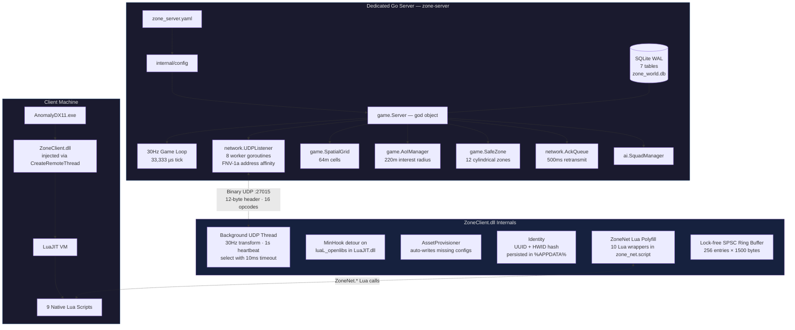
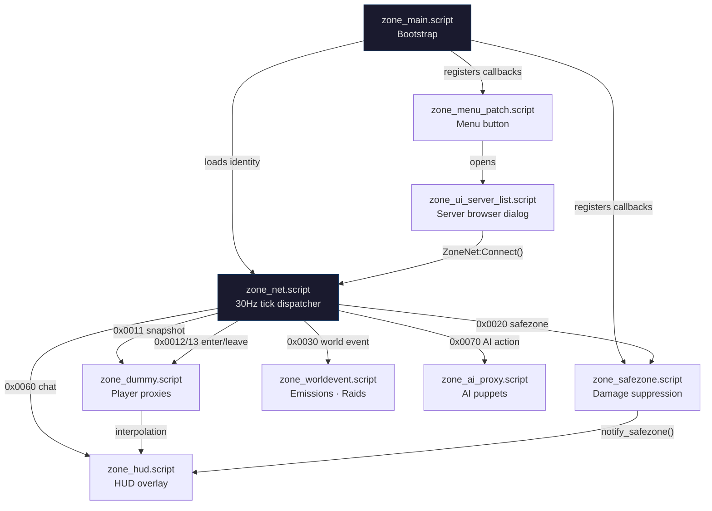
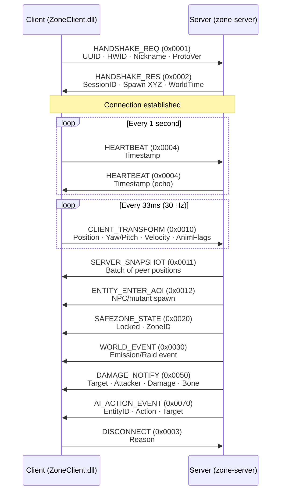

# Zone — S.T.A.L.K.E.R. Anomaly Multiplayer

[](https://golang.org)
[](https://isocpp.org)
[](https://github.com/themrdemonized/STALKER-Anomaly-modded-exes)
[](LICENSE)

**Zone** is a dedicated survival multiplayer architecture for **S.T.A.L.K.E.R. Anomaly 1.5.3**. It pairs a high-performance, authoritative Golang server with an autonomous, injectable C++ client DLL and native X-Ray UI — no proxy DLLs, no DirectX hooks, no external overlays.

---

## System Architecture



---

## Key Highlights

- **Headless Authoritative Daemon (`zone-server`)** — Written in Go for native concurrency and low memory footprint. Ticks at a fixed **30 Hz** (33,333 µs), managing a 64m spatial grid, 220m Area of Interest radius, and two-tier AI simulation. Runs on Windows and Linux.

- **Embedded SQLite Persistence** — Zero external DB dependencies (no Postgres, Redis, or Docker). Operates in Write-Ahead Logging (WAL) mode. Async write-behind queue (buffered channel, capacity 1000) is wired into the game loop for non-blocking DB writes.

- **Autonomous Zero-Touch Client (`ZoneClient.dll`)** — Injected into Anomaly via `CreateRemoteThread` + `LoadLibraryW`. Contains an embedded `AssetProvisioner` that auto-provisions DLTX configs (`mod_system_zone_online.ltx`) and UI layouts (`zone_ui_server_list.xml`) on attach — DLTX configs only if missing (user edits preserved); scripts + UI XML overwritten atomically (temp + `MoveFileEx`) to match the DLL.

- **Native X-Ray UI** — Zero external overlay layers or DirectX Present hooks. Injects a native `CUI3tButton` on the main menu via Lua script, opening a native `CUIScriptWnd` Server Browser with Direct Connect, persistent Favorites (up to 16), and double-click-to-connect.

- **Cubic Hermite Spline Interpolation** — Remote stalker proxies are smoothed using Catmull-Rom tangent estimation with a **100ms jitter buffer** and an 8-sample position history ring buffer, eliminating stuttering and rubberbanding.

- **Cylindrical Safe Zones** — 12 canonical Zone locations enforce weapon holstering, godmode protection, and PDA alerts on entry/leave. Server-authoritative boundary checks use 2D distance + vertical half-extent.

- **Lock-Free Networking** — Client uses a single-producer/single-consumer ring buffer (256 entries) for received packets. Server dispatches packets across 8 worker goroutines using FNV-1a hash of the client address for per-client ordering guarantees.

- **Admin Server (Named Pipe)** — Windows named pipe (`\\.\pipe\zone_admin`) with Unix socket fallback (`/tmp/zone_admin.sock`). Supports `status`, `kick <session_id>`, `ban <uuid> <reason>`, and `broadcast <message>` commands. Wired into server startup with graceful shutdown.

- **Economy System** — Full buy/sell transactional economy backed by SQLite. Ruble currency with balance queries, atomic buy (deduct + inventory insert) and sell (inventory remove + credit) operations, and tier progression tracking per character.

- **Stash Manager** — World stash CRUD with JSON-serialized item contents. Supports save, open/close sessions per player, and add/deduct item counts with underflow protection. DB-backed via `world_stashes` table.

---

## Repository Structure

```
zone-online/
├── zone-server/                 # Golang dedicated survival server
│   ├── cmd/server/main.go       # Entrypoint: wires config, DB, game loop, UDP
│   ├── internal/
│   │   ├── ai/                  # Squad manager (stub), A* pathfinding (complete)
│   │   ├── config/              # YAML configuration loader
│   │   ├── database/            # SQLite schema (7 tables), CRUD, async write queue, stash + ban ops
│   │   ├── game/                # 30Hz ticker, spatial grid, safe zones, AoI, events, economy, stashes, admin
│   │   ├── network/             # UDP listener (8 workers), sessions, reliable ACK queue
│   │   └── protocol/            # Binary wire protocol (14 opcodes, 12-byte header)
│   └── zone_server.yaml         # Server configuration
│
├── zone-client/                 # C++ injectable client DLL + automated injector
│   ├── 3rdparty/lua/            # Dynamic LuaJIT header shim (runtime resolution)
│   ├── injector/                # Win32 injector (--launch, --wait, --pid modes)
│   └── src/
│       ├── main.cpp             # DllMain: MinHook init, Identity, AssetProvisioner
│       ├── hook/                # MinHook detour on luaL_openlibs
│       ├── identity/            # UUID + HWID persistence (%APPDATA%\zone_identity.ltx)
│       ├── lua/                 # ZoneNet global table (8 Lua C bindings)
│       ├── net/                 # UDP client: background thread, state machine, ring buffer
│       ├── protocol/            # Packed binary structs (#pragma pack(push, 1))
│       └── provision/           # Auto-provisions DLTX configs + UI XML on first inject
│
├── gamedata/                    # Native X-Ray configs & scripts for Anomaly 1.5.3
│   ├── configs/
│   │   ├── mod_system_zone_online.ltx   # DLTX proxy stalker definition
│   │   ├── system.ltx_patch.ltx         # Supplementary patch (net_spawn_flags)
│   │   └── ui/zone_ui_server_list.xml   # Server browser dialog layout
│   └── scripts/
│       ├── zone_main.script             # Bootstrap, identity loading, callbacks
│       ├── zone_net.script              # 30Hz tick, packet dispatcher, transform sync
│       ├── zone_dummy.script            # Player proxy + Hermite spline interpolation
│       ├── zone_safezone.script         # Weapon holstering, damage suppression
│       ├── zone_hud.script              # HUD status overlay, PDA news
│       ├── zone_menu_patch.script       # Main menu button injection
│       ├── zone_ui_server_list.script   # Server browser dialog with favorites
│       ├── zone_ai_proxy.script         # Server-authoritative AI puppets
│       └── zone_worldevent.script       # Emission + mutant raid sync
│
├── Makefile                     # Root build orchestrator
├── INSTALL.md                   # Detailed installation and setup guide
└── README.md                    # This file
```

---

## Lua Scripting Layer

The client-side game logic is implemented entirely in native X-Ray Lua scripts. These communicate with the server through the `ZoneNet` global table — a Lua-side polyfill defined in `zone_net.script` that wraps FFI calls to the injected `ZoneClient.dll` exports.



| Script | Lines | Purpose |
|:---|:---:|:---|
| `zone_main` | 55 | Bootstrap entry point. Reads `%APPDATA%\zone_identity.ltx`, calls `ZoneNet:Connect()`, registers `actor_on_update` and hit/key callbacks. |
| `zone_net` | 177 | Core network tick. Sends player transform at 30 Hz via LuaJIT FFI. Parses 12-byte packet headers and dispatches by opcode to other scripts. Also defines the `ZoneNet` Lua polyfill table wrapping DLL exports. |
| `zone_dummy` | 213 | Manages remote player proxy objects. Spawns alife stalkers, buffers 8 position samples, applies cubic Hermite (Catmull-Rom) interpolation with 100ms jitter buffer every frame. Handles damage/kill propagation. |
| `zone_safezone` | 104 | Enforces safe zone rules. Nullifies incoming damage (`s_hit.power = 0`), blocks fire input, forces weapon holster via `db.actor:hide_weapon()`. Re-holsters every frame. |
| `zone_hud` | 210 | Persistent HUD indicator at top-right showing `[ZO] Online` / `Safe Zone` / `Offline` with ping. Issues PDA news tips on state transitions. Runs at 1 Hz. |
| `zone_menu_patch` | 94 | Monkey-patches `ui_main_menu.main_menu:InitControls` to append a native `CUI3tButton` labeled "Zone". Button position defined in XML layout. |
| `zone_ui_server_list` | 506 | Full `CUIScriptWnd` server browser. Favorites persisted in `%APPDATA%\zone_identity.ltx` (max 16). Supports direct IP connect, double-click-to-connect, add/remove favorites. |
| `zone_ai_proxy` | 86 | Spawns server-authoritative AI puppets. Handles entity enter (NPC/mutant), AI action events (attack, death), and entity leave. |
| `zone_worldevent` | 43 | Handles emission warnings (`0x01`), active emissions (`0x02`), clear (`0x03`), raid start (`0x04`), and raid end (`0x05`). Triggers weather changes and siren sounds. |

---

## Binary UDP Protocol

All communication occurs over UDP port `27015` using packed little-endian binary structures.

### 12-Byte Header Format

```
 0                   1                   2                   3
 0 1 2 3 4 5 6 7 8 9 0 1 2 3 4 5 6 7 8 9 0 1 2 3 4 5 6 7 8 9 0 1
+-+-+-+-+-+-+-+-+-+-+-+-+-+-+-+-+-+-+-+-+-+-+-+-+-+-+-+-+-+-+-+-+
|       Magic (0x5A4F "ZO")     |  Protocol(1)  |  Flags/Chan   |
+-+-+-+-+-+-+-+-+-+-+-+-+-+-+-+-+-+-+-+-+-+-+-+-+-+-+-+-+-+-+-+-+
|                    Sequence Number (uint32)                   |
+-+-+-+-+-+-+-+-+-+-+-+-+-+-+-+-+-+-+-+-+-+-+-+-+-+-+-+-+-+-+-+-+
|        Opcode (uint16)        |     Payload Length (uint16)   |
+-+-+-+-+-+-+-+-+-+-+-+-+-+-+-+-+-+-+-+-+-+-+-+-+-+-+-+-+-+-+-+-+
```

**Flags:** `0x01` = Reliable, `0x02` = Unreliable, `0x04` = Compressed

### Connection Lifecycle



### Opcode Reference

| Opcode | Name | Dir | Payload |
|:---:|:---|:---:|:---|
| `0x0001` | `PKT_HANDSHAKE_REQ` | C→S | UUID (37B), HWID (32B SHA-256), Nickname (32B), ProtoVer (1B) |
| `0x0002` | `PKT_HANDSHAKE_RES` | S→C | SessionID (4B), Status (1B: 0=ok/1=full/2=banned/3=version), SpawnXYZ (12B), WorldTime (8B), EcoTier (1B) |
| `0x0003` | `PKT_DISCONNECT` | Both | Reason (1B) |
| `0x0004` | `PKT_HEARTBEAT` | Both | Timestamp (8B) |
| `0x0005` | `PKT_ACK` | Both | Sequence (4B) |
| `0x0010` | `PKT_CLIENT_TRANSFORM` | C→S | 27B total: SessionID (4B), PosXYZ (12B), Yaw/Pitch (4B), VelXYZ (6B), AnimFlags (1B) |
| `0x0011` | `PKT_SERVER_SNAPSHOT` | S→C | Peer Count (1B), Array of 32: SessionID, PosXYZ, Yaw/Pitch, AnimFlags, Health |
| `0x0012` | `PKT_ENTITY_ENTER_AOI` | S→C | EntityID (4B), Type (1B), Section (32B), PosXYZ (12B), Faction (16B), Health (1B) |
| `0x0013` | `PKT_ENTITY_LEAVE_AOI` | S→C | EntityID (4B) |
| `0x0020` | `PKT_SAFEZONE_STATE` | S→C | Locked (1B: 0=free, 1=locked), ZoneID (32B) |
| `0x0030` | `PKT_WORLD_EVENT` | S→C | EventType (1B), State (1B), Timer (4B) |
| `0x0040` | `PKT_STASH_INTERACT` | C→S | StashID (4B), Action (1B), ItemSection (32B), Count (2B) |
| `0x0041` | `PKT_STASH_RESPONSE` | S→C | Stash contents response |
| `0x0050` | `PKT_DAMAGE_NOTIFY` | Both | TargetSessionID (4B), AttackerSessionID (4B), Damage (4B float), BoneID (1B) |
| `0x0060` | `PKT_CHAT_TEXT` | Both | SenderID (4B), Length (1B), Message Text (up to 255B) |
| `0x0070` | `PKT_AI_ACTION_EVENT` | S→C | EntityID (4B), Action (1B: Idle/Patrol/Attack/Flee/Death), TargetID (4B) |

Handshake `Status` surfaces distinct client errors via `ZN_GetLastError` (full/banned/version). Chat is level-filtered + rate-limited (5 msgs/5s per session). Reliable inbound packets are ACKed immediately; replayed reliable sequences are dropped after ACK.

---

## Quickstart

### 1. Start the Server
```bat
cd zone-server
go build -o zone-server.exe ./cmd/server
zone-server.exe
```

### 2. Build the Client
```bat
cd zone-client
cmake -S . -B build -G "Visual Studio 17 2022" -A x64
cmake --build build --config Release
```

### 3. Launch & Connect
Inject first, then use the in-game browser (the DLL must be loaded before the menu opens):
```bat
ZoneClient_Injector.exe --launch "C:\Anomaly\bin\AnomalyDX11.exe"
```
Once in the main menu:
1. Click the native **Zone** button below the menu options.
2. Enter the server IP (default `127.0.0.1`), port (`27015`), and your callsign.
3. Click **Connect** and keep the dialog open: the footer polls `ZoneNet:IsConnected()` (~2 Hz) from `Connecting` to `Connected` (then close via **Back** and start/load a game) or `Failed` after ~16s with the `ZN_GetLastError` reason. Do not run xrRazom co-op at the same time — Zone refuses while co-op is live.

---

## Implementation Status

### Complete

| Subsystem | Notes |
|:---|:---|
| Config loading (YAML) | 7 keys: port, tick_rate_hz, max_players, db_path, log_level, emission_interval_min, admin_pipe. Complete bounds validation (`Validate()`). |
| Database schema (7 tables) | accounts, characters, character_inventory, world_stashes, safe_zones, audit_log, ai_squads. WAL mode via pragma. |
| Database CRUD & Lifecycle | AutoProvision, LoadCharacter, SaveCharacter, FlushPlayerTransform, GetCharacterInventory (with `rows.Err()` checks), IsPlayerBanned, BanAccount, GetStash, SaveStash, UpdateStashContents, clean `Close()` method. |
| DB async write queue | `StartWriteQueue()` routes writes through buffered channel (cap 1000). Gracefully drains all pending jobs on server shutdown. |
| Safe zone seeding + detection | 12 cylindrical zones hardcoded, seeded into DB on startup. 2D distance + height check. |
| UDP listener + worker pool | 8 goroutines, FNV-1a address affinity, sync.Pool buffer recycling, atomic dropped packet counter + warnings. |
| Session management | Dual-index map (by ID + by addr), cached slice for lock-free reads, 30s stale timeout, session ID collision cleanup. |
| Binary protocol read/write | 12-byte header, little-endian, 16 wire opcodes (incl. `0x0005` ACK). `WritePacket` bounds-checks payload length <= 65535. Sparse `ServerSnapshot` delta serialization. Replay protection via per-session `LastSequence` (stale reliable dropped after ACK). |
| Reliable delivery (send + retransmit) | 500ms retransmit interval, 5 retries, checked each game tick. Client sends immediate `0x0005` ACK on reliable receipt; server ACKs inbound reliable packets the same way. |
| AI pathfinding (A*) | Full implementation with priority queue, 3D Euclidean heuristic, quantized integer waypoint keys, 5000-iteration ceiling. |
| Anti-Cheat & Transform Validation | Total 3D speed magnitude validation (`sqrt(vx^2 + vy^2 + vz^2) <= 25m/s`), NaN/Inf coordinate rejection, +/-10000 coordinate clamping. |
| Core Server Unit Test Suite | Comprehensive unit test suite in `server_test.go` covering `HandlePacket` (handshake, heartbeat, chat sanitization, transform bounds), `Tick` (exact 1s play time accumulation), `KickSession`, `BanPlayer`, `AntiCheat`. |
| Dynamic Lua Runtime Hooking | `lua_hook.cpp` compiled into DLL. Detours `luaL_openlibs` via MinHook, dynamically exports and populates LuaJIT function pointers, registers native `ZoneNet` table. |
| Thread-Safe UDP Client | Background thread with `std::atomic<uint32_t>` sequence & session IDs, `std::mutex` socket send serialization, 10s server liveness watchdog, 5-retry handshake ceiling, graceful `PKT_DISCONNECT` on unload. |
| DLL Injection & Protection | 3 modes (--launch, --wait, --pid), CreateRemoteThread + LoadLibraryW, SeDebugPrivilege. Upfront injector/target bitness check + bounded Lua-readiness gate (LuaJIT module or main window, 30s). UAF-safe `VirtualFreeEx` timeout handling, PID preservation avoiding TOCTOU races. |
| Identity Persistence | UUID via UuidCreate, HWID via CryptoAPI SHA-256 binary hash over MachineGuid + ComputerName (32 bytes), atomic UTF-8 `%APPDATA%` path conversion. |
| Asset provisioning | DLTX configs written only if missing; scripts + UI XML overwritten atomically (temp + `MoveFileEx`). Robust `\bin` directory matching preventing over-stripping. |
| Lock-free SPSC ring buffer | 256 entries x 1500 bytes, atomic head/tail with acquire/release ordering, dropped packet tracking, capacity-checked event polling. |
| Player proxy interpolation | Cubic Hermite (Catmull-Rom), 100ms jitter buffer, O(1) ring buffer history, non-uniform time scaling, smooth edge interval handling. |
| Safe zone enforcement (client) | Damage nullification (`s_hit.power = 0`), fire input block (`kWPN_FIRE`/`kWPN_ZOOM`), weapon re-holster every frame, state reset on level change & disconnect. |
| Server browser UI | CUIScriptWnd with favorites (max 16), direct connect, double-click-to-connect, direct io-only LTX write (no tmp/rename), nickname sanitization. Dialog stays open with `Connecting→Connected/Failed` footer (~2 Hz `IsConnected()` poll, 16s timeout); Connect gated on DLL-loaded (`ffi.load`) and xrRazom-idle. |
| HUD status overlay | CUIStatic at top-right, 1 Hz update, dynamic screen resolution and aspect-ratio tracking via `device().width`/`device().height`, PDA news on transitions. |
| World event sync | Emission warn/active/clear, raid start/end. 6-byte wire protocol (`eventType`, `state`, `timer`), weather changes + siren sounds, nil-safe audio objects, state reset on disconnect. |
| Economy & Stash systems | Buy/sell transactions, ruble currency, atomic balance checks, tier progression, unmarshal-safe stash CRUD without lock starvation. Stash access is 5m + same-level + passcode-gated, fail-closed (no passcode field on the wire yet, so locked stashes reject). |
| Admin server (named pipe & Unix socket) | Windows named pipe + Unix socket fallback with 0600 permissions and configurable path. Commands: `status`, `kick`, `ban`, `broadcast`. Per-connection token auth (one client's `auth` never unlocks others), 50ms exponential accept backoff. |
| Per-IP Rate Limiting | Token bucket per client IP (100 pkt/s, burst 150) in raw UDP ingestion loop with 60s idle cleanup, early-dropping flood traffic before worker queue. |
| Chat (level-filtered + rate-limited) | Sender-ID forgery rejected, 5 msgs/5s per-session limit, sanitized UTF-8, broadcast to sender's level only (admin sender 0 still global). |
| Client Reliable ACK Engine | Immediate `Opcode::ACK` (0x0005) dispatch on receiving reliable packets (`flags & 0x01`), halting server retransmission timeouts. |
| Anti-Combat Logging Sleeper System | Spawns authoritative 30-second sleeper proxy entities on explicit disconnect AND 30s timeout outside safe zones or during active combat; persists damage and death to database. |
| Server-Authoritative Combat & Damage Rules | Validates attack distance (300m ceiling), enforces safe zone damage immunity for attacker and target, clamps damage, tracks 30-second combat engagement status. |
| Session Authentication & Ban Enforcement | Validates session IDs and tokens on incoming client packets; handshake returns Status 0/1/2/3 (ok/full/banned/version) with distinct `ZN_GetLastError` client errors. |
| Periodic 60s DB Checkpointing | Replaced 30Hz per-transform DB writes with in-memory session tracking, flushing dirty sessions on 60-second intervals, safe zone transitions, and disconnects (>98% I/O reduction). |
| CI/CD Pipeline | Automated GitHub Actions workflow (`ci.yml`) testing Go server with race detection (`go test -race ./...`) and building client Release DLL with MSVC on Windows. |

---

## To-Do & Roadmap

Subsystems and features scheduled for upcoming milestones:

### Infrastructure & Deployment

| Subsystem | Priority | Description |
|:---|:---:|:---|
| Master Server Browser | Low | Add central HTTP master server listing for public community servers |
| Dedicated Headless Linux VM Deployment | Low | Deploy to headless Ubuntu container and verify LAN latency |

---

## License

This project is licensed under the MIT License. S.T.A.L.K.E.R. and X-Ray Engine are trademarks of GSC Game World.

