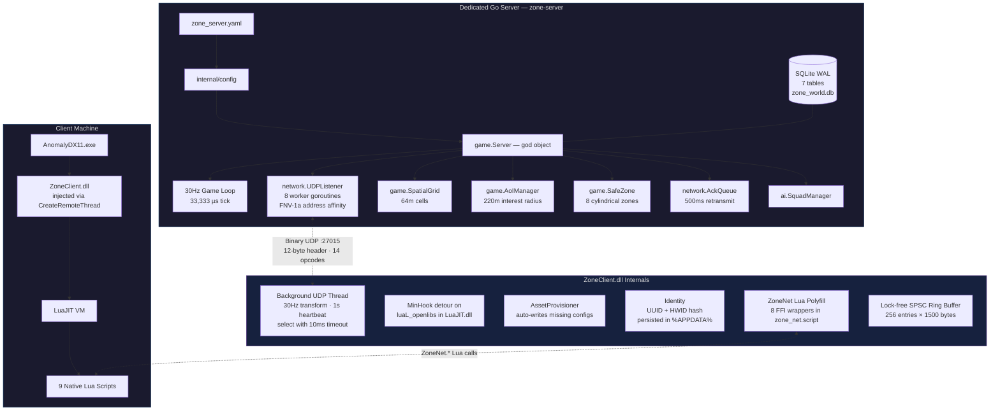
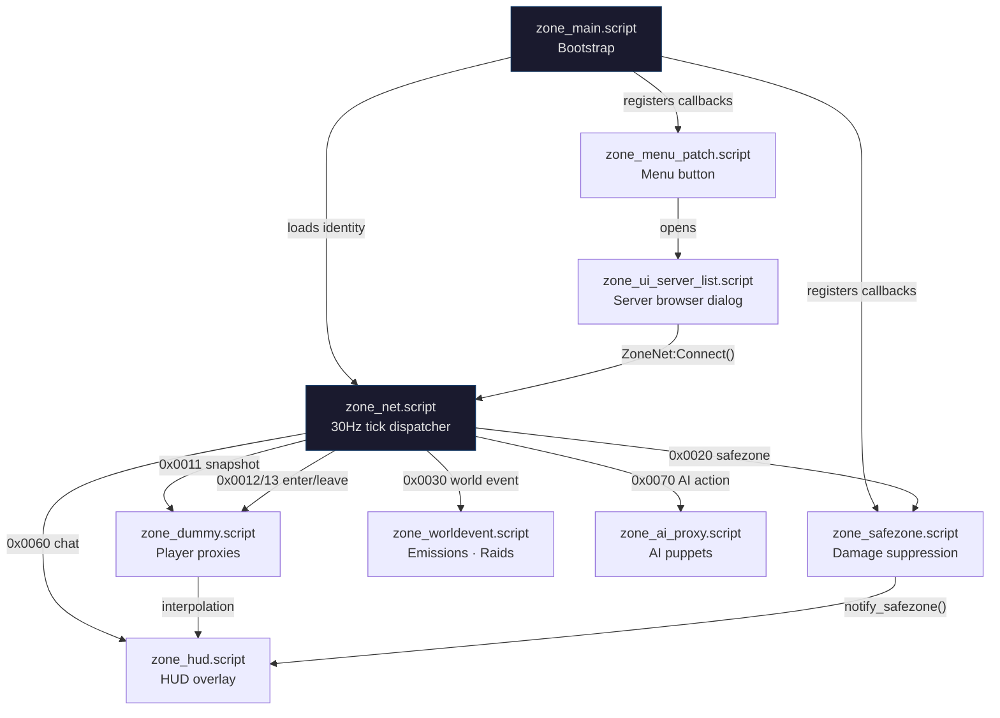
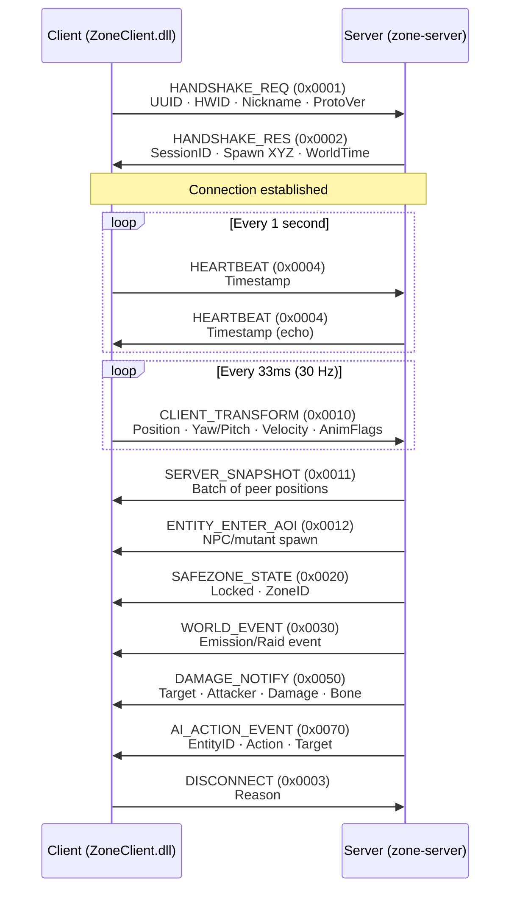

# Zone — S.T.A.L.K.E.R. Anomaly Multiplayer

[](https://golang.org)
[](https://isocpp.org)
[](https://github.com/themrdemonized/STALKER-Anomaly-modded-exes)
[](LICENSE)

**Zone** is a dedicated survival multiplayer architecture for **S.T.A.L.K.E.R. Anomaly 1.5.3**. It pairs a high-performance, authoritative Golang server with an autonomous, injectable C++ client DLL and native X-Ray UI — no proxy DLLs, no DirectX hooks, no external overlays.

---

## System Architecture



---

## Key Highlights

- **Headless Authoritative Daemon (`zone-server`)** — Written in Go for native concurrency and low memory footprint. Ticks at a fixed **30 Hz** (33,333 µs), managing a 64m spatial grid, 220m Area of Interest radius, and two-tier AI simulation. Runs on Windows and Linux.

- **Embedded SQLite Persistence** — Zero external DB dependencies (no Postgres, Redis, or Docker). Operates in Write-Ahead Logging (WAL) mode. Async write-behind queue (buffered channel, capacity 1000) is wired into the game loop for non-blocking DB writes.

- **Autonomous Zero-Touch Client (`ZoneClient.dll`)** — Injected into Anomaly via `CreateRemoteThread` + `LoadLibraryW`. Contains an embedded `AssetProvisioner` that auto-provisions DLTX configs (`mod_system_zone_online.ltx`) and UI layouts (`zone_ui_server_list.xml`) on attach — never overwrites existing files.

- **Native X-Ray UI** — Zero external overlay layers or DirectX Present hooks. Injects a native `CUI3tButton` on the main menu via Lua script, opening a native `CUIScriptWnd` Server Browser with Direct Connect, persistent Favorites (up to 16), and double-click-to-connect.

- **Cubic Hermite Spline Interpolation** — Remote stalker proxies are smoothed using Catmull-Rom tangent estimation with a **100ms jitter buffer** and an 8-sample position history ring buffer, eliminating stuttering and rubberbanding.

- **Cylindrical Safe Zones** — 8 canonical Zone locations enforce weapon holstering, godmode protection, and PDA alerts on entry/leave. Server-authoritative boundary checks use 2D distance + vertical half-extent.

- **Lock-Free Networking** — Client uses a single-producer/single-consumer ring buffer (256 entries) for received packets. Server dispatches packets across 8 worker goroutines using FNV-1a hash of the client address for per-client ordering guarantees.

- **Admin Server (Named Pipe)** — Windows named pipe (`\\.\pipe\zone_admin`) with Unix socket fallback (`/tmp/zone_admin.sock`). Supports `status`, `kick <session_id>`, `ban <uuid> <reason>`, and `broadcast <message>` commands. Wired into server startup with graceful shutdown.

- **Economy System** — Full buy/sell transactional economy backed by SQLite. Ruble currency with balance queries, atomic buy (deduct + inventory insert) and sell (inventory remove + credit) operations, and tier progression tracking per character.

- **Stash Manager** — World stash CRUD with JSON-serialized item contents. Supports save, open/close sessions per player, and add/deduct item counts with underflow protection. DB-backed via `world_stashes` table.

---

## Repository Structure

```
zone-online/
├── zone-server/                 # Golang dedicated survival server
│   ├── cmd/server/main.go       # Entrypoint: wires config, DB, game loop, UDP
│   ├── internal/
│   │   ├── ai/                  # Squad manager (stub), A* pathfinding (complete)
│   │   ├── config/              # YAML configuration loader
│   │   ├── database/            # SQLite schema (7 tables), CRUD, async write queue, stash + ban ops
│   │   ├── game/                # 30Hz ticker, spatial grid, safe zones, AoI, events, economy, stashes, admin
│   │   ├── network/             # UDP listener (8 workers), sessions, reliable ACK queue
│   │   └── protocol/            # Binary wire protocol (14 opcodes, 12-byte header)
│   └── zone_server.yaml         # Server configuration
│
├── zone-client/                 # C++ injectable client DLL + automated injector
│   ├── 3rdparty/lua/            # Dynamic LuaJIT header shim (runtime resolution)
│   ├── injector/                # Win32 injector (--launch, --wait, --pid modes)
│   └── src/
│       ├── main.cpp             # DllMain: MinHook init, Identity, AssetProvisioner
│       ├── hook/                # MinHook detour on luaL_openlibs
│       ├── identity/            # UUID + HWID persistence (%APPDATA%\zone_identity.ltx)
│       ├── lua/                 # ZoneNet global table (8 Lua C bindings)
│       ├── net/                 # UDP client: background thread, state machine, ring buffer
│       ├── protocol/            # Packed binary structs (#pragma pack(push, 1))
│       └── provision/           # Auto-provisions DLTX configs + UI XML on first inject
│
├── gamedata/                    # Native X-Ray configs & scripts for Anomaly 1.5.3
│   ├── configs/
│   │   ├── mod_system_zone_online.ltx   # DLTX proxy stalker definition
│   │   ├── system.ltx_patch.ltx         # Supplementary patch (net_spawn_flags)
│   │   └── ui/zone_ui_server_list.xml   # Server browser dialog layout
│   └── scripts/
│       ├── zone_main.script             # Bootstrap, identity loading, callbacks
│       ├── zone_net.script              # 30Hz tick, packet dispatcher, transform sync
│       ├── zone_dummy.script            # Player proxy + Hermite spline interpolation
│       ├── zone_safezone.script         # Weapon holstering, damage suppression
│       ├── zone_hud.script              # HUD status overlay, PDA news
│       ├── zone_menu_patch.script       # Main menu button injection
│       ├── zone_ui_server_list.script   # Server browser dialog with favorites
│       ├── zone_ai_proxy.script         # Server-authoritative AI puppets
│       └── zone_worldevent.script       # Emission + mutant raid sync
│
├── Makefile                     # Root build orchestrator
├── INSTALL.md                   # Detailed installation and setup guide
└── README.md                    # This file
```

---

## Lua Scripting Layer

The client-side game logic is implemented entirely in native X-Ray Lua scripts. These communicate with the server through the `ZoneNet` global table — a Lua-side polyfill defined in `zone_net.script` that wraps FFI calls to the injected `ZoneClient.dll` exports.



| Script | Lines | Purpose |
|:---|:---:|:---|
| `zone_main` | 55 | Bootstrap entry point. Reads `%APPDATA%\zone_identity.ltx`, calls `ZoneNet:Connect()`, registers `actor_on_update` and hit/key callbacks. |
| `zone_net` | 177 | Core network tick. Sends player transform at 30 Hz via LuaJIT FFI. Parses 12-byte packet headers and dispatches by opcode to other scripts. Also defines the `ZoneNet` Lua polyfill table wrapping DLL exports. |
| `zone_dummy` | 213 | Manages remote player proxy objects. Spawns alife stalkers, buffers 8 position samples, applies cubic Hermite (Catmull-Rom) interpolation with 100ms jitter buffer every frame. Handles damage/kill propagation. |
| `zone_safezone` | 104 | Enforces safe zone rules. Nullifies incoming damage (`s_hit.power = 0`), blocks fire input, forces weapon holster via `db.actor:hide_weapon()`. Re-holsters every frame. |
| `zone_hud` | 210 | Persistent HUD indicator at top-right showing `[ZO] Online` / `Safe Zone` / `Offline` with ping. Issues PDA news tips on state transitions. Runs at 1 Hz. |
| `zone_menu_patch` | 94 | Monkey-patches `ui_main_menu.main_menu:InitControls` to append a native `CUI3tButton` labeled "Zone". Button position defined in XML layout. |
| `zone_ui_server_list` | 506 | Full `CUIScriptWnd` server browser. Favorites persisted in `%APPDATA%\zone_identity.ltx` (max 16). Supports direct IP connect, double-click-to-connect, add/remove favorites. |
| `zone_ai_proxy` | 86 | Spawns server-authoritative AI puppets. Handles entity enter (NPC/mutant), AI action events (attack, death), and entity leave. |
| `zone_worldevent` | 43 | Handles emission warnings (`0x01`), active emissions (`0x02`), clear (`0x03`), raid start (`0x04`), and raid end (`0x05`). Triggers weather changes and siren sounds. |

---

## Binary UDP Protocol

All communication occurs over UDP port `27015` using packed little-endian binary structures.

### 12-Byte Header Format

```
 0                   1                   2                   3
 0 1 2 3 4 5 6 7 8 9 0 1 2 3 4 5 6 7 8 9 0 1 2 3 4 5 6 7 8 9 0 1
+-+-+-+-+-+-+-+-+-+-+-+-+-+-+-+-+-+-+-+-+-+-+-+-+-+-+-+-+-+-+-+-+
|       Magic (0x5A4F "ZO")     |  Protocol(1)  |  Flags/Chan   |
+-+-+-+-+-+-+-+-+-+-+-+-+-+-+-+-+-+-+-+-+-+-+-+-+-+-+-+-+-+-+-+-+
|                    Sequence Number (uint32)                   |
+-+-+-+-+-+-+-+-+-+-+-+-+-+-+-+-+-+-+-+-+-+-+-+-+-+-+-+-+-+-+-+-+
|        Opcode (uint16)        |     Payload Length (uint16)   |
+-+-+-+-+-+-+-+-+-+-+-+-+-+-+-+-+-+-+-+-+-+-+-+-+-+-+-+-+-+-+-+-+
```

**Flags:** `0x01` = Reliable, `0x02` = Unreliable, `0x04` = Compressed

### Connection Lifecycle



### Opcode Reference

| Opcode | Name | Dir | Payload |
|:---:|:---|:---:|:---|
| `0x0001` | `PKT_HANDSHAKE_REQ` | C→S | UUID (36B), HWID Hash (4B), Nickname (32B), ProtoVer (1B) |
| `0x0002` | `PKT_HANDSHAKE_RES` | S→C | SessionID (4B), Status (1B), SpawnXYZ (12B), WorldTime (8B), EcoTier (1B) |
| `0x0003` | `PKT_DISCONNECT` | Both | Reason (1B) |
| `0x0004` | `PKT_HEARTBEAT` | Both | Timestamp (8B) |
| `0x0010` | `PKT_CLIENT_TRANSFORM` | C→S | SessionID (4B), PosXYZ (12B), Yaw/Pitch (4B), VelXYZ (6B), AnimFlags (2B) |
| `0x0011` | `PKT_SERVER_SNAPSHOT` | S→C | Peer Count (1B), Array of: SessionID, PosXYZ, Yaw/Pitch, AnimFlags, Health |
| `0x0012` | `PKT_ENTITY_ENTER_AOI` | S→C | EntityID (4B), Type (1B), Section (32B), PosXYZ (12B), Faction (1B), Health (2B) |
| `0x0013` | `PKT_ENTITY_LEAVE_AOI` | S→C | EntityID (4B) |
| `0x0020` | `PKT_SAFEZONE_STATE` | S→C | Locked (1B: 0=free, 1=locked), ZoneID (16B) |
| `0x0030` | `PKT_WORLD_EVENT` | S→C | EventType (1B), Timer (4B) |
| `0x0040` | `PKT_STASH_INTERACT` | C→S | StashID (4B), Action (1B), ItemSection (32B), Count (2B) |
| `0x0041` | `PKT_STASH_RESPONSE` | S→C | Stash contents response |
| `0x0050` | `PKT_DAMAGE_NOTIFY` | S→C | TargetSessionID (4B), AttackerSessionID (4B), Damage (4B float), BoneID (1B) |
| `0x0060` | `PKT_CHAT_TEXT` | Both | SenderID (4B), Length (1B), Message Text (up to 255B) |
| `0x0070` | `PKT_AI_ACTION_EVENT` | S→C | EntityID (4B), Action (1B: Idle/Patrol/Attack/Flee/Death), TargetID (4B) |

---

## Quickstart

### 1. Start the Server
```bat
cd zone-server
go build -o zone-server.exe ./cmd/server
zone-server.exe
```

### 2. Build the Client
```bat
cd zone-client
cmake -S . -B build -G "Visual Studio 17 2022" -A x64
cmake --build build --config Release
```

### 3. Launch & Connect
Launch Anomaly using the automated injector:
```bat
ZoneClient_Injector.exe --launch "C:\Anomaly\bin\AnomalyDX11.exe"
```
Once in the main menu:
1. Click the native **Zone** button below the menu options.
2. Enter the server IP (default `127.0.0.1`), port (`27015`), and your callsign.
3. Click **Connect**.

---

## Implementation Status

### Complete

| Subsystem | Notes |
|:---|:---|
| Config loading (YAML) | 7 keys: port, tick_rate_hz, max_players, db_path, log_level, emission_interval_min, admin_pipe |
| Database schema (7 tables) | accounts, characters, character_inventory, world_stashes, safe_zones, audit_log, ai_squads. WAL mode via pragma. |
| Database CRUD | AutoProvision, LoadCharacter, SaveCharacter, FlushPlayerTransform, GetCharacterInventory, IsPlayerBanned, BanAccount, GetStash, SaveStash, UpdateStashContents |
| Safe zone seeding + detection | 8 cylindrical zones hardcoded, seeded into DB on startup. 2D distance + height check. |
| UDP listener + worker pool | 8 goroutines, FNV-1a address affinity, sync.Pool buffer recycling, silent drop on full channel |
| Session management | Dual-index map (by ID + by addr), cached slice for lock-free reads, 30s stale timeout |
| Binary protocol read/write | 12-byte header, little-endian, 14 opcodes defined, WritePacket/ReadHeader tested |
| Reliable delivery (send + retransmit) | 500ms timeout, 100ms scan interval. Retransmit loop is wired into game loop. |
| AI pathfinding (A*) | Full implementation with priority queue, 3D Euclidean heuristic, path reconstruction. 4 test cases pass. |
| DLL injection | 3 modes (--launch, --wait, --pid), CreateRemoteThread + LoadLibraryW, SeDebugPrivilege, 11 known exe names |
| Asset provisioning | Auto-writes DLTX config + UI XML if missing. `GetGameRoot()` uses `GetModuleFileNameW` to resolve executable path. |
| Identity persistence | UUID via UuidCreate, HWID via FNV-1a(MachineGuid + ComputerName), LTX file in %APPDATA% |
| UDP client (background thread) | 3-state machine (DISCONNECTED/CONNECTING/CONNECTED), select with 10ms timeout, exponential backoff on handshake |
| Lock-free SPSC ring buffer | 256 entries x 1500 bytes, atomic head/tail with acquire/release ordering |
| Player proxy interpolation | Cubic Hermite (Catmull-Rom), 100ms jitter buffer, 8-sample ring buffer |
| Safe zone enforcement (client) | Damage nullification (`s_hit.power = 0`), fire input block, weapon re-holster every frame |
| Server browser UI | CUIScriptWnd with favorites (max 16), direct connect, double-click-to-connect, LTX persistence |
| HUD status overlay | CUIStatic at top-right, 1 Hz update, color-coded states, PDA news on transitions |
| World event sync | Emission warn/active/clear, raid start/end. Weather changes + siren sounds. |
| Emission + raid Lua handling | 5 event types parsed, surge API with fallback to weather override |
| Economy system | Buy/sell transactions, ruble currency, atomic balance checks, tier progression. Fully tested. |
| Stash manager | World stash CRUD, open/close sessions, JSON item contents, add/deduct with underflow protection. Fully tested. |
| Admin server (named pipe) | Windows named pipe + Unix socket fallback. Commands: `status`, `kick`, `ban`, `broadcast`. Tested with pipe lifecycle. |
| DB async write queue | `StartWriteQueue()` wired into `main.go`, routes writes through buffered channel (cap 1000). |
| Packet dispatch — `CLIENT_TRANSFORM` (0x0010) | Parses transform, updates session position/rotation/velocity/anim, queues periodic DB flush. |
| Packet dispatch — `CHAT_TEXT` (0x0060) | `BroadcastChat` sends `ChatText` packet to all sessions. |
| Ping measurement | RTT from heartbeat timestamp round-trip. Client sends `Timestamp`, server echoes it back. |
| Heartbeat echo | Server parses `HeartbeatPayload`, echoes timestamp back to client (reliable or raw). |

---

### Known Bugs

Confirmed defects in existing code that must be fixed before production.

#### Server (`zone-server`)

| ID | Severity | Location | Description |
|:---|:---:|:---|:---|
| S-01 | **Critical** | `game/server.go:238`, `game/tick.go:10` | **Play time inflated 30x.** `QueuePeriodicStats(uuid, 1)` fires every tick (30 Hz), adding 1 second of play time per tick instead of per real second. |
| S-02 | **Critical** | `database/db.go:190` | **DB write errors silently swallowed.** `_, _ = d.db.Exec(...)` discards all SQL errors. Failed writes (bans, inventory, character saves) are permanently lost with zero logging. |
| S-03 | **Critical** | `protocol/packets.go:159` | **PayloadLength integer truncation.** `uint16(buf.Len())` has no bounds check. Payloads >65535 bytes silently wrap, desynchronizing protocol framing. |
| S-04 | High | `cmd/server/main.go:59-60`, `game/tick.go:18` | **Data race on `s.udp`.** Game loop goroutine starts before `Run()` assigns `s.udp`. Unsynchronized read/write across goroutines. |
| S-05 | High | `game/aoi_manager.go:25,106-113` | **AoI entries map leak.** When a session disconnects, its entry in `a.entries[sessID]` is never removed. Unbounded memory growth over time. |
| S-06 | High | `game/aoi_manager.go:49-53`, `protocol/packets.go:50-53` | **Snapshot always serializes full 64-entry array.** `ServerSnapshot` has a fixed `[64]SnapshotEntry` field. `binary.Write` sends all 64 entries regardless of `Count` — up to 21x bandwidth waste. |
| S-07 | High | `game/admin.go:166-175` | **Admin interface has no authentication.** Any local process can issue `kick`, `ban`, `broadcast` commands. Unix socket at `/tmp/zone_admin.sock` is world-accessible. |
| S-08 | High | `game/server.go:107-112` | **UDP amplification via heartbeat.** Heartbeat responses sent to unauthenticated/unknown source addresses. Enables reflection attacks. |
| S-09 | High | `game/server.go:121-139` | **No input validation on transform data.** Position, rotation, velocity from client packets written directly to session with zero bounds/NaN/Inf checks. |
| S-10 | High | `game/admin.go:131-143` | **Admin accept loop busy-spin.** On persistent `Accept()` error, loop retries immediately with no backoff — consumes 100% CPU. |
| S-11 | High | `database/db.go:182-195` | **Write queue not drained on shutdown.** `ctx.Done()` exits immediately. Up to 1000 pending writes (inventory, bans, character saves) are silently lost. |
| S-12 | High | `database/db.go:14-25` | **DB connection never closed.** `DB` struct has no `Close()` method. SQLite file handle leaks on shutdown; WAL may not checkpoint. |
| S-13 | Medium | `game/anticheat.go:40-65` | **Anti-cheat checks components, not total speed.** `ValidateMove` checks horizontal speed and vertical delta independently. A player moving 24 m/s horizontal + 14 m/s vertical (27.8 m/s total) passes both checks. |
| S-14 | Medium | `game/stash_manager.go:148-153` | **Stash mutex held during DB query.** `ModifyStashItem` holds application lock during `db.GetStash()` I/O, blocking all other stash operations. |
| S-15 | Medium | `game/stash_manager.go:158` | **Stash JSON unmarshal errors silently discarded.** Malformed `ContentsJSON` proceeds with empty items, overwriting corrupted data on next save. |
| S-16 | Medium | `game/server.go:223-231,239-247` | **KickSession/BanPlayer don't save character state.** Session removed without flushing position/health/inventory to DB. Unsaved state is lost. |
| S-17 | Medium | `game/admin_other.go:15-22` | **Unix socket ignores config `pipeName`.** Hardcoded to `/tmp/zone_admin.sock`. Two server instances conflict; `os.Remove` can destroy another instance's listener. |
| S-18 | Medium | `game/admin_other.go:18` | **Unix admin socket has no permission restrictions.** Created with default umask (typically 0755). Any local user can connect and issue admin commands. |
| S-19 | Medium | `ai/pathfinding.go:64-93` | **A* has no iteration limit.** On large or pathological graphs, function can block indefinitely. If called from game loop, freezes the tick. |
| S-20 | Medium | `ai/pathfinding.go:69-70` | **A* uses float32 as map key.** `Waypoint` contains `float32` fields compared with `==`. Floating-point equality is fragile; could cause redundant node exploration. |
| S-21 | Medium | `game/admin_test.go:16` | **`admin_test.go` imports Windows package without build tag.** Tests fail to compile on Linux/macOS. |
| S-22 | Medium | `internal/config/config.go:19-31` | **Config has no validation.** `Port` can be 0 or >65535. `TickRateHz` can be 0 (division by zero). `MaxPlayers` can be 0. No defaults for missing keys. |
| S-23 | Medium | `game/aoi_manager.go:71-72` | **Yaw/pitch precision loss in snapshots.** Rotation round-trips through float32 division (`server.go:127`) then int16 truncation (`aoi_manager.go:71`), losing fractional part. |
| S-24 | Low | `game/server.go:239-247` | **BanPlayer iterates all sessions without early exit.** Should break after finding and kicking the matching UUID. |
| S-25 | Low | `database/db.go:107-114` | **`GetCharacterInventory` doesn't check `rows.Err()`.** Mid-iteration DB errors silently lost; partial result returned as complete. |
| S-26 | Low | `network/session.go:49-55` | **Session ID collision silently overwrites.** `AddSession` overwrites existing session with same ID without warning. Old session's `byAddr` entry becomes a phantom. |
| S-27 | Low | `network/udp_listener.go:135-138` | **Silent packet drop when worker channels full.** No metric counter, no log message, no backpressure signal. Impossible to diagnose packet loss in production. |

#### Client (`zone-client`)

| ID | Severity | Location | Description |
|:---|:---:|:---|:---|
| C-01 | **Critical** | `protocol/packets.h:38`, `net/udp_client.cpp:106` | **UUID truncated by 1 character.** `char uuid[36]` + `snprintf(buf, 36, ...)` writes max 35 chars + NUL. Last hex digit of every UUID is lost on the wire. |
| C-02 | **Critical** | `src/main.cpp:28-30` | **Heavy I/O inside DllMain under loader lock.** `Identity::Init()` and `AssetProvisioner::EnsureAssets()` do registry reads, file I/O, and directory creation synchronously under the OS loader lock. Can deadlock the game process. |
| C-03 | **Critical** | `lua/zone_bindings.cpp:7-10` | **Null pointer dereference from Lua.** `ZN_Connect` passes raw `const char*` to `std::string` ctor without null check. `nil` from Lua = UB/crash. `ZN_SendChatText` has the guard (`text ? text : ""`); `ZN_Connect` does not. |
| C-04 | **Critical** | `zone_net.script:28,160-169` | **Yaw/pitch truncated to zero precision.** Sends raw radians as `int16_t` (values -3 to +3). Receiver divides by 100 expecting centidegrees. Net result: ~0.0 rotation for all proxies. |
| C-05 | High | `net/udp_client.cpp:50,111,295,344` | **Data race on `g_Sequence`.** Plain `uint32_t` incremented from both background thread and game thread without synchronization. |
| C-06 | High | `net/udp_client.cpp:21,64,282-284` | **Data race on `g_ServerAddr`.** Written under `g_StateMutex` in `Connect()`, read without lock in `SendPacket()`. |
| C-07 | High | `net/udp_client.cpp:26,186,330,340` | **Data race on `g_SessionID`.** Written by background thread, read by game thread. Not atomic. |
| C-08 | High | `net/udp_client.cpp:30,71,334` | **Data race on `g_LastError`.** `std::string` concurrent read+write is undefined behavior. |
| C-09 | High | `net/udp_client.cpp:61-78,296,348` | **`SendPacket` called from two threads.** Background thread and game thread both call `sendto()` on the same socket without serialization. |
| C-10 | High | `hook/lua_hook.cpp:32-33,46-47` | **MinHook error returns ignored.** `MH_CreateHook` and `MH_EnableHook` return values not checked. Hook silently fails with no diagnostic. |
| C-11 | High | `src/main.cpp:28` | **`MH_Initialize()` return value ignored.** |
| C-12 | High | `net/udp_client.cpp:243-249` | **WSAStartup/socket creation not validated.** Background thread starts on invalid socket if initialization fails. |
| C-13 | High | `src/main.cpp:11-16` | **No exception handling in InitThread.** Unhandled exception calls `std::terminate()` → `abort()`, crashing the game. |
| C-14 | High | `injector/injector_main.cpp:196-216` | **Use-after-free on injection timeout.** `VirtualFreeEx` runs after `WaitForSingleObject` returns regardless of timeout. If remote thread is still running, its argument buffer is freed. |
| C-15 | Medium | `net/udp_client.cpp:87,119` | **Connection backoff not reset on reconnect.** Backoff retains previous value (up to 30s) across sessions. |
| C-16 | Medium | `net/udp_client.cpp:100-121` | **No connection timeout.** Handshake retries indefinitely with exponential backoff. No max retry count. |
| C-17 | Medium | `net/udp_client.cpp:122-134` | **No server liveness detection.** Client stays CONNECTED indefinitely if server stops responding. No heartbeat timeout. |
| C-18 | Medium | `src/main.cpp:40-48` | **No graceful DISCONNECT on DLL unload.** `Shutdown()` stops the thread but never sends `PKT_DISCONNECT`. Server must detect via heartbeat timeout. |
| C-19 | Medium | `net/udp_client.cpp:199-206` | **Silent ring buffer overflow.** When ring buffer is full, packets are discarded with no counter or log. |
| C-20 | Medium | `net/udp_client.cpp:312-323`, `lua/zone_bindings.cpp:32-35` | **`PollEvent` buffer overflow risk.** `outLen` is overwritten with ring entry length; caller's buffer capacity is ignored. |
| C-21 | Medium | `identity/identity.cpp:46,52` | **Registry/computer name errors ignored.** Failed calls produce zeroed HWID, shared by all affected systems. |
| C-22 | Medium | `identity/identity.cpp:69-71` | **`WideCharToMultiByte` failure not handled.** Path exceeding MAX_PATH leaves buffer in indeterminate state. |
| C-23 | Medium | `provision/asset_provisioner.cpp:18-19` | **`GetModuleFileNameW` MAX_PATH truncation undetected.** |
| C-24 | Medium | `provision/asset_provisioner.cpp:27-45` | **Game root over-stripping.** Path containing `bin` in unexpected positions (e.g. `D:\bin\Anomaly\bin\...`) causes incorrect root resolution. |
| C-25 | Medium | `lua/zone_bindings.cpp:7-9` | **Double-to-uint cast without range validation.** Negative `port` or `hwid` values from Lua → undefined behavior in C++17. |
| C-26 | Medium | `injector/injector_main.cpp:385-391` | **TOCTOU race in `--launch` mode.** Process handle closed before `InjectDLL` is called by PID. PID could be reused. |

#### Lua Scripts (`gamedata/scripts`)

| ID | Severity | Location | Description |
|:---|:---:|:---|:---|
| L-01 | **Critical** | `zone_ai_proxy.script:68-70` | **Actor position mutated in-place.** `db.actor:position():sub(obj:position())` modifies the actor's actual world position via the returned reference. Player is teleported every frame an AI puppet attacks. Verified against engine source: `CScriptGameObject::Position` returns `Fvector` by value through `BIND_FUNCTION10` macro, but the `vector:sub()` method modifies in-place and returns `self`. |
| L-02 | **Critical** | `zone_net.script:89-130` | **No payload-length validation.** `paylen` is read from header but never checked against actual packet length. `string.byte` returns nil on out-of-bounds, causing nil-arithmetic crash in `read_uint16_le`/`read_float_le`. |
| L-03 | High | `zone_net.script:121-126` | **Chat parser reads from wrong offset.** Reads raw payload from `offset` (byte 13) without skipping the 4-byte sender ID and 1-byte length prefix defined in the protocol spec. Display text includes binary header bytes. |
| L-04 | High | `zone_net.script:165-166` | **`IsMoveState` does not exist.** Verified: zero results in entire xray-monolith codebase. Crouch and sprint flags are never transmitted — `animflags` is always 0. |
| L-05 | High | `zone_dummy.script:82-125` | **Hermite spline skips edge intervals.** Guard `idx > 1 and idx < #hist - 1` means the first and last time intervals are never interpolated. With 4 samples (minimum), only 1 of 3 intervals is usable. Proxies freeze at buffer boundaries. |
| L-06 | High | `zone_net.script:6-8` | **`last_pos`/`last_tick` not reset on reconnect.** Module-level variables retain old session values. First tick after reconnect sends a massive velocity spike (old position → new spawn). |
| L-07 | High | `zone_main.script:50`, `zone_safezone.script:101` | **Duplicate `on_key_press` callback registration.** Same handler registered from two scripts. Fires twice per key press in safe zones. |
| L-08 | High | `zone_ui_server_list.script:8` | **`getFS()` called at file scope.** Executes when script loads, not in a function. Works in normal Anomaly but is fragile — crashes if engine init order changes. |
| L-09 | High | `zone_menu_patch.script:26-41` | **`SetAutoDelete(true)` creates dangling Lua reference.** Button C++ object freed by engine on menu destroy, but Lua table slot retains stale reference. "Zone" button may disappear after returning to main menu. |
| L-10 | Medium | `zone_net.script:94-98` | **Magic number and protocol version not validated.** `magic` and `proto` fields are read but discarded. Corrupted or non-Zone packets dispatched by opcode. |
| L-11 | Medium | `zone_main.script:29` | **`type(ZoneNet)` nil check always passes.** `zone_net.script` unconditionally creates `_G.ZoneNet = {}` at file scope. The guard in `zone_main` is dead code — DLL failure is silently invisible. |
| L-12 | Medium | `zone_safezone.script:79` | **`IsWeapon` nil risk.** `IsWeapon` exists as a global in Anomaly (verified in `_g_patches.script`), but if unavailable, the periodic weapon re-holster silently never fires. Short-circuit prevents crash. |
| L-13 | Medium | `zone_safezone.script` | **Safe zone state not reset on level change/disconnect.** `in_safe_zone` flag persists indefinitely. Weapons remain holstered after leaving the server. |
| L-14 | Medium | `zone_ai_proxy.script` | **No `on_level_changing` cleanup.** `ai_entities` table retains stale references after level change. `level.object_by_id()` calls return nil for dead entities. |
| L-15 | Medium | `zone_dummy.script:17-20` | **`alife():create` at vertex 0 when actor nil.** If `db.actor` is nil (loading/death), `level_vertex_id` and `game_vertex_id` are both 0. Invalid spatial placement. |
| L-16 | Medium | `zone_ai_proxy.script:68` | **`db.actor:id()` called without nil check.** During attack action, if `target_id ~= 0` and `db.actor` is nil, crash on nil-index. |
| L-17 | Medium | `zone_ai_proxy.script:24` | **Network-supplied section name passed directly to `alife():create`.** No validation; invalid section crashes or returns nil. No fallback (unlike `zone_dummy` which falls back to `sim_default_stalker`). |
| L-18 | Medium | `zone_dummy.script:69` | **`obj:kill(obj)` — self-kill attribution.** Proxy is both victim and killer. Death attributed to self-kill rather than actual attacker. |
| L-19 | Medium | `zone_worldevent.script:4-5` | **`active_emission` not reset on level change/disconnect.** Emission state persists indefinitely. |
| L-20 | Medium | `zone_worldevent.script:16-17` | **Hardcoded emission sound path with no nil check.** `sound_object(...)` may return nil if file missing; `snd:play()` crashes. |
| L-21 | Medium | `zone_hud.script:64-91` | **HUD parent destroyed on level change.** `CUIStatic` attached to HUD root which is recreated on level transitions. Dangling reference risk if `on_actor_destroy` doesn't fire before parent destruction. |
| L-22 | Medium | `zone_ui_server_list.script:253-295` | **Non-atomic read-modify-write on favorites file.** Game crash between truncating and completing write = corrupted LTX file. |
| L-23 | Medium | `zone_ui_server_list.script:274-275` | **Nickname with LTX-special chars corrupts config.** Characters like `[`, `]`, `=`, newlines in nickname break the LTX file format. |
| L-24 | Medium | `zone_dummy.script:104-105` | **Catmull-Rom tangents not time-scaled.** Assumes uniform sample spacing. Variable network latency causes speed distortion and overshoot. |
| L-25 | Medium | `zone_dummy.script:147` | **Snapshot-spawned proxies use hardcoded "stalker" faction.** Missed `ENTITY_ENTER` packet → wrong visual appearance. |
| L-26 | Low | `zone_safezone.script:56` | **`s_hit.ignore_flag` is not a standard SHit field.** Verified: does not exist in `SHit` or `CScriptHit` engine structs. Assignment creates a harmless Lua table key the engine ignores. |
| L-27 | Low | `zone_worldevent.script:29-33` | **Double weather change on emission clear.** `surge_manager:end_surge(true)` may already restore weather; subsequent `level.set_weather("default", true)` causes visual flicker. |
| L-28 | Low | `zone_main.script:39-43` | **Shared default UUID/HWID for unconfigured clients.** `"default_uuid"` and `123456789` sent if identity file missing — multiple players share identity. |
| L-29 | Low | `zone_hud.script:78` | **Hardcoded HUD widget position.** `Frect():set(800, 8, 1016, 30)` assumes 1024x768 virtual coords. May overlap at ultra-wide or be too narrow at low resolutions. |
| L-30 | Low | `zone_dummy.script:53-55` | **`table.remove(tbl, 1)` is O(n).** In hot interpolation path. Ring buffer with head/tail index would be O(1). |
| L-31 | Low | `zone_net.script:52-60,78-83` | **Per-call FFI allocations in hot path.** `ffi.new("char[1500]")` per poll, `ffi.new("znet_float_cast")` per `read_float_le`. GC pressure at 30 Hz. |

#### Build, Test & Configuration

| ID | Severity | Location | Description |
|:---|:---:|:---|:---|
| B-01 | **Critical** | `zone-client/CMakeLists.txt` | **`lua_hook.cpp` not in CMakeLists.** MinHook detour on `luaL_openlibs` is never compiled into the DLL. |
| B-02 | **Critical** | (none) | **No CI/CD.** No automated builds, no automated tests, no release packaging. |
| B-03 | **Critical** | `zone-server/internal/game/server.go` | **Core server functions have zero tests.** `HandlePacket()`, `Tick()`, `Run()`, `KickSession()`, `BanPlayer()` — none tested. Overall source file test coverage: 36%. |
| B-04 | High | `.gitignore` | **`dist/` is git-ignored.** Distribution artifacts (`.exe`, `.dll`) cannot be version-controlled. |
| B-05 | High | `dist/` | **`LICENSE` file missing from dist package.** MIT License requires redistribution include the license text. |
| B-06 | High | `Makefile` dist target | **`VERSION.txt` referenced but not present in dist.** |
| B-07 | High | `.gitmodules` | **Dead `imgui` submodule entry.** `git submodule update --init` clones 100+ MB of unused code. |
| B-08 | High | `.gitmodules` | **MinHook submodule pinned to `master` branch, not a commit hash.** Any commit to MinHook master changes the code used. |
| B-09 | High | `zone-client/README.md` | **Documents `lua_hook.cpp` as "Complete".** Misleading — file is not in CMakeLists and hook is never installed. |
| B-10 | High | `zone-server/Makefile` | **Build output path mismatch.** Server Makefile outputs to `bin/zone-server.exe`, root dist target copies from `zone-server.exe`. |
| B-11 | High | `INSTALL.md` | **Uses developer-specific absolute path.** `F:\AnomalyDev\zone-online\zone-server` in Windows instructions. |
| B-12 | Medium | `Makefile` dist target | **Missing `gamedata/configs/ui/` subdirectory copy.** XML file would be absent if dist built via Makefile. |
| B-13 | Medium | `go.mod` | **Go version lacks patch specifier.** `go 1.22` should be `go 1.22.X` for reproducibility. |
| B-14 | Medium | `go.mod` | **`golang.org/x/sys` dependency stale.** v0.16.0 from late 2023. |
| B-15 | Medium | `3rdparty/lua/` | **Lua headers have no version identifier or LICENSE.** Provenance unclear. |
| B-16 | Medium | `zone_server.yaml` | **Dist `admin_pipe` value (`zone_server_admin`) differs from code default (`zone_admin`).** |

---

### To-Do

Features and subsystems that need to be implemented or completed.

#### Networking & Protocol

| Subsystem | Priority | Current State | What Needs Doing |
|:---|:---:|:---|:---|
| Handshake response | **High** | Request parsed + logged, no response sent | Send `HANDSHAKE_RES`, create session, call `AutoProvision`, load spawn point |
| Spatial grid | **High** | `GetNeighbors` always returns `[]uint32{}` | Implement `Insert`, `Remove`, `Update`, cell-key computation, and real neighbor query |
| Packet dispatch — `DISCONNECT` (0x0003) | **High** | Opcode defined, not handled | Remove session, broadcast leave to peers, save character state |
| Packet dispatch — `STASH_INTERACT` (0x0040) | Medium | Opcode defined, stash manager exists | Wire opcode handler to StashManager CRUD, send `PKT_STASH_RESPONSE` |
| Snapshot broadcast | **High** | Code complete but dead (no sessions, empty grid) | Depends on handshake + spatial grid. Then it will work. |
| ACK receive side | **High** | `AckReceived()` never called | Handle incoming ACK packets to stop retransmission |
| Client heartbeat timeout | Medium | Client sends heartbeats, never checks for missing responses | Track last received heartbeat; transition to DISCONNECTED after N seconds of silence |
| Client connection timeout | Medium | Handshake retries indefinitely | Add max retry count or total timeout; transition to DISCONNECTED and notify Lua |
| Graceful disconnect on DLL unload | Medium | `Shutdown()` stops thread but sends no DISCONNECT packet | Call `Disconnect()` before `Shutdown()` in `DLL_PROCESS_DETACH` |
| Per-IP rate limiting | Medium | No rate limiting on incoming UDP | Add per-IP token bucket or connection cap to prevent flood-based DoS |
| Packet authentication | Low | No HMAC, nonce, or replay protection | Add challenge-response handshake, sequence validation, or session tokens |
| PayloadLength validation | Medium | `HandlePacket` checks header size but not `PayloadLength` vs actual data | Validate `hdr.PayloadLength == len(data) - 12`; reject mismatches |

#### Game Logic

| Subsystem | Priority | Current State | What Needs Doing |
|:---|:---:|:---|:---|
| Emission orchestrator | Medium | Config key loaded, never used | Create orchestrator struct, timer goroutine, emit `WORLD_EVENT` packets |
| AI squad manager | Medium | Empty struct, no methods | Implement `Tick`, spawn/despawn squads, path following, broadcast AI actions |
| Anti-cheat integration | Medium | `ValidateMove` exists, never called | Wire into `CLIENT_TRANSFORM` handler, add total-magnitude speed check |
| Safe zone server integration | **High** | `CheckSafeZone()` works but never called | Call from game loop or transform handler, set `InSafeZone` on sessions, send `SAFEZONE_STATE` |
| DB integration in packet handlers | **High** | Transform + play time queued via async write, AutoProvision on handshake | Wire `SaveCharacter` on disconnect, periodic `FlushPlayerTransform` |
| `max_players` enforcement | Medium | Config loaded but never enforced | Reject handshake/session creation when at capacity |
| `log_level` config | Medium | Loaded but ignored (always uses `zap.NewProduction()`) | Wire to logger initialization |
| `emission_interval_min` config | Medium | Loaded but never used | Wire to emission orchestrator when implemented |

#### Client DLL

| Subsystem | Priority | Current State | What Needs Doing |
|:---|:---:|:---|:---|
| Lua hook wiring | **High** | `lua_hook.cpp` exists but not in CMakeLists, never called from main.cpp | Add to CMakeLists, call `LuaHook::Install()` from InitThread |
| ZoneNet Lua bindings | **High** | `RegisterZoneNetBindings()` declared but never defined | Implement function body: create Lua table, register C closures, set as global |
| Dynamic Lua function pointers | **High** | 17 `extern` declarations, never initialized | Add `GetProcAddress` loop in init to populate all function pointers from LuaJIT.dll |

#### Testing & CI

| Subsystem | Priority | Current State | What Needs Doing |
|:---|:---:|:---|:---|
| CI/CD pipeline | **High** | None | Add GitHub Actions: `go test -race -v ./...` on push/PR, CMake build verification for client |
| Server integration tests | **High** | None | Test packet dispatch → session update → DB write flow, handshake → session → AoI notify |
| `HandlePacket` / `Tick` tests | **High** | Zero coverage on core game loop | Basic tests for handshake logging, heartbeat echo, transform parsing |
| `UDPListener` tests | High | Zero coverage | Test worker pool dispatch, FNV-1a hashing, send/receive |
| Config validation tests | Medium | Happy path only | Missing file, corrupt YAML, missing fields, zero values |
| Safe zone boundary tests | Medium | 1 of 8 zones tested | Boundary edges (exactly on radius, above/below height) |
| Client race detection | Medium | No `-race` equivalent for C++ | Add ThreadSanitizer builds or manual audit of shared state |
| Linting | Medium | None | Add `golangci-lint` for server, `clang-tidy` for client |

#### Build & Distribution

| Subsystem | Priority | Current State | What Needs Doing |
|:---|:---:|:---|:---|
| Fix CMakeLists.txt | **High** | `lua_hook.cpp` missing | Add `src/hook/lua_hook.cpp` and `src/hook/lua_hook.h` to `ZONE_CLIENT_SOURCES` |
| Fix Makefile dist target | High | Missing `ui/` copy, LICENSE, VERSION.txt; wrong server binary path | Correct paths, add missing files, remove silent `|| true` error suppression |
| Fix `.gitignore` | High | `dist/` ignored | Add `!dist/` override or move release artifacts to a tracked location |
| Remove dead `imgui` submodule | Medium | `.gitmodules` references unused repo | Delete the entry from `.gitmodules` |
| Pin MinHook to commit hash | Medium | Submodule on `master` branch | Update `.gitmodules` to use specific commit |
| Config validation | Medium | Zero validation | Add bounds checks for port (1–65535), tick_rate_hz (>0), max_players (>0), defaults for missing keys |
| Admin auth | Medium | No authentication | Add shared-secret or token-based auth to named pipe / Unix socket |
| Admin connection limit | Medium | No limit | Add semaphore or max concurrent connections to prevent resource exhaustion |
| Health check endpoint | Low | None | Add HTTP `/health` or equivalent for load balancers / orchestrators |
| Metrics / observability | Low | None | Add Prometheus counters or statsd for packet loss, tick duration, session counts, DB write latency |
| A* iteration limit | Low | None | Add max iteration count or timeout to prevent infinite loops on pathological graphs |
| UDP socket buffer config | Low | OS default | Add `SetReadBuffer()` call with configurable size |

---

## License

This project is licensed under the MIT License. S.T.A.L.K.E.R. and X-Ray Engine are trademarks of GSC Game World.
