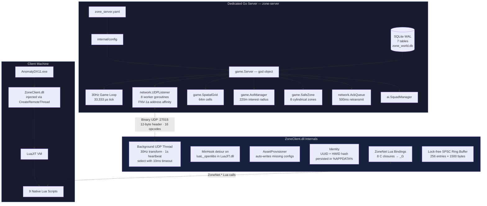
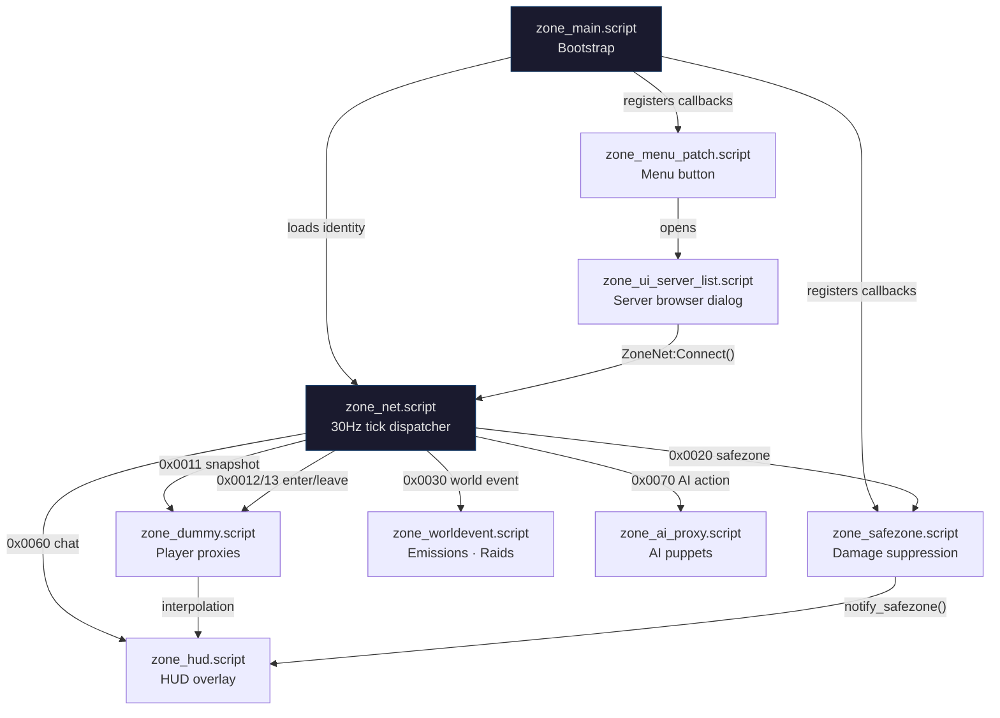
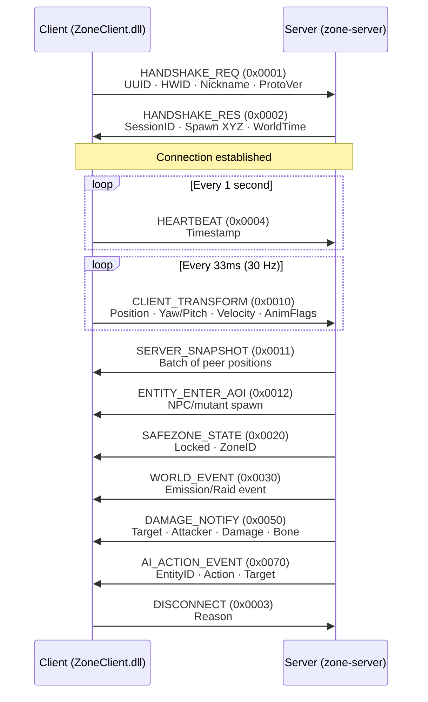

# Zone — S.T.A.L.K.E.R. Anomaly Multiplayer

[](https://golang.org)
[](https://isocpp.org)
[](https://github.com/themrdemonized/STALKER-Anomaly-modded-exes)
[](LICENSE)

**Zone** is a dedicated survival multiplayer architecture for **S.T.A.L.K.E.R. Anomaly 1.5.3**. It pairs a high-performance, authoritative Golang server with an autonomous, injectable C++ client DLL and native X-Ray UI — no proxy DLLs, no DirectX hooks, no external overlays.

---

## System Architecture



---

## Key Highlights

- **Headless Authoritative Daemon (`zone-server`)** — Written in Go for native concurrency and low memory footprint. Ticks at a fixed **30 Hz** (33,333 µs), managing a 64m spatial grid, 220m Area of Interest radius, and two-tier AI simulation. Runs on Windows and Linux.

- **Embedded SQLite Persistence** — Zero external DB dependencies (no Postgres, Redis, or Docker). Operates in Write-Ahead Logging (WAL) mode with an async write-behind queue (buffered channel, capacity 1000) to avoid blocking the game loop.

- **Autonomous Zero-Touch Client (`ZoneClient.dll`)** — Injected into Anomaly via `CreateRemoteThread` + `LoadLibraryW`. Contains an embedded `AssetProvisioner` that auto-provisions DLTX configs (`mod_system_zone_online.ltx`) and UI layouts (`zone_ui_server_list.xml`) on attach — never overwrites existing files.

- **Native X-Ray UI** — Zero external overlay layers or DirectX Present hooks. Injects a native `CUI3tButton` on the main menu via Lua script, opening a native `CUIScriptWnd` Server Browser with Direct Connect, persistent Favorites (up to 16), and double-click-to-connect.

- **Cubic Hermite Spline Interpolation** — Remote stalker proxies are smoothed using Catmull-Rom tangent estimation with a **100ms jitter buffer** and an 8-sample position history ring buffer, eliminating stuttering and rubberbanding.

- **Cylindrical Safe Zones** — 8 canonical Zone locations enforce weapon holstering, godmode protection, and PDA alerts on entry/leave. Server-authoritative boundary checks use 2D distance + vertical half-extent.

- **Lock-Free Networking** — Client uses a single-producer/single-consumer ring buffer (256 entries) for received packets. Server dispatches packets across 8 worker goroutines using FNV-1a hash of the client address for per-client ordering guarantees.

---

## Repository Structure

```
zone-online/
├── zone-server/                 # Golang dedicated survival server
│   ├── cmd/server/main.go       # Entrypoint: wires config, DB, game loop, UDP
│   ├── internal/
│   │   ├── ai/                  # Squad manager, A* pathfinding (stub)
│   │   ├── config/              # YAML configuration loader
│   │   ├── database/            # SQLite schema (7 tables), CRUD, async write queue
│   │   ├── game/                # 30Hz ticker, spatial grid, safe zones, AoI, events
│   │   ├── network/             # UDP listener (8 workers), sessions, reliable ACK queue
│   │   └── protocol/            # Binary wire protocol (16 opcodes, 12-byte header)
│   └── zone_server.yaml         # Server configuration
│
├── zone-client/                 # C++ injectable client DLL + automated injector
│   ├── 3rdparty/lua/            # Dynamic LuaJIT header shim (runtime resolution)
│   ├── injector/                # Win32 injector (--launch, --wait, --pid modes)
│   └── src/
│       ├── main.cpp             # DllMain: MinHook init, Identity, AssetProvisioner
│       ├── hook/                # MinHook detour on luaL_openlibs
│       ├── identity/            # UUID + HWID persistence (%APPDATA%\zone_identity.ltx)
│       ├── lua/                 # ZoneNet global table (8 Lua C bindings)
│       ├── net/                 # UDP client: background thread, state machine, ring buffer
│       ├── protocol/            # Packed binary structs (#pragma pack(push, 1))
│       └── provision/           # Auto-provisions DLTX configs + UI XML on first inject
│
├── gamedata/                    # Native X-Ray configs & scripts for Anomaly 1.5.3
│   ├── configs/
│   │   ├── mod_system_zone_online.ltx   # DLTX proxy stalker definition
│   │   ├── system.ltx_patch.ltx         # Supplementary patch (net_spawn_flags)
│   │   └── ui/zone_ui_server_list.xml   # Server browser dialog layout
│   └── scripts/
│       ├── zone_main.script             # Bootstrap, identity loading, callbacks
│       ├── zone_net.script              # 30Hz tick, packet dispatcher, transform sync
│       ├── zone_dummy.script            # Player proxy + Hermite spline interpolation
│       ├── zone_safezone.script         # Weapon holstering, damage suppression
│       ├── zone_hud.script              # HUD status overlay, PDA news
│       ├── zone_menu_patch.script       # Main menu button injection
│       ├── zone_ui_server_list.script   # Server browser dialog with favorites
│       ├── zone_ai_proxy.script         # Server-authoritative AI puppets
│       └── zone_worldevent.script       # Emission + mutant raid sync
│
├── Makefile                     # Root build orchestrator
├── INSTALL.md                   # Detailed installation and setup guide
└── README.md                    # This file
```

---

## Lua Scripting Layer

The client-side game logic is implemented entirely in native X-Ray Lua scripts. These communicate with the server through the `ZoneNet` global table injected by the DLL.



| Script | Lines | Purpose |
|:---|:---:|:---|
| `zone_main` | 59 | Bootstrap entry point. Reads `%APPDATA%\zone_identity.ltx`, calls `ZoneNet:Connect()`, registers `actor_on_update` and hit/key callbacks. |
| `zone_net` | 124 | Core network tick. Sends player transform at 30 Hz via LuaJIT FFI. Parses 12-byte packet headers and dispatches by opcode to other scripts. |
| `zone_dummy` | 186 | Manages remote player proxy objects. Spawns alife stalkers, buffers 8 position samples, applies cubic Hermite (Catmull-Rom) interpolation with 100ms jitter buffer every frame. |
| `zone_safezone` | 107 | Enforces safe zone rules. Nullifies incoming damage (`s_hit.power = 0`), blocks fire input, forces weapon holster via `db.actor:hide_weapon()`. |
| `zone_hud` | 215 | Persistent HUD indicator at top-right showing `[ZO] Online` / `Safe Zone` / `Offline` with ping. Issues PDA news tips on state transitions. Runs at 1 Hz. |
| `zone_menu_patch` | 113 | Monkey-patches `ui_main_menu.main_menu:InitControls` to append a native `CUI3tButton` at position (40, 548) labeled "Zone". |
| `zone_ui_server_list` | 506 | Full `CUIScriptWnd` server browser. Favorites persisted in `%APPDATA%\zone_identity.ltx` (max 16). Supports direct IP connect, double-click-to-connect, add/remove favorites. |
| `zone_ai_proxy` | 85 | Spawns server-authoritative AI puppets. Handles entity enter (NPC/mutant), AI action events (attack, death, flee), and entity leave. |
| `zone_worldevent` | 40 | Handles emission warnings (`0x01`), active emissions (`0x02`), clear (`0x03`), raid start (`0x04`), and raid end (`0x05`). Triggers weather changes and siren sounds. |

---

## Binary UDP Protocol

All communication occurs over UDP port `27015` using packed little-endian binary structures.

### 12-Byte Header Format

```
 0                   1                   2                   3
 0 1 2 3 4 5 6 7 8 9 0 1 2 3 4 5 6 7 8 9 0 1 2 3 4 5 6 7 8 9 0 1
+-+-+-+-+-+-+-+-+-+-+-+-+-+-+-+-+-+-+-+-+-+-+-+-+-+-+-+-+-+-+-+-+
|       Magic (0x5A4F "ZO")     |  Protocol(1)  |  Flags/Chan   |
+-+-+-+-+-+-+-+-+-+-+-+-+-+-+-+-+-+-+-+-+-+-+-+-+-+-+-+-+-+-+-+-+
|                    Sequence Number (uint32)                   |
+-+-+-+-+-+-+-+-+-+-+-+-+-+-+-+-+-+-+-+-+-+-+-+-+-+-+-+-+-+-+-+-+
|        Opcode (uint16)        |     Payload Length (uint16)   |
+-+-+-+-+-+-+-+-+-+-+-+-+-+-+-+-+-+-+-+-+-+-+-+-+-+-+-+-+-+-+-+-+
```

**Flags:** `0x01` = Reliable, `0x02` = Unreliable, `0x04` = Compressed

### Connection Lifecycle



### Opcode Reference

| Opcode | Name | Dir | Payload |
|:---:|:---|:---:|:---|
| `0x0001` | `PKT_HANDSHAKE_REQ` | C→S | UUID (36B), HWID Hash (4B), Nickname (32B), ProtoVer (1B) |
| `0x0002` | `PKT_HANDSHAKE_RES` | S→C | SessionID (4B), Status (1B), SpawnXYZ (12B), WorldTime (8B), EcoTier (1B) |
| `0x0003` | `PKT_DISCONNECT` | Both | Reason (1B) |
| `0x0004` | `PKT_HEARTBEAT` | C→S | Timestamp (8B) |
| `0x0010` | `PKT_CLIENT_TRANSFORM` | C→S | SessionID (4B), PosXYZ (12B), Yaw/Pitch (4B), VelXYZ (6B), AnimFlags (2B) |
| `0x0011` | `PKT_SERVER_SNAPSHOT` | S→C | Peer Count (1B), Array of: SessionID, PosXYZ, Yaw/Pitch, AnimFlags, Health |
| `0x0012` | `PKT_ENTITY_ENTER_AOI` | S→C | EntityID (4B), Type (1B), Section (32B), PosXYZ (12B), Faction (1B), Health (2B) |
| `0x0013` | `PKT_ENTITY_LEAVE_AOI` | S→C | EntityID (4B) |
| `0x0020` | `PKT_SAFEZONE_STATE` | S→C | Locked (1B: 0=free, 1=locked), ZoneID (16B) |
| `0x0030` | `PKT_WORLD_EVENT` | S→C | EventType (1B), Timer (4B) |
| `0x0040` | `PKT_STASH_INTERACT` | C→S | StashID (4B), Action (1B), ItemSection (32B), Count (2B) |
| `0x0041` | `PKT_STASH_RESPONSE` | S→C | Stash contents response |
| `0x0050` | `PKT_DAMAGE_NOTIFY` | S→C | TargetSessionID (4B), AttackerSessionID (4B), Damage (4B float), BoneID (1B) |
| `0x0060` | `PKT_CHAT_TEXT` | Both | SenderID (4B), Length (1B), Message Text (up to 255B) |
| `0x0070` | `PKT_AI_ACTION_EVENT` | S→C | EntityID (4B), Action (1B: Idle/Patrol/Attack/Flee/Death), TargetID (4B) |

---

## Quickstart

### 1. Start the Server
```bat
cd zone-server
go build -o zone-server.exe ./cmd/server
zone-server.exe
```

### 2. Build the Client
```bat
cd zone-client
cmake -S . -B build -G "Visual Studio 17 2022" -A x64
cmake --build build --config Release
```

### 3. Launch & Connect
Launch Anomaly using the automated injector:
```bat
ZoneClient_Injector.exe --launch "C:\Anomaly\bin\AnomalyDX11.exe"
```
Once in the main menu:
1. Click the native **Zone** button below the menu options.
2. Enter the server IP (default `127.0.0.1`), port (`27015`), and your callsign.
3. Click **Connect**.

---

## Implementation Status

| Subsystem | Status | Notes |
|:---|:---:|:---|
| Config loading (YAML) | Done | Port, tick rate, max players, DB path, emission interval |
| Database schema + CRUD | Done | 7 tables, WAL mode, async write-behind queue |
| Safe zone seeding + detection | Done | 8 cylindrical zones with 2D distance + height check |
| UDP listener + worker pool | Done | 8 goroutines, FNV-1a affinity, sync.Pool buffers |
| Reliable delivery (ACK/retransmit) | Done | 500ms timeout, 100ms scan interval |
| Session management | Done | Dual-index map (by ID + by addr), 30s stale timeout |
| Binary protocol read/write | Done | 12-byte header, little-endian, 16 opcodes |
| Heartbeat handling | Done | Updates `LastSeen` timestamp |
| Handshake handling | Partial | Reads request and logs; response not yet sent |
| Snapshot broadcast | Stub | AoI manager methods defined but empty |
| Spatial grid queries | Stub | `GetNeighbors` returns empty slice |
| Packet dispatch (most opcodes) | Stub | Only HandshakeReq and Heartbeat handled |
| Anti-cheat | Stub | Velocity check defined, not integrated |
| Economy system | Stub | Struct defined, no logic |
| Stash manager | Stub | Struct defined, no logic |
| Emission orchestrator | Stub | Struct defined, no logic |
| AI pathfinding (A*) | Stub | Returns empty waypoint slice |
| AI squad manager | Stub | `Tick` method is a no-op |
| Admin server (named pipe) | Stub | Config key defined, no listener |
| DLL injection + hook | Done | MinHook on luaL_openlibs, 3 injector modes |
| Asset provisioning | Done | Auto-writes missing LTX + XML on first inject |
| Identity persistence | Done | UUID (UuidCreate) + HWID (FNV-1a of MachineGuid + hostname) |
| Lua bindings (ZoneNet) | Done | 8 C closures dynamically resolved from LuaJIT.dll |
| Player proxy interpolation | Done | Cubic Hermite, 100ms jitter, 8-sample ring buffer |
| Safe zone enforcement | Done | Client-side damage nullification + weapon block |
| Server browser UI | Done | CUIScriptWnd with favorites, direct connect |
| HUD status overlay | Done | 1 Hz update, connection/safe zone indicators |
| World event sync | Done | Emission warn/active/clear, raid start/end |

---

## License

This project is licensed under the MIT License. S.T.A.L.K.E.R. and X-Ray Engine are trademarks of GSC Game World.
