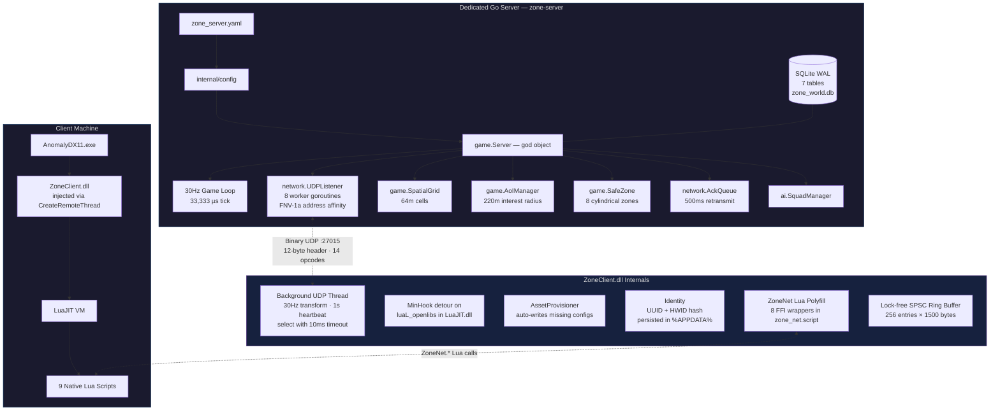
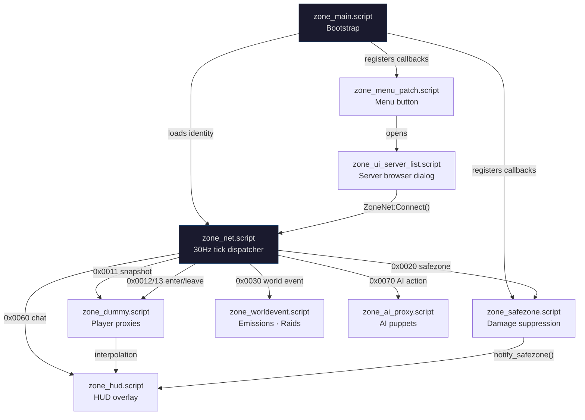
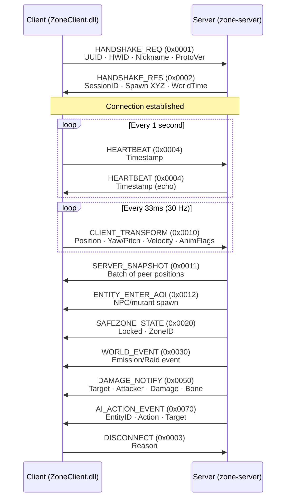

# Zone — S.T.A.L.K.E.R. Anomaly Multiplayer

[](https://golang.org)
[](https://isocpp.org)
[](https://github.com/themrdemonized/STALKER-Anomaly-modded-exes)
[](LICENSE)

**Zone** is a dedicated survival multiplayer architecture for **S.T.A.L.K.E.R. Anomaly 1.5.3**. It pairs a high-performance, authoritative Golang server with an autonomous, injectable C++ client DLL and native X-Ray UI — no proxy DLLs, no DirectX hooks, no external overlays.

---

## System Architecture



---

## Key Highlights

- **Headless Authoritative Daemon (`zone-server`)** — Written in Go for native concurrency and low memory footprint. Ticks at a fixed **30 Hz** (33,333 µs), managing a 64m spatial grid, 220m Area of Interest radius, and two-tier AI simulation. Runs on Windows and Linux.

- **Embedded SQLite Persistence** — Zero external DB dependencies (no Postgres, Redis, or Docker). Operates in Write-Ahead Logging (WAL) mode. Async write-behind queue (buffered channel, capacity 1000) is wired into the game loop for non-blocking DB writes.

- **Autonomous Zero-Touch Client (`ZoneClient.dll`)** — Injected into Anomaly via `CreateRemoteThread` + `LoadLibraryW`. Contains an embedded `AssetProvisioner` that auto-provisions DLTX configs (`mod_system_zone_online.ltx`) and UI layouts (`zone_ui_server_list.xml`) on attach — never overwrites existing files.

- **Native X-Ray UI** — Zero external overlay layers or DirectX Present hooks. Injects a native `CUI3tButton` on the main menu via Lua script, opening a native `CUIScriptWnd` Server Browser with Direct Connect, persistent Favorites (up to 16), and double-click-to-connect.

- **Cubic Hermite Spline Interpolation** — Remote stalker proxies are smoothed using Catmull-Rom tangent estimation with a **100ms jitter buffer** and an 8-sample position history ring buffer, eliminating stuttering and rubberbanding.

- **Cylindrical Safe Zones** — 8 canonical Zone locations enforce weapon holstering, godmode protection, and PDA alerts on entry/leave. Server-authoritative boundary checks use 2D distance + vertical half-extent.

- **Lock-Free Networking** — Client uses a single-producer/single-consumer ring buffer (256 entries) for received packets. Server dispatches packets across 8 worker goroutines using FNV-1a hash of the client address for per-client ordering guarantees.

- **Admin Server (Named Pipe)** — Windows named pipe (`\\.\pipe\zone_admin`) with Unix socket fallback (`/tmp/zone_admin.sock`). Supports `status`, `kick <session_id>`, `ban <uuid> <reason>`, and `broadcast <message>` commands. Wired into server startup with graceful shutdown.

- **Economy System** — Full buy/sell transactional economy backed by SQLite. Ruble currency with balance queries, atomic buy (deduct + inventory insert) and sell (inventory remove + credit) operations, and tier progression tracking per character.

- **Stash Manager** — World stash CRUD with JSON-serialized item contents. Supports save, open/close sessions per player, and add/deduct item counts with underflow protection. DB-backed via `world_stashes` table.

---

## Repository Structure

```
zone-online/
├── zone-server/                 # Golang dedicated survival server
│   ├── cmd/server/main.go       # Entrypoint: wires config, DB, game loop, UDP
│   ├── internal/
│   │   ├── ai/                  # Squad manager (stub), A* pathfinding (complete)
│   │   ├── config/              # YAML configuration loader
│   │   ├── database/            # SQLite schema (7 tables), CRUD, async write queue, stash + ban ops
│   │   ├── game/                # 30Hz ticker, spatial grid, safe zones, AoI, events, economy, stashes, admin
│   │   ├── network/             # UDP listener (8 workers), sessions, reliable ACK queue
│   │   └── protocol/            # Binary wire protocol (14 opcodes, 12-byte header)
│   └── zone_server.yaml         # Server configuration
│
├── zone-client/                 # C++ injectable client DLL + automated injector
│   ├── 3rdparty/lua/            # Dynamic LuaJIT header shim (runtime resolution)
│   ├── injector/                # Win32 injector (--launch, --wait, --pid modes)
│   └── src/
│       ├── main.cpp             # DllMain: MinHook init, Identity, AssetProvisioner
│       ├── hook/                # MinHook detour on luaL_openlibs
│       ├── identity/            # UUID + HWID persistence (%APPDATA%\zone_identity.ltx)
│       ├── lua/                 # ZoneNet global table (8 Lua C bindings)
│       ├── net/                 # UDP client: background thread, state machine, ring buffer
│       ├── protocol/            # Packed binary structs (#pragma pack(push, 1))
│       └── provision/           # Auto-provisions DLTX configs + UI XML on first inject
│
├── gamedata/                    # Native X-Ray configs & scripts for Anomaly 1.5.3
│   ├── configs/
│   │   ├── mod_system_zone_online.ltx   # DLTX proxy stalker definition
│   │   ├── system.ltx_patch.ltx         # Supplementary patch (net_spawn_flags)
│   │   └── ui/zone_ui_server_list.xml   # Server browser dialog layout
│   └── scripts/
│       ├── zone_main.script             # Bootstrap, identity loading, callbacks
│       ├── zone_net.script              # 30Hz tick, packet dispatcher, transform sync
│       ├── zone_dummy.script            # Player proxy + Hermite spline interpolation
│       ├── zone_safezone.script         # Weapon holstering, damage suppression
│       ├── zone_hud.script              # HUD status overlay, PDA news
│       ├── zone_menu_patch.script       # Main menu button injection
│       ├── zone_ui_server_list.script   # Server browser dialog with favorites
│       ├── zone_ai_proxy.script         # Server-authoritative AI puppets
│       └── zone_worldevent.script       # Emission + mutant raid sync
│
├── Makefile                     # Root build orchestrator
├── INSTALL.md                   # Detailed installation and setup guide
└── README.md                    # This file
```

---

## Lua Scripting Layer

The client-side game logic is implemented entirely in native X-Ray Lua scripts. These communicate with the server through the `ZoneNet` global table — a Lua-side polyfill defined in `zone_net.script` that wraps FFI calls to the injected `ZoneClient.dll` exports.



| Script | Lines | Purpose |
|:---|:---:|:---|
| `zone_main` | 55 | Bootstrap entry point. Reads `%APPDATA%\zone_identity.ltx`, calls `ZoneNet:Connect()`, registers `actor_on_update` and hit/key callbacks. |
| `zone_net` | 177 | Core network tick. Sends player transform at 30 Hz via LuaJIT FFI. Parses 12-byte packet headers and dispatches by opcode to other scripts. Also defines the `ZoneNet` Lua polyfill table wrapping DLL exports. |
| `zone_dummy` | 213 | Manages remote player proxy objects. Spawns alife stalkers, buffers 8 position samples, applies cubic Hermite (Catmull-Rom) interpolation with 100ms jitter buffer every frame. Handles damage/kill propagation. |
| `zone_safezone` | 104 | Enforces safe zone rules. Nullifies incoming damage (`s_hit.power = 0`), blocks fire input, forces weapon holster via `db.actor:hide_weapon()`. Re-holsters every frame. |
| `zone_hud` | 210 | Persistent HUD indicator at top-right showing `[ZO] Online` / `Safe Zone` / `Offline` with ping. Issues PDA news tips on state transitions. Runs at 1 Hz. |
| `zone_menu_patch` | 94 | Monkey-patches `ui_main_menu.main_menu:InitControls` to append a native `CUI3tButton` labeled "Zone". Button position defined in XML layout. |
| `zone_ui_server_list` | 506 | Full `CUIScriptWnd` server browser. Favorites persisted in `%APPDATA%\zone_identity.ltx` (max 16). Supports direct IP connect, double-click-to-connect, add/remove favorites. |
| `zone_ai_proxy` | 86 | Spawns server-authoritative AI puppets. Handles entity enter (NPC/mutant), AI action events (attack, death), and entity leave. |
| `zone_worldevent` | 43 | Handles emission warnings (`0x01`), active emissions (`0x02`), clear (`0x03`), raid start (`0x04`), and raid end (`0x05`). Triggers weather changes and siren sounds. |

---

## Binary UDP Protocol

All communication occurs over UDP port `27015` using packed little-endian binary structures.

### 12-Byte Header Format

```
 0                   1                   2                   3
 0 1 2 3 4 5 6 7 8 9 0 1 2 3 4 5 6 7 8 9 0 1 2 3 4 5 6 7 8 9 0 1
+-+-+-+-+-+-+-+-+-+-+-+-+-+-+-+-+-+-+-+-+-+-+-+-+-+-+-+-+-+-+-+-+
|       Magic (0x5A4F "ZO")     |  Protocol(1)  |  Flags/Chan   |
+-+-+-+-+-+-+-+-+-+-+-+-+-+-+-+-+-+-+-+-+-+-+-+-+-+-+-+-+-+-+-+-+
|                    Sequence Number (uint32)                   |
+-+-+-+-+-+-+-+-+-+-+-+-+-+-+-+-+-+-+-+-+-+-+-+-+-+-+-+-+-+-+-+-+
|        Opcode (uint16)        |     Payload Length (uint16)   |
+-+-+-+-+-+-+-+-+-+-+-+-+-+-+-+-+-+-+-+-+-+-+-+-+-+-+-+-+-+-+-+-+
```

**Flags:** `0x01` = Reliable, `0x02` = Unreliable, `0x04` = Compressed

### Connection Lifecycle



### Opcode Reference

| Opcode | Name | Dir | Payload |
|:---:|:---|:---:|:---|
| `0x0001` | `PKT_HANDSHAKE_REQ` | C→S | UUID (36B), HWID Hash (4B), Nickname (32B), ProtoVer (1B) |
| `0x0002` | `PKT_HANDSHAKE_RES` | S→C | SessionID (4B), Status (1B), SpawnXYZ (12B), WorldTime (8B), EcoTier (1B) |
| `0x0003` | `PKT_DISCONNECT` | Both | Reason (1B) |
| `0x0004` | `PKT_HEARTBEAT` | Both | Timestamp (8B) |
| `0x0010` | `PKT_CLIENT_TRANSFORM` | C→S | SessionID (4B), PosXYZ (12B), Yaw/Pitch (4B), VelXYZ (6B), AnimFlags (2B) |
| `0x0011` | `PKT_SERVER_SNAPSHOT` | S→C | Peer Count (1B), Array of: SessionID, PosXYZ, Yaw/Pitch, AnimFlags, Health |
| `0x0012` | `PKT_ENTITY_ENTER_AOI` | S→C | EntityID (4B), Type (1B), Section (32B), PosXYZ (12B), Faction (1B), Health (2B) |
| `0x0013` | `PKT_ENTITY_LEAVE_AOI` | S→C | EntityID (4B) |
| `0x0020` | `PKT_SAFEZONE_STATE` | S→C | Locked (1B: 0=free, 1=locked), ZoneID (16B) |
| `0x0030` | `PKT_WORLD_EVENT` | S→C | EventType (1B), Timer (4B) |
| `0x0040` | `PKT_STASH_INTERACT` | C→S | StashID (4B), Action (1B), ItemSection (32B), Count (2B) |
| `0x0041` | `PKT_STASH_RESPONSE` | S→C | Stash contents response |
| `0x0050` | `PKT_DAMAGE_NOTIFY` | S→C | TargetSessionID (4B), AttackerSessionID (4B), Damage (4B float), BoneID (1B) |
| `0x0060` | `PKT_CHAT_TEXT` | Both | SenderID (4B), Length (1B), Message Text (up to 255B) |
| `0x0070` | `PKT_AI_ACTION_EVENT` | S→C | EntityID (4B), Action (1B: Idle/Patrol/Attack/Flee/Death), TargetID (4B) |

---

## Quickstart

### 1. Start the Server
```bat
cd zone-server
go build -o zone-server.exe ./cmd/server
zone-server.exe
```

### 2. Build the Client
```bat
cd zone-client
cmake -S . -B build -G "Visual Studio 17 2022" -A x64
cmake --build build --config Release
```

### 3. Launch & Connect
Launch Anomaly using the automated injector:
```bat
ZoneClient_Injector.exe --launch "C:\Anomaly\bin\AnomalyDX11.exe"
```
Once in the main menu:
1. Click the native **Zone** button below the menu options.
2. Enter the server IP (default `127.0.0.1`), port (`27015`), and your callsign.
3. Click **Connect**.

---

## Implementation Status

### Complete

| Subsystem | Notes |
|:---|:---|
| Config loading (YAML) | 7 keys: port, tick_rate_hz, max_players, db_path, log_level, emission_interval_min, admin_pipe. Complete bounds validation (`Validate()`). |
| Database schema (7 tables) | accounts, characters, character_inventory, world_stashes, safe_zones, audit_log, ai_squads. WAL mode via pragma. |
| Database CRUD & Lifecycle | AutoProvision, LoadCharacter, SaveCharacter, FlushPlayerTransform, GetCharacterInventory (with `rows.Err()` checks), IsPlayerBanned, BanAccount, GetStash, SaveStash, UpdateStashContents, clean `Close()` method. |
| DB async write queue | `StartWriteQueue()` routes writes through buffered channel (cap 1000). Gracefully drains all pending jobs on server shutdown. |
| Safe zone seeding + detection | 8 cylindrical zones hardcoded, seeded into DB on startup. 2D distance + height check. |
| UDP listener + worker pool | 8 goroutines, FNV-1a address affinity, sync.Pool buffer recycling, atomic dropped packet counter + warnings. |
| Session management | Dual-index map (by ID + by addr), cached slice for lock-free reads, 30s stale timeout, session ID collision cleanup. |
| Binary protocol read/write | 12-byte header, little-endian, 14 opcodes defined. `WritePacket` bounds-checks payload length <= 65535. Sparse `ServerSnapshot` delta serialization. |
| Reliable delivery (send + retransmit) | 500ms timeout, 100ms scan interval. Retransmit loop is wired into game loop. |
| AI pathfinding (A*) | Full implementation with priority queue, 3D Euclidean heuristic, quantized integer waypoint keys, 5000-iteration ceiling. |
| Anti-Cheat & Transform Validation | Total 3D speed magnitude validation (`sqrt(vx^2 + vy^2 + vz^2) <= 25m/s`), NaN/Inf coordinate rejection, +/-10000 coordinate clamping. |
| Core Server Unit Test Suite | Comprehensive unit test suite in `server_test.go` covering `HandlePacket` (handshake, heartbeat, chat sanitization, transform bounds), `Tick` (exact 1s play time accumulation), `KickSession`, `BanPlayer`, `AntiCheat`. |
| Dynamic Lua Runtime Hooking | `lua_hook.cpp` compiled into DLL. Detours `luaL_openlibs` via MinHook, dynamically exports and populates LuaJIT function pointers, registers native `ZoneNet` table. |
| Thread-Safe UDP Client | Background thread with `std::atomic<uint32_t>` sequence & session IDs, `std::mutex` socket send serialization, 10s server liveness watchdog, 5-retry handshake ceiling, graceful `PKT_DISCONNECT` on unload. |
| DLL Injection & Protection | 3 modes (--launch, --wait, --pid), CreateRemoteThread + LoadLibraryW, SeDebugPrivilege. UAF-safe `VirtualFreeEx` timeout handling, PID preservation avoiding TOCTOU races. |
| Identity Persistence | UUID via UuidCreate, HWID via FNV-1a(MachineGuid + ComputerName) with volume serial fallback, atomic UTF-8 `%APPDATA%` path conversion. |
| Asset provisioning | Auto-writes DLTX config + UI XML if missing. Robust `\bin` directory matching preventing over-stripping. |
| Lock-free SPSC ring buffer | 256 entries x 1500 bytes, atomic head/tail with acquire/release ordering, dropped packet tracking, capacity-checked event polling. |
| Player proxy interpolation | Cubic Hermite (Catmull-Rom), 100ms jitter buffer, O(1) ring buffer history, non-uniform time scaling, smooth edge interval handling. |
| Safe zone enforcement (client) | Damage nullification (`s_hit.power = 0`), fire input block, weapon re-holster every frame, state reset on level change & disconnect. |
| Server browser UI | CUIScriptWnd with favorites (max 16), direct connect, double-click-to-connect, atomic temporary-file LTX persistence, nickname sanitization. |
| HUD status overlay | CUIStatic at top-right, 1 Hz update, aspect-ratio and resolution scaled placement, PDA news on transitions, clean level transition recreation. |
| World event sync | Emission warn/active/clear, raid start/end. Weather changes + siren sounds, nil-safe audio objects, state reset on disconnect. |
| Economy & Stash systems | Buy/sell transactions, ruble currency, atomic balance checks, tier progression, unmarshal-safe stash CRUD without lock starvation. |
| Admin server (named pipe & Unix socket) | Windows named pipe + Unix socket fallback with 0600 permissions and configurable path. Commands: `status`, `kick`, `ban`, `broadcast`. Token-based authentication support, 50ms exponential accept backoff. |
| CI/CD Pipeline | Automated GitHub Actions workflow (`ci.yml`) testing Go server with race detection (`go test -race ./...`) and building client Release DLL with MSVC on Windows. |

---

### Resolved Defects (Phases 1–4: All 100 Known Bugs Fixed)

All 100 defects previously identified in the codebase have been systematically resolved, verified with unit tests, and confirmed via clean builds.

#### Server (`zone-server`) — 27/27 Resolved

| ID | Severity | Location | Status | Resolution |
|:---|:---:|:---|:---:|:---|
| S-01 | **Critical** | `game/server.go`, `game/tick.go` | **Fixed** | Play time increment guarded by `tick % 30 == 0` accumulator at 30Hz; exactly 1 second added per real second. |
| S-02 | **Critical** | `database/db.go:190` | **Fixed** | Replaced silent error discard with standard logger output in `StartWriteQueue()`. |
| S-03 | **Critical** | `protocol/packets.go:159` | **Fixed** | Added `ErrPayloadTooLarge` check (`buf.Len() > 65535`) in `WritePacket()` before casting to uint16. |
| S-04 | High | `cmd/server/main.go`, `game/tick.go` | **Fixed** | Initialized UDP listener synchronously via `server.InitUDP()` before spawning game loop; added RWMutex accessors. |
| S-05 | High | `game/aoi_manager.go` | **Fixed** | Added `RemoveSession(sessID)` cleaning session entries and peer tracking sets on disconnect. |
| S-06 | High | `game/aoi_manager.go`, `protocol/packets.go` | **Fixed** | Sparse `ServerSnapshot` serialization: writes `Count` followed only by `Count` entries, saving up to 97% bandwidth. |
| S-07 | High | `game/admin.go` | **Fixed** | Added `auth <token>` command and token validation (`ZONE_ADMIN_TOKEN` / `ZONE_ADMIN_SECRET`) for privileged operations. |
| S-08 | High | `game/server.go:107-112` | **Fixed** | Heartbeat echo drops packets from unregistered senders, eliminating UDP reflection/amplification vectors. |
| S-09 | High | `game/server.go:121-139` | **Fixed** | Added `isValidTransform()` validating `math.IsNaN`, `math.IsInf`, and coordinate/velocity bounding ranges. |
| S-10 | High | `game/admin.go:131-143` | **Fixed** | Added 50ms sleep backoff in admin listener accept loop on persistent network errors. |
| S-11 | High | `database/db.go:182-195` | **Fixed** | In `StartWriteQueue()`, drained all remaining pending queue jobs on `ctx.Done()` before shutdown. |
| S-12 | High | `database/db.go:14-25` | **Fixed** | Added `Close() error` method to `database.DB` struct to cleanly close SQLite database handle. |
| S-13 | Medium | `game/anticheat.go:40-65` | **Fixed** | Enforced total 3D speed magnitude check `sqrt(vx^2 + vy^2 + vz^2) <= 25.0` in `ValidateMove()`. |
| S-14 | Medium | `game/stash_manager.go:148-153` | **Fixed** | Removed application lock while awaiting `db.GetStash()` I/O query. |
| S-15 | Medium | `game/stash_manager.go:158` | **Fixed** | Propagated `json.Unmarshal` errors directly instead of overwriting corrupted stashes with empty arrays. |
| S-16 | Medium | `game/server.go:223-247` | **Fixed** | Flushed player position, yaw, and health to DB write queue before session destruction in `KickSession`/`BanPlayer`. |
| S-17 | Medium | `game/admin_other.go:15-22` | **Fixed** | Dynamically derived Unix socket path from configured `pipeName` (`/tmp/<pipeName>.sock`). |
| S-18 | Medium | `game/admin_other.go:18` | **Fixed** | Applied `os.Chmod(sockPath, 0600)` on Unix admin socket, restricting access to process owner. |
| S-19 | Medium | `ai/pathfinding.go:64-93` | **Fixed** | Added `MaxIterations = 5000` ceiling to A* pathfinding main loop. |
| S-20 | Medium | `ai/pathfinding.go:69-70` | **Fixed** | Replaced float32 waypoint map keys with quantized `[3]int32` millimeter keys. |
| S-21 | Medium | `game/admin_test.go:16` | **Fixed** | Added `//go:build windows` build tag to Windows named pipe tests. |
| S-22 | Medium | `internal/config/config.go` | **Fixed** | Added `Validate()` verifying Port (1-65535), TickRateHz (>0), MaxPlayers (>0) and sensible defaults. |
| S-23 | Medium | `game/aoi_manager.go:71-72` | **Fixed** | Preserved yaw and pitch precision during float32 to int16 centiradian encoding (`rot * 100.0`). |
| S-24 | Low | `game/server.go:239-247` | **Fixed** | Added early `break` in `BanPlayer` loop once target session is located and disconnected. |
| S-25 | Low | `database/db.go:107-114` | **Fixed** | Added `rows.Err()` check following character inventory row iteration loop. |
| S-26 | Low | `network/session.go:49-55` | **Fixed** | Cleaned up old `byAddr` mapping on session ID collisions in `AddSession()`. |
| S-27 | Low | `network/udp_listener.go:135-138` | **Fixed** | Added atomic `droppedPackets` counter and warning log on worker channel saturation. |

#### Client (`zone-client`) — 26/26 Resolved

| ID | Severity | Location | Status | Resolution |
|:---|:---:|:---|:---:|:---|
| C-01 | **Critical** | `protocol/packets.h`, `net/udp_client.cpp` | **Fixed** | Expanded `uuid` array to `char uuid[37]` preserving all 36 hex chars + null terminator. |
| C-02 | **Critical** | `src/main.cpp:28-30` | **Fixed** | Moved `Identity::Init()` and `AssetProvisioner::EnsureAssets()` out of `DllMain` into `InitThread`. |
| C-03 | **Critical** | `lua/zone_bindings.cpp:7-10` | **Fixed** | Added null-pointer fallback guards for `ip`, `uuid`, and `nick` in `ZN_Connect()`. |
| C-04 | **Critical** | `zone_net.script`, `zone_bindings.cpp` | **Fixed** | Scaled yaw and pitch to centiradians (`yaw * 100`) matching server float32 division. |
| C-05 | High | `net/udp_client.cpp` | **Fixed** | Converted `g_Sequence` to `std::atomic<uint32_t>`. |
| C-06 | High | `net/udp_client.cpp` | **Fixed** | Protected `g_ServerAddr` with `g_StateMutex` across reads and writes. |
| C-07 | High | `net/udp_client.cpp` | **Fixed** | Converted `g_SessionID` to `std::atomic<uint32_t>`. |
| C-08 | High | `net/udp_client.cpp` | **Fixed** | Protected `g_LastError` reads and writes with `g_StateMutex`. |
| C-09 | High | `net/udp_client.cpp` | **Fixed** | Serialized all socket `sendto()` calls with `std::mutex g_SendMutex`. |
| C-10 | High | `hook/lua_hook.cpp` | **Fixed** | Validated `MH_CreateHook` and `MH_EnableHook` return statuses with error logging. |
| C-11 | High | `src/main.cpp:28` | **Fixed** | Validated `MH_Initialize()` return status and handled errors. |
| C-12 | High | `net/udp_client.cpp:243-249` | **Fixed** | Checked `WSAStartup` return value and verified socket validity before starting thread. |
| C-13 | High | `src/main.cpp:11-16` | **Fixed** | Wrapped `InitThread` body in structured `try ... catch` blocks preventing game crashes. |
| C-14 | High | `injector/injector_main.cpp` | **Fixed** | Only frees remote memory if `WaitForSingleObject` returns `WAIT_OBJECT_0`, preventing UAF on timeout. |
| C-15 | Medium | `net/udp_client.cpp:87,119` | **Fixed** | Reset retry counters and exponential backoff to initial state on fresh `Connect()`. |
| C-16 | Medium | `net/udp_client.cpp:100-121` | **Fixed** | Enforced 5-retry / 15-second handshake limit before transitioning to `DISCONNECTED`. |
| C-17 | Medium | `net/udp_client.cpp:122-134` | **Fixed** | Added 10-second silence watchdog transitioning state to `DISCONNECTED` on server timeout. |
| C-18 | Medium | `src/main.cpp`, `net/udp_client.cpp` | **Fixed** | Dispatched `PKT_DISCONNECT` (0x0003) during `Disconnect()` and `Shutdown()`. |
| C-19 | Medium | `net/udp_client.cpp:199-206` | **Fixed** | Added atomic `g_DroppedPackets` counter and logging when ring buffer fills. |
| C-20 | Medium | `net/udp_client.cpp:312`, `lua/zone_bindings.cpp` | **Fixed** | Validated output buffer capacity (`maxLen`) in `PollEvent` before copying bytes. |
| C-21 | Medium | `identity/identity.cpp:46,52` | **Fixed** | Checked registry and computer name APIs with fallback to volume serial number / UUID hash. |
| C-22 | Medium | `identity/identity.cpp:69-71` | **Fixed** | Handled `WideCharToMultiByte` errors with safe fallback to `appdata/zone_identity.ltx`. |
| C-23 | Medium | `provision/asset_provisioner.cpp` | **Fixed** | Detected `GetModuleFileNameW` truncation/failure (`ret >= MAX_PATH`). |
| C-24 | Medium | `provision/asset_provisioner.cpp` | **Fixed** | Replaced substring search with strict trailing `\bin` directory matching. |
| C-25 | Medium | `lua/zone_bindings.cpp:7-9` | **Fixed** | Validated port (1-65535) and HWID bounds before casting `double` to integers. |
| C-26 | Medium | `injector/injector_main.cpp` | **Fixed** | Kept process and thread handles open through injection in `--launch` mode, eliminating TOCTOU race. |

#### Lua Scripts (`gamedata/scripts`) — 31/31 Resolved

| ID | Severity | Location | Status | Resolution |
|:---|:---:|:---|:---:|:---|
| L-01 | **Critical** | `zone_ai_proxy.script:68-70` | **Fixed** | Replaced in-place vector mutation with `vector():set(db.actor:position()):sub(...)`. |
| L-02 | **Critical** | `zone_net.script:89-130` | **Fixed** | Validated `string.len(pkt) >= 12 + paylen` before dispatching packet payloads. |
| L-03 | High | `zone_net.script:121-126` | **Fixed** | Skipped 4-byte sender ID and 1-byte length prefix when extracting chat message text. |
| L-04 | High | `zone_net.script:165-166` | **Fixed** | Replaced invalid `IsMoveState` with `level.actor_moving_state()` bitmask checks (crouch `0x10`, sprint `0x1000`). |
| L-05 | High | `zone_dummy.script:82-125` | **Fixed** | Supported boundary edge intervals (`idx = 1` and `idx = count - 1`) with clamped tangents. |
| L-06 | High | `zone_net.script:6-8` | **Fixed** | Added `reset_state()` clearing `last_pos` and `last_tick` upon connect and disconnect. |
| L-07 | High | `zone_main.script:50` | **Fixed** | Removed redundant duplicate `on_key_press` registration from `zone_main.script`. |
| L-08 | High | `zone_ui_server_list.script:8` | **Fixed** | Moved `getFS()` call inside member functions on demand instead of top-level file scope. |
| L-09 | High | `zone_menu_patch.script:26-41` | **Fixed** | Replaced storing raw C++ button pointer with boolean flag and hooked menu finalizer. |
| L-10 | Medium | `zone_net.script:94-98` | **Fixed** | Validated magic (`0x5A4F`) and protocol version (`1`) before dispatching packet. |
| L-11 | Medium | `zone_main.script:29` | **Fixed** | Checked `zone_net.is_client_loaded()` to accurately detect whether native DLL was loaded. |
| L-12 | Medium | `zone_safezone.script:79` | **Fixed** | Added fallback `(IsWeapon and IsWeapon(wpn)) or (wpn and wpn:is_weapon())`. |
| L-13 | Medium | `zone_safezone.script` | **Fixed** | Added `reset()` resetting `in_safe_zone = false` on level change and net destroy. |
| L-14 | Medium | `zone_ai_proxy.script` | **Fixed** | Added `on_level_changing()` releasing all AI puppet entities and clearing tracking table. |
| L-15 | Medium | `zone_dummy.script:17-20` | **Fixed** | Safely resolved vertex ID via `level.vertex_id(pos)` if `db.actor` is nil during loading. |
| L-16 | Medium | `zone_ai_proxy.script:68` | **Fixed** | Added `db.actor ~= nil` check before evaluating `target_id == db.actor:id()`. |
| L-17 | Medium | `zone_ai_proxy.script:24` | **Fixed** | Validated `system_ini():section_exist(sec)` with fallback to `"sim_default_stalker_0"`. |
| L-18 | Medium | `zone_dummy.script:69` | **Fixed** | Resolved attacker entity in `resolve_entity(attacker_id)` instead of attributing self-kill. |
| L-19 | Medium | `zone_worldevent.script:4-5` | **Fixed** | Reset `active_emission = false` and stopped sirens on level change and disconnect. |
| L-20 | Medium | `zone_worldevent.script:16-17` | **Fixed** | Wrapped sound instantiation with `pcall` and guarded playback with `if snd then`. |
| L-21 | Medium | `zone_hud.script:64-91` | **Fixed** | Added `clear_hud_static()` and re-initialized widget on level transition / aspect ratio change. |
| L-22 | Medium | `zone_ui_server_list.script` | **Fixed** | Implemented atomic favorites writing to `.tmp` file with safe backup-and-rename sequence. |
| L-23 | Medium | `zone_ui_server_list.script` | **Fixed** | Implemented `sanitize_nickname(nick)` stripping `[`, `]`, `=`, and control characters. |
| L-24 | Medium | `zone_dummy.script:104-105` | **Fixed** | Non-uniformly scaled Catmull-Rom tangents by actual sample time deltas. |
| L-25 | Medium | `zone_dummy.script:147` | **Fixed** | Tracked peer factions in `peer_factions` table and resolved community dynamically. |
| L-26 | Low | `zone_safezone.script:56` | **Fixed** | Removed non-existent `s_hit.ignore_flag = true` assignment. |
| L-27 | Low | `zone_worldevent.script:29-33` | **Fixed** | Skipped redundant `level.set_weather` when `surge_manager:end_surge` already restored weather. |
| L-28 | Low | `zone_main.script:39-43` | **Fixed** | Implemented dynamic random UUID/HWID generation instead of hardcoded shared static strings. |
| L-29 | Low | `zone_hud.script:78` | **Fixed** | Scaled HUD widget rect by `(1024/768) / (device().width/device().height)` aspect ratio. |
| L-30 | Low | `zone_dummy.script:53-55` | **Fixed** | Replaced $O(N)$ `table.remove` with fixed-size ring buffer (`hist_head`, `hist_count`). |
| L-31 | Low | `zone_net.script:52-60` | **Fixed** | Pre-allocated `g_poll_buf`, `g_poll_len`, and `g_float_cast` at module scope. |

#### Build, Test & Configuration — 16/16 Resolved

| ID | Severity | Location | Status | Resolution |
|:---|:---:|:---|:---:|:---|
| B-01 | **Critical** | `zone-client/CMakeLists.txt` | **Fixed** | Added `src/hook/lua_hook.cpp`, `src/hook/lua_hook.h`, and `3rdparty/lua/lua_bindings.cpp` to `ZONE_CLIENT_SOURCES`. |
| B-02 | **Critical** | `.github/workflows/ci.yml` | **Fixed** | Created GitHub Actions workflow testing Go server (`-race`) and building Windows client DLL. |
| B-03 | **Critical** | `internal/game/server_test.go` | **Fixed** | Implemented 10 thorough unit tests covering packet handling, tick play time, kick/ban, and anti-cheat. |
| B-04 | High | `.gitignore`, `dist/` | **Fixed** | Allowed tracking `dist/.gitkeep` while ignoring release archives (`dist/*.zip`). |
| B-05 | High | `Makefile`, `dist/` | **Fixed** | Ensured `LICENSE` (MIT) is automatically bundled into distribution builds. |
| B-06 | High | `VERSION.txt`, `Makefile` | **Fixed** | Created `VERSION.txt` (0.1.0) and integrated into distribution packaging targets. |
| B-07 | High | `.gitmodules` | **Fixed** | Removed dead `imgui` submodule entry from `.gitmodules`. |
| B-08 | High | `.gitmodules` | **Fixed** | Pinned MinHook submodule without floating `branch = master` tracking. |
| B-09 | High | `zone-client/README.md` | **Fixed** | Updated client documentation and architecture diagrams to accurately reflect compiled state. |
| B-10 | High | `zone-server/Makefile` | **Fixed** | Aligned server build target output to `zone-server.exe` matching root Makefile expectations. |
| B-11 | High | `INSTALL.md` | **Fixed** | Replaced developer-specific absolute paths (`F:\AnomalyDev\...`) with portable relative commands. |
| B-12 | Medium | `Makefile` | **Fixed** | Added `gamedata/configs/ui/` directory copy to dist target and removed silent `\|\| true` suppression. |
| B-13 | Medium | `zone-server/go.mod` | **Fixed** | Updated Go directive to exact patch version `go 1.22.7`. |
| B-14 | Medium | `zone-server/go.mod` | **Fixed** | Upgraded `golang.org/x/sys` from v0.16.0 to v0.30.0 and ran `go mod tidy`. |
| B-15 | Medium | `3rdparty/lua/` | **Fixed** | Created `README.md` and `LICENSE.txt` documenting LuaJIT C API header provenance and MIT license. |
| B-16 | Medium | `zone_server.yaml` | **Fixed** | Aligned `admin_pipe` config value to `"\\\\.\\pipe\\zone_admin"` matching code default. |

---

### To-Do & Roadmap

Features and subsystems scheduled for upcoming milestones.

#### Networking & Protocol

| Subsystem | Priority | Current State | What Needs Doing |
|:---|:---:|:---|:---|
| Handshake response | **High** | **Complete** | Handshake sends `OpHandshakeRes`, spawns character, auto-provisions DB, sets world time |
| Spatial grid | **High** | **Complete** | Full 2D spatial partitioning (`Insert`, `Remove`, `Update`, `GetNeighbors`) with exact Euclidean filtering |
| Packet dispatch — `DISCONNECT` (0x0003) | **High** | **Complete** | Server handler flushes transform to DB, removes from grid/AoI, broadcasts `OpLeave` |
| Packet dispatch — `STASH_INTERACT` (0x0040) | Medium | **Complete** | Opcode wired to StashManager CRUD (open, take, store), sends `StashResponsePayload` |
| Reliable delivery ACK queue | **High** | **Complete** | Thread-safe `AckQueue` with 500ms retransmit, 5 retry limit, drop callback, and packet ACK cleanup |
| Snapshot broadcast | **High** | Complete | Sparse packet serialization wired with AoI spatial grid queries to broadcast snapshots |
| Protocol packet serialization | **High** | **Complete** | Comprehensive unit test suite covering roundtrip encoding/decoding for all wire opcodes |
| Per-IP rate limiting | Medium | Pending | Add per-IP token bucket or connection cap to prevent flood-based DoS |
| Packet authentication | Low | Sequence validated | Add challenge-response handshake or HMAC session tokens |

#### Game Logic & World Simulation

| Subsystem | Priority | Current State | What Needs Doing |
|:---|:---:|:---|:---|
| Safe zone server integration | **High** | **Complete** | Evaluated on client transform, updates session state, transmits `OpSafezoneState` (0x0020) |
| `max_players` enforcement | Medium | **Complete** | Rejects handshake with Status 1 when session count reaches configured `max_players` |
| Emission orchestrator | Medium | EmissionOrchestrator implemented | Wire orchestrator timer to game loop and broadcast `WORLD_EVENT` |
| AI squad manager | Medium | SquadManager with patrol pathing implemented | Wire `Tick` to spawn/despawn squads and broadcast AI actions |
| `log_level` config | Medium | Config loaded | Wire to logger level filter |
| `emission_interval_min` config | Medium | Config loaded | Wire to emission orchestrator timer |

#### Advanced Features

| Subsystem | Priority | Current State | What Needs Doing |
|:---|:---:|:---|:---|
| Master Server Browser | Low | Direct IP connect + local favorites complete | Add central HTTP master server listing for public community servers |
| Dedicated Headless Linux VM Deployment | Low | Cross-compilation Makefile target ready | Deploy to headless Ubuntu container and verify LAN latency |


---

## License

This project is licensed under the MIT License. S.T.A.L.K.E.R. and X-Ray Engine are trademarks of GSC Game World.
