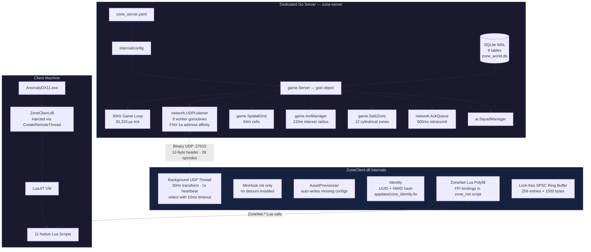
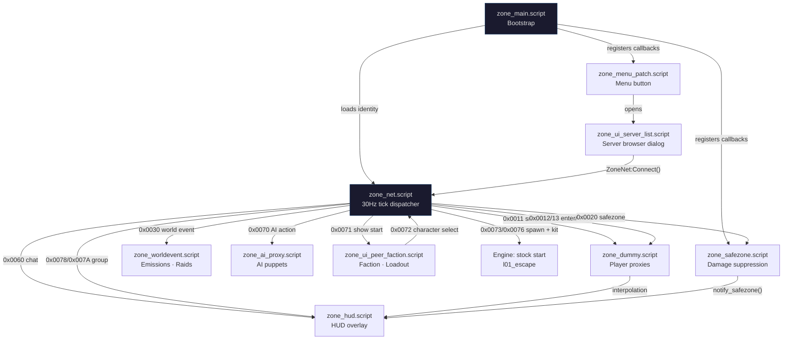
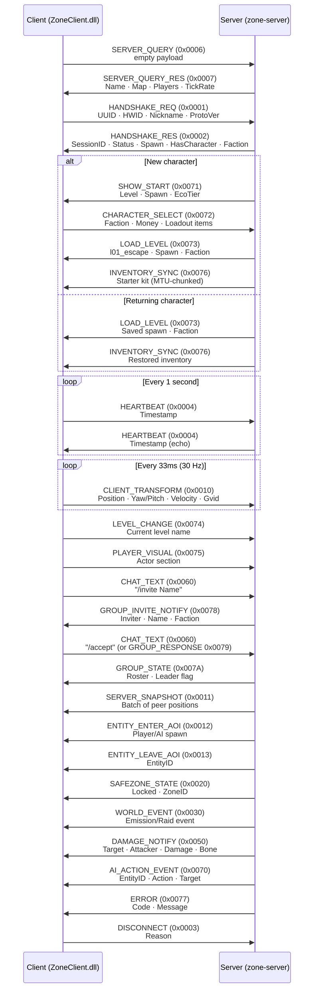

# Zone — S.T.A.L.K.E.R. Anomaly Multiplayer

[](https://golang.org)
[](https://isocpp.org)
[](https://github.com/themrdemonized/STALKER-Anomaly-modded-exes)
[](LICENSE)

**Zone** is a dedicated survival multiplayer architecture for **S.T.A.L.K.E.R. Anomaly 1.5.3**. It pairs a high-performance, authoritative Golang server with an autonomous, injectable C++ client DLL and native X-Ray UI — no proxy DLLs, no DirectX hooks, no external overlays.

---

## System Architecture


```mermaid
graph TB
    subgraph Server["Dedicated Go Server — zone-server"]
        direction TB
        YAML["zone_server.yaml"] --> CFG["internal/config"]
        CFG --> SRV["game.Server — god object"]
        SRV --> TICK["30Hz Game Loop<br/>33,333 µs tick"]
        SRV --> UDP["network.UDPListener<br/>8 worker goroutines<br/>FNV-1a address affinity"]
        SRV --> SPATIAL["game.SpatialGrid<br/>64m cells"]
        SRV --> AOI["game.AoIManager<br/>220m interest radius"]
        SRV --> SZ["game.SafeZone<br/>12 cylindrical zones"]
        SRV --> ACK["network.AckQueue<br/>500ms retransmit"]
        SRV --> AI["ai.SquadManager"]
        DB[("SQLite WAL<br/>8 tables<br/>zone_world.db")] --- SRV
    end

    subgraph Client["Client Machine"]
        EXE["AnomalyDX11.exe"] --> DLL["ZoneClient.dll<br/>injected via CreateRemoteThread"]
        DLL --> LUA["LuaJIT VM"]
        LUA --> SCRIPTS["11 Native Lua Scripts"]
    end

    subgraph DLLInternals["ZoneClient.dll Internals"]
        NET["Background UDP Thread<br/>30Hz transform · 1s heartbeat<br/>select with 10ms timeout"]
        HOOK["MinHook init only<br/>no detours installed"]
        PROV["AssetProvisioner<br/>auto-writes missing configs"]
        ID["Identity<br/>UUID + HWID hash<br/>appdata/zone_identity.ltx"]
        BIND["ZoneNet Lua Polyfill<br/>FFI bindings in zone_net.script"]
        RING["Lock-free SPSC Ring Buffer<br/>256 entries × 1500 bytes"]
    end

    UDP <-.->|"Binary UDP :27015<br/>12-byte header · 28 opcodes"| NET
    BIND <-.->|"ZoneNet.* Lua calls"| SCRIPTS

    style Server fill:#1a1a2e,stroke:#0f3460,color:#e0e0e0
    style Client fill:#1a1a2e,stroke:#0f3460,color:#e0e0e0
    style DLLInternals fill:#16213e,stroke:#533483,color:#e0e0e0
```

---

## Key Highlights

- **Headless Authoritative Daemon (`zone-server`)** — Written in Go for native concurrency and low memory footprint. Ticks at **30 Hz** by default (33,333 µs; **configurable via `tick_rate_hz`**), managing a 64m spatial grid, 220m Area of Interest radius, and two-tier AI simulation. Runs on Windows and Linux.

- **Embedded SQLite Persistence** — Zero external DB dependencies (no Postgres, Redis, or Docker). Operates in Write-Ahead Logging (WAL) mode. Async write-behind queue (buffered channel, capacity 1000) is wired into the game loop for non-blocking DB writes.

- **Autonomous Zero-Touch Client (`ZoneClient.dll`)** — Injected into Anomaly via `CreateRemoteThread` + `LoadLibraryW`. The injector stages `ZoneClient.dll` next to the game executable (so `ffi.load("ZoneClient")` resolves) and, in `--launch` mode, pre-provisions all 19 Zone gamedata files into the game root before the engine starts. The DLL also contains an embedded `AssetProvisioner` that provisions DLTX configs (`mod_system_zone_online.ltx` is overwritten; `mod_system_zone_faction_relations.ltx` and `system.ltx_patch.ltx` are written only if missing so local edits survive), UI layouts (`zone_ui_server_list.xml`, `ui_mm_zone_peer_faction.xml`, `zone_ui_chat.xml`) and localization (`text/{eng,rus}/ui_zone.xml`) on attach; scripts, the Zone-owned online config, UI XML and text are overwritten atomically (temp + `MoveFileEx`) to match the DLL.

- **Seamless Join to `l01_escape`** — A new player handshakes, receives `SHOW_START` (`0x0071`), and is taken straight into the native faction/loadout dialog; the server validates the choice, creates the character plus starter inventory in SQLite, then sends `LOAD_LEVEL` (`0x0073`) and `INVENTORY_SYNC` (`0x0076`). The client starts the stock singleplayer level, applies faction, spawn position and inventory, and keeps a pending-join marker across the Lua VM restart. Returning players skip the dialog and go directly to their spawn. Only `l01_escape` is hosted; arbitrary level loading is an engine limitation tracked in [ROADMAP.md](ROADMAP.md).

- **Native X-Ray UI** — Zero external overlay layers or DirectX Present hooks. Injects a native `CUI3tButton` on the main menu via Lua script, opening a native `CUIScriptWnd` Server Browser with Internet/LAN/Favorites/Direct Connect tabs and a fully asynchronous server query (`ZN_QueryStart`/`ZN_QueryPoll`/`ZN_QueryCancel`) that never blocks the UI thread, streams rows in as replies arrive, aborts stale scan generations, dims stale/offline servers with retry backoff, and provides sortable headers, name/map/ping filters, a details pane with protocol version and tick rate, atomic favorites (up to 32) and history (up to 20), extended keyboard navigation, and double-click-to-connect. The faction/loadout dialog is a native X-Ray window defined in `ui_mm_zone_peer_faction.xml`. All widgets use stock Anomaly textures; Zone ships no custom textures, and UI strings are localized in `gamedata/configs/text/{eng,rus}/ui_zone.xml`.

- **Server-Authoritative Faction Relations** — The vanilla Anomaly `[communities_relations]` matrix is embedded in the Go build, seeded into the `faction_relations` SQLite table, and reloaded on startup so operator edits win. Values run from `-2000` (enemy) through `0` (neutral) to `+300`/`+2000` (ally); `actor_`-prefixed community ids are normalized. The same matrix ships as `gamedata/configs/mod_system_zone_faction_relations.ltx` (a DLTX `mod_system_` file auto-merged by the engine) for the client HUD. Damage between the same faction or the same group is rejected server-side, while safe zones stay faction-agnostic.

- **Mixed-Faction Groups & Social HUD** — `/invite`, `/accept`, `/decline`, `/leave` and `/group` chat commands drive party state, with reliable `GROUP_INVITE_NOTIFY` (`0x0078`), `GROUP_RESPONSE` (`0x0079`) and `GROUP_STATE` (`0x007A`) packets. Groups default to 4 players (wire capacity 8), invitations expire after 60 s, groups may mix factions, and the leader leaving dissolves the group. The native HUD adds a nearby-players panel with relation colors, a group roster, invite notices and a chat bar with fading history (`zone_ui_chat.xml`), localized in English and Russian.

- **Cubic Hermite Spline Interpolation** — Remote stalker proxies are smoothed using Catmull-Rom tangent estimation with a **100ms jitter buffer** and an 8-sample position history ring buffer, eliminating stuttering and rubberbanding.

- **Cylindrical Safe Zones** — 12 canonical Zone locations (seeded into the DB and loaded at startup) enforce weapon holstering, fire-input blocking, damage immunity in both directions (neither a protected actor nor their attacker deals or receives damage inside), and client-side AI hostility suppression so NPCs and mutants do not acquire targets while either side stands in a zone, plus PDA alerts on entry/leave. Server-authoritative boundary checks use 2D distance + vertical half-extent. Safe zones are faction-agnostic: protection does not depend on faction, group membership or war state.

- **Lock-Free Networking** — Client uses a single-producer/single-consumer ring buffer (256 entries) for received packets. Server dispatches packets across 8 worker goroutines using FNV-1a hash of the client address for per-client ordering guarantees.

- **Admin Server (Named Pipe)** — Windows named pipe (`\\.\pipe\zone_admin`) with Unix socket fallback (`/tmp/zone_admin.sock`). Supports `status`, `kick <session_id>`, `ban <uuid> <reason>`, and `broadcast <message>` commands. Wired into server startup with graceful shutdown.

- **Economy System** — Full buy/sell transactional economy backed by SQLite. Ruble currency with balance queries, atomic buy (deduct + inventory insert) and sell (inventory remove + credit) operations, and tier progression tracking per character.

- **Stash Manager** — World stash CRUD with JSON-serialized item contents. Supports save, open/close sessions per player, and add/deduct item counts with underflow protection. DB-backed via `world_stashes` table.

---

## Repository Structure

```
zone-online/
├── zone-server/                 # Golang dedicated survival server
│   ├── cmd/server/main.go       # Entrypoint: wires config, DB, game loop, UDP
│   ├── internal/
│   │   ├── ai/                  # Squad manager (stub), A* pathfinding (complete)
│   │   ├── config/              # YAML configuration loader
│   │   ├── database/            # SQLite schema (8 tables), CRUD, async write queue, stash + ban ops
│   │   ├── game/                # 30Hz ticker, spatial grid, safe zones, AoI, events, economy, stashes, admin
│   │   ├── network/             # UDP listener (8 workers), sessions, reliable ACK queue
│   │   └── protocol/            # Binary wire protocol (28 opcodes, 12-byte header)
│   └── zone_server.yaml         # Server configuration
│
├── zone-client/                 # C++ injectable client DLL + automated injector
│   ├── 3rdparty/lua/            # LuaJIT C API headers (reference only; not compiled)
│   ├── injector/                # Win32 injector (--launch, --wait, --pid; DLL staging + gamedata pre-provisioning)
│   └── src/
│       ├── main.cpp             # DllMain: MinHook init (no detours), Identity, AssetProvisioner
│       ├── identity/            # UUID + HWID persistence (appdata\zone_identity.ltx under the game root)
│       ├── lua/                 # 21 ZN_* exports consumed via LuaJIT FFI
│       ├── net/                 # UDP client: background thread, state machine, ring buffer
│       ├── protocol/            # Packed binary structs (#pragma pack(push, 1))
│       └── provision/           # Auto-provisions DLTX configs + UI XML on first inject
│
├── gamedata/                    # Native X-Ray configs & scripts for Anomaly 1.5.3
│   ├── configs/
│   │   ├── mod_system_zone_online.ltx      # DLTX proxy stalker definition
│   │   ├── system.ltx_patch.ltx            # Supplementary patch (net_spawn_flags)
│   │   ├── mod_system_zone_faction_relations.ltx  # DLTX-merged client HUD relation matrix
│   │   ├── ui/zone_ui_server_list.xml      # Server browser dialog layout
│   │   ├── ui/ui_mm_zone_peer_faction.xml  # Faction/loadout dialog layout
│   │   ├── ui/zone_ui_chat.xml             # Chat input bar layout
│   │   └── text/{eng,rus}/ui_zone.xml      # Zone localization strings
│   └── scripts/
│       ├── zone_main.script              # Bootstrap, identity, save/load veto, SHOW_START owner
│       ├── zone_net.script               # ZoneNet FFI polyfill, 30Hz tick, packet dispatcher, join flow
│       ├── zone_dummy.script             # Remote player proxies + Hermite spline interpolation
│       ├── zone_safezone.script          # Weapon holster, fire block, damage cancel, AI suppression
│       ├── zone_hud.script               # HUD status overlay, PDA news
│       ├── modxml_zone_main_menu.script  # XML patch: injects the "Zone" button
│       ├── zone_menu_patch.script        # Menu button behavior + menu-safe packet pump
│       ├── zone_ui_server_list.script    # Server browser (tabs, LAN scan, favorites, history)
│       ├── zone_ui_peer_faction.script   # Faction grid + loadout selection dialog
│       ├── zone_ai_proxy.script          # Server-authoritative AI puppets
│       └── zone_worldevent.script        # Emission + mutant raid sync
│
├── Makefile                     # Root build orchestrator
├── INSTALL.md                   # Detailed installation and setup guide
└── README.md                    # This file
```

---

## Lua Scripting Layer

The client-side game logic is implemented entirely in native X-Ray Lua scripts. These communicate with the server through the `ZoneNet` global table — a Lua-side polyfill defined in `zone_net.script` that wraps FFI calls to the injected `ZoneClient.dll` exports.


```mermaid
graph TD
    BOOT["zone_main.script<br/>Bootstrap"] -->|"loads identity"| NET["zone_net.script<br/>30Hz tick dispatcher"]
    BOOT -->|"registers callbacks"| SAFE["zone_safezone.script<br/>Damage suppression"]
    BOOT -->|"registers callbacks"| MENU["zone_menu_patch.script<br/>Menu button"]

    MENU -->|"opens"| BROWSER["zone_ui_server_list.script<br/>Server browser dialog"]
    BROWSER -->|"ZoneNet:Connect()"| NET

    NET -->|"0x0011 snapshot"| DUMMY["zone_dummy.script<br/>Player proxies"]
    NET -->|"0x0012/13 enter/leave"| DUMMY
    NET -->|"0x0020 safezone"| SAFE
    NET -->|"0x0030 world event"| EVENT["zone_worldevent.script<br/>Emissions · Raids"]
    NET -->|"0x0060 chat"| HUD["zone_hud.script<br/>HUD overlay"]
    NET -->|"0x0078/0x007A group"| HUD
    NET -->|"0x0070 AI action"| AI["zone_ai_proxy.script<br/>AI puppets"]
    NET -->|"0x0071 show start"| FAC["zone_ui_peer_faction.script<br/>Faction · Loadout"]
    FAC -->|"0x0072 character select"| NET
    NET -->|"0x0073/0x0076 spawn + kit"| GAME["Engine: stock start<br/>l01_escape"]

    DUMMY -->|"interpolation"| HUD
    SAFE -->|"notify_safezone()"| HUD

    style BOOT fill:#1a1a2e,stroke:#0f3460,color:#e0e0e0
    style NET fill:#1a1a2e,stroke:#0f3460,color:#e0e0e0
```

| Script | Lines | Purpose |
|:---|:---:|:---|
| `zone_main` | 276 | Bootstrap entry point. Loads or generates `appdata\zone_identity.ltx` under the game root, calls `ZoneNet:Connect()` for auto-dial, registers the save/load veto and tick callbacks. Sole owner of `SHOW_START` handling: opens the faction/loadout dialog only when the server says this player still needs a character. |
| `zone_net` | 1224 | Core network layer. Defines the `ZoneNet` polyfill over 21 DLL exports via LuaJIT FFI, sends the player transform at 30 Hz, validates the 12-byte header, and dispatches every opcode. Owns the join/spawn flow (`0x0071`/`0x0073`/`0x0076`/`0x0077`), level/visual reports, inventory materialization, chat send, and the menu-safe packet pump. |
| `zone_dummy` | 627 | Manages remote player proxy objects. Spawns alife stalkers, buffers 8 position samples, applies cubic Hermite (Catmull-Rom) interpolation with a 100ms jitter buffer every frame. Handles damage/kill propagation and exposes name/faction/nearby-player metadata to the HUD. |
| `zone_safezone` | 497 | Enforces safe-zone rules. Lowers/hides the weapon, blocks fire and quick-use binds, cancels damage involving a protected actor, and suppresses AI hostility (`xr_combat_ignore.is_enemy` wrap, `on_enemy_eval` override, monster enemy callback). Reconciled from both the packet state and the client atomic. |
| `zone_hud` | 1031 | Top-right `[ZO]` status indicator (Online / Safe Zone / Offline + ping, PDA news on transitions) plus the social overlay: nearby-players panel with relation colors, group roster, invite notices, and a chat bar with fading history backed by `zone_ui_chat.xml`. 1 Hz refresh, pcall-guarded against load/level-change crashes. |
| `modxml_zone_main_menu` | 150 | XML patch that injects `btn_zone_online` into `ui_mm_main.xml` / `ui_mm_main_16.xml`, resizes the menu list and disclaimer, and chains safely with xrRazom's main-menu patch. |
| `zone_menu_patch` | 112 | Handles the "Zone" button behavior. Wraps `ui_main_menu.main_menu` Update/OnButton, opens the browser, and keeps the menu-safe packet pump running while the menu is up. |
| `zone_ui_server_list` | 2576 | Full `CUIScriptWnd` server browser with Internet/LAN/Favorites/Direct Connect tabs. Fully async scan via `ZN_QueryStart`/`ZN_QueryPoll`/`ZN_QueryCancel` with scan generations and abort, incremental rows, LAN broadcast probe, stale/offline states with retry backoff, sortable headers, name/map/ping filters, a details pane (protocol + tick rate), atomic favorites (max 32) and history (max 20) persisted in `appdata\zone_identity.ltx`, and double-click-to-connect. |
| `zone_ui_peer_faction` | 612 | Faction grid + loadout selection dialog (`ui_mm_zone_peer_faction.xml`). Shows 9 base factions (plus optionally unlocked renegade/greh/isg), point-budgeted loadout from `new_game_loadouts.ltx`, and sends `CHARACTER_SELECT`. |
| `zone_ai_proxy` | 212 | Spawns server-authoritative AI puppets. Handles entity enter (NPC/mutant), AI action events (attack, death), and entity leave. |
| `zone_worldevent` | 142 | Handles emission warnings (`0x01`), active emissions (`0x02`), clear (`0x03`), raid start (`0x04`), and raid end (`0x05`). Triggers weather changes and siren sounds. |

---

## Binary UDP Protocol

All communication occurs over UDP port `27015` using packed little-endian binary structures.

### 12-Byte Header Format

```
 0                   1                   2                   3
 0 1 2 3 4 5 6 7 8 9 0 1 2 3 4 5 6 7 8 9 0 1 2 3 4 5 6 7 8 9 0 1
+-+-+-+-+-+-+-+-+-+-+-+-+-+-+-+-+-+-+-+-+-+-+-+-+-+-+-+-+-+-+-+-+
|       Magic (0x5A4F "ZO")     |  Protocol(1)  |  Flags/Chan   |
+-+-+-+-+-+-+-+-+-+-+-+-+-+-+-+-+-+-+-+-+-+-+-+-+-+-+-+-+-+-+-+-+
|                    Sequence Number (uint32)                   |
+-+-+-+-+-+-+-+-+-+-+-+-+-+-+-+-+-+-+-+-+-+-+-+-+-+-+-+-+-+-+-+-+
|        Opcode (uint16)        |     Payload Length (uint16)   |
+-+-+-+-+-+-+-+-+-+-+-+-+-+-+-+-+-+-+-+-+-+-+-+-+-+-+-+-+-+-+-+-+
```

**Flags:** `0x01` = Reliable, `0x02` = Unreliable, `0x04` = Compressed

### Connection Lifecycle


```mermaid
sequenceDiagram
    participant C as Client (ZoneClient.dll)
    participant S as Server (zone-server)

    C->>S: SERVER_QUERY (0x0006)<br/>empty payload
    S->>C: SERVER_QUERY_RES (0x0007)<br/>Name · Map · Players · TickRate

    C->>S: HANDSHAKE_REQ (0x0001)<br/>UUID · HWID · Nickname · ProtoVer
    S->>C: HANDSHAKE_RES (0x0002)<br/>SessionID · Status · Spawn · HasCharacter · Faction

    alt New character
        S->>C: SHOW_START (0x0071)<br/>Level · Spawn · EcoTier
        C->>S: CHARACTER_SELECT (0x0072)<br/>Faction · Money · Loadout items
        S->>C: LOAD_LEVEL (0x0073)<br/>l01_escape · Spawn · Faction
        S->>C: INVENTORY_SYNC (0x0076)<br/>Starter kit (MTU-chunked)
    else Returning character
        S->>C: LOAD_LEVEL (0x0073)<br/>Saved spawn · Faction
        S->>C: INVENTORY_SYNC (0x0076)<br/>Restored inventory
    end

    loop Every 1 second
        C->>S: HEARTBEAT (0x0004)<br/>Timestamp
        S->>C: HEARTBEAT (0x0004)<br/>Timestamp (echo)
    end

    loop Every 33ms (30 Hz)
        C->>S: CLIENT_TRANSFORM (0x0010)<br/>Position · Yaw/Pitch · Velocity · Gvid
    end

    C->>S: LEVEL_CHANGE (0x0074)<br/>Current level name
    C->>S: PLAYER_VISUAL (0x0075)<br/>Actor section

    C->>S: CHAT_TEXT (0x0060)<br/>"/invite Name"
    S->>C: GROUP_INVITE_NOTIFY (0x0078)<br/>Inviter · Name · Faction
    C->>S: CHAT_TEXT (0x0060)<br/>"/accept" (or GROUP_RESPONSE 0x0079)
    S->>C: GROUP_STATE (0x007A)<br/>Roster · Leader flag

    S->>C: SERVER_SNAPSHOT (0x0011)<br/>Batch of peer positions
    S->>C: ENTITY_ENTER_AOI (0x0012)<br/>Player/AI spawn
    S->>C: ENTITY_LEAVE_AOI (0x0013)<br/>EntityID
    S->>C: SAFEZONE_STATE (0x0020)<br/>Locked · ZoneID
    S->>C: WORLD_EVENT (0x0030)<br/>Emission/Raid event
    S->>C: DAMAGE_NOTIFY (0x0050)<br/>Target · Attacker · Damage · Bone
    S->>C: AI_ACTION_EVENT (0x0070)<br/>EntityID · Action · Target
    S->>C: ERROR (0x0077)<br/>Code · Message

    C->>S: DISCONNECT (0x0003)<br/>Reason
```

### Opcode Reference

| Opcode | Name | Dir | Payload |
|:---:|:---|:---:|:---|
| `0x0001` | `PKT_HANDSHAKE_REQ` | C→S | UUID (37B), HWID (32B SHA-256), Nickname (32B), ProtoVer (1B) |
| `0x0002` | `PKT_HANDSHAKE_RES` | S→C | SessionID (4B), Status (1B: 0=ok/1=full/2=banned/3=version), SpawnXYZ (12B), WorldTime (8B), EcoTier (1B), HasCharacter (1B), Faction (16B) |
| `0x0003` | `PKT_DISCONNECT` | Both | Reason (1B) |
| `0x0004` | `PKT_HEARTBEAT` | Both | Timestamp (8B) |
| `0x0005` | `PKT_ACK` | Both | Sequence (4B) |
| `0x0006` | `PKT_SERVER_QUERY` | C→S | Empty. Answered without creating a session |
| `0x0007` | `PKT_SERVER_QUERY_RES` | S→C | 70B fixed: Name (32B), Map (32B), Players (1B), MaxPlayers (1B), Mode (1B), Locked (1B), ProtoVer (1B), TickRateHz (1B) |
| `0x0010` | `PKT_CLIENT_TRANSFORM` | C→S | 29B: SessionID (4B), PosXYZ (12B), Yaw/Pitch (4B), VelXYZ (6B), AnimFlags (1B), Gvid (2B) |
| `0x0011` | `PKT_SERVER_SNAPSHOT` | S→C | Peer Count (1B), sparse array of up to 32 × 22B: SessionID, PosXYZ, Yaw/Pitch, AnimFlags, Health |
| `0x0012` | `PKT_ENTITY_ENTER_AOI` | S→C | 132B (v3): EntityID (4B), Type (1B: 0=AI squad, 1=player), Section (64B), PosXYZ (12B), Faction (16B), Health (1B), Gvid (2B), Name (32B) |
| `0x0013` | `PKT_ENTITY_LEAVE_AOI` | S→C | EntityID (4B) |
| `0x0020` | `PKT_SAFEZONE_STATE` | S→C | Locked (1B: 0=free, 1=locked), ZoneID (32B) |
| `0x0030` | `PKT_WORLD_EVENT` | S→C | EventType (1B), State (1B), Timer (4B) |
| `0x0040` | `PKT_STASH_INTERACT` | C→S | StashID (4B), Action (1B: 1=Open/2=Take/3=Store), ItemSection (32B), Count (2B) |
| `0x0041` | `PKT_STASH_RESPONSE` | S→C | StashID (4B), Status (1B: 0=OK/1=NotFound/2=Error), Count (2B), Data (256B JSON contents on Open) |
| `0x0050` | `PKT_DAMAGE_NOTIFY` | Both | TargetSessionID (4B), AttackerSessionID (4B), Damage (4B float), BoneID (1B) |
| `0x0060` | `PKT_CHAT_TEXT` | Both | SenderID (4B), Length (1B), Message Text (up to 255B) |
| `0x0070` | `PKT_AI_ACTION_EVENT` | S→C | EntityID (4B), Action (1B: Idle/Patrol/Attack/Flee/Death), TargetID (4B) |
| `0x0071` | `PKT_SHOW_START` | S→C | Level (1B), SpawnXYZ (12B), Flags (1B), EcoTier (1B). Sent when the account has no character |
| `0x0072` | `PKT_CHARACTER_SELECT` | C→S | Faction (16B), Money (4B), Loadout items (256B `section:count,...`) |
| `0x0073` | `PKT_LOAD_LEVEL` | S→C | 30B: Level (1B), PosXYZ (12B), Faction (16B), EcoTier (1B) |
| `0x0074` | `PKT_LEVEL_CHANGE` | C→S | Level (32B). Client reports the level it is on |
| `0x0075` | `PKT_PLAYER_VISUAL` | C→S | Visual/actor section (64B) |
| `0x0076` | `PKT_INVENTORY_SYNC` | S→C | ItemCount (1B) + up to 16 × 70B entries: Section (64B), Count (2B), Condition (1B, %), Ammo (2B), Slot (1B, -1 unslotted). MTU-chunked |
| `0x0077` | `PKT_ERROR` | S→C | Code (1B: 1=invalid faction, 2=invalid loadout, 3=character creation failed), Message (96B) |
| `0x0078` | `PKT_GROUP_INVITE_NOTIFY` | S→C | 52B: InviterSessionID (4B), InviterName (32B), InviterFaction (16B). Reliable |
| `0x0079` | `PKT_GROUP_RESPONSE` | C→S | Accept (1B: 1=accept, 0=decline). Optional binary path; `/accept` and `/decline` chat commands carry the same intent |
| `0x007A` | `PKT_GROUP_STATE` | S→C | MemberCount (1B) + MemberCount × 53B (SessionID 4B, Name 32B, Faction 16B, IsLeader 1B). Empty group = 1 byte. Reliable |

Handshake `Status` surfaces distinct client errors via `ZN_GetLastError` (full/banned/version). Chat is level-filtered + rate-limited (5 msgs/5s per session), and carries the group commands (`/invite`, `/accept`, `/decline`, `/leave`, `/group`). Reliable inbound packets are ACKed immediately; replayed reliable sequences are dropped after ACK. `PKT_SERVER_QUERY` is answered from any source address without creating a session, and `PKT_INVENTORY_SYNC` is chunked to stay under the 1200-byte safe MTU. Damage between two players of the same faction or the same group is rejected; safe-zone protection is faction-agnostic.

---

## Quickstart

### 1. Start the Server
```bat
cd zone-server
go build -o zone-server.exe ./cmd/server
zone-server.exe
```

### 2. Build the Client
```bat
cd zone-client
cmake -S . -B build -G "Visual Studio 17 2022" -A x64
cmake --build build --config Release
```

### 3. Launch & Connect
Inject first, then use the in-game browser (the DLL must be loaded before the menu opens):
```bat
ZoneClient_Injector.exe --launch "C:\Anomaly\bin\AnomalyDX11.exe"
```
The injector stages `ZoneClient.dll` next to `AnomalyDX11.exe` and, under `--launch`, pre-provisions all 19 Zone gamedata files into the game root before the engine starts, so a first-time install works in one step. With `--wait` or `--pid` the game is already running and the engine has cached its filesystem mounts: the DLL is still staged, but first-time gamedata provisioning only takes effect after a game restart (relaunch through `--launch`). Keep `ZoneClient_Injector.exe`, `ZoneClient.dll` and the shipped `gamedata` tree together.

Once in the main menu:
1. Click the native **Zone** button below the menu options.
2. The browser scans asynchronously — rows stream in as servers answer, stale/offline entries dim and back off — and you can sort by name/map/players/ping/mode/proto/lock, filter by name/map/ping, or read protocol/tick details in the pane. Enter the server IP (default `127.0.0.1`), port (`27015`), and your callsign.
3. Click **Connect**. A new account is taken automatically into the faction/loadout dialog (`SHOW_START`); a returning account is loaded straight to its saved spawn. Pick a faction and loadout and click **Start**: the server creates the character and starter inventory, then the client starts `l01_escape`, applies the server spawn/faction, and materializes the sent inventory. The browser footer polls `ZoneNet:IsConnected()` (~2 Hz) while the handshake is pending; if it fails, it shows `Failed` after ~16s with the `ZN_GetLastError` reason. In game, press `Y` (or the configured `kXRR_CHAT` bind) to open chat; `/invite <name>` and `/accept` form a mixed-faction group of up to 4 players. Do not run xrRazom co-op at the same time — Zone refuses while co-op is live.

---

## Implementation Status

### Complete

| Subsystem | Notes |
|:---|:---|
| Config loading (YAML) | 13 keys: port, tick_rate_hz, max_players, db_path, log_level, emission_interval_min, admin_pipe, server_name, map_name, mode, locked, group_max_players, invite_ttl_sec. Complete bounds validation (`Validate()`); group size clamped to the wire capacity. |
| Database schema (8 tables) | accounts, characters, character_inventory, world_stashes, safe_zones, audit_log, faction_relations, ai_squads. WAL mode via pragma. |
| Database CRUD & Lifecycle | AutoProvision, LoadCharacter, SaveCharacter, FlushPlayerTransform, GetCharacterInventory (with `rows.Err()` checks), IsPlayerBanned, BanAccount, GetStash, SaveStash, UpdateStashContents, clean `Close()` method. |
| DB async write queue | `StartWriteQueue()` routes writes through buffered channel (cap 1000). Gracefully drains all pending jobs on server shutdown. |
| Safe zone seeding + detection | 12 cylindrical zones seeded into the DB on first startup, then loaded from `safe_zones` so operator edits apply on restart. 2D distance + height check. |
| UDP listener + worker pool | 8 goroutines, FNV-1a address affinity, sync.Pool buffer recycling, atomic dropped packet counter + warnings. |
| Session management | Dual-index map (by ID + by addr), cached slice for lock-free reads, 30s stale timeout, session ID collision cleanup. |
| Binary protocol read/write | 12-byte header, little-endian, 28 wire opcodes (27 declared in `opcodes.go` plus `0x0005` ACK in `packets.go`). `WritePacket` enforces the 1200-byte safe MTU and the uint16 payload ceiling. Sparse `ServerSnapshot` serialization; variable-length `GroupState` (1 + 53×N); `EntityEnterAoI` v3 at a fixed 132 bytes. Replay protection via per-session `LastSequence` (stale reliable dropped after ACK). |
| Reliable delivery (send + retransmit) | 500ms retransmit interval, 5 retries, checked each game tick. Client sends immediate `0x0005` ACK on reliable receipt; server ACKs inbound reliable packets the same way. |
| AI pathfinding (A*) | Full implementation with priority queue, 3D Euclidean heuristic, quantized integer waypoint keys, 5000-iteration ceiling. |
| Anti-Cheat & Transform Validation | Total 3D speed magnitude validation (`sqrt(vx^2 + vy^2 + vz^2) <= 25m/s`), NaN/Inf coordinate rejection, +/-10000 coordinate clamping. |
| Core Server Unit Test Suite | Comprehensive unit test suite in `server_test.go` covering `HandlePacket` (handshake, heartbeat, chat sanitization, transform bounds), `Tick` (exact 1s play time accumulation), `KickSession`, `BanPlayer`, `AntiCheat`. |
| LuaJIT Interop | No detours are installed: `MH_Initialize()` still runs at DLL startup, but there are no hooks, because the engine links LuaJIT statically and no runtime Lua module exists to hook. The `luaL_openlibs` detour path was removed; the `ZoneNet` table is a Lua-side polyfill in `zone_net.script` that loads the DLL with `ffi.load("ZoneClient")` and binds the 21 `ZN_*` exports. |
| Thread-Safe UDP Client | Background thread with `std::atomic<uint32_t>` sequence & session IDs, `std::mutex` socket send serialization, 10s server liveness watchdog, 5-retry handshake ceiling, graceful `PKT_DISCONNECT` on unload. |
| DLL Injection & Protection | 3 modes (--launch, --wait, --pid), CreateRemoteThread + LoadLibraryW, SeDebugPrivilege. Upfront injector/target bitness check + bounded Lua-readiness gate (LuaJIT module or main window, 30s). UAF-safe `VirtualFreeEx` timeout handling, PID preservation avoiding TOCTOU races. |
| Identity Persistence | UUID via UuidCreate, HWID via CryptoAPI SHA-256 over MachineGuid + ComputerName, persisted as canonical `[zone_identity]` keys (`client_uuid`, `hwid_hash`, `nickname`) in `<game root>\appdata\zone_identity.ltx` (the engine's `$app_data_root$`), not `%APPDATA%`. Every write merges only those three keys atomically (temp + `MoveFileExW`) and preserves all other content, so server-browser favorites and history survive identity updates. |
| Asset provisioning | DLTX configs written only if missing; scripts + UI XML overwritten atomically (temp + `MoveFileEx`). Robust `\bin` directory matching preventing over-stripping. |
| Lock-free SPSC ring buffer | 256 entries x 1500 bytes, atomic head/tail with acquire/release ordering, dropped packet tracking, capacity-checked event polling. |
| Player proxy interpolation | Cubic Hermite (Catmull-Rom), 100ms jitter buffer, O(1) ring buffer history, non-uniform time scaling, smooth edge interval handling. |
| Safe zone enforcement (client) | Damage nullification (`s_hit.power = 0` plus hard cancel), fire and quick-use input block, weapon lower/hide with per-frame re-holster, AI hostility suppression (`xr_combat_ignore.is_enemy` wrap, `on_enemy_eval` override, monster enemy callback), state reset on level change & disconnect. |
| Server browser UI | CUIScriptWnd with Internet/LAN/Favorites/Direct Connect tabs. Fully async scan (`ZN_QueryStart`/`ZN_QueryPoll`/`ZN_QueryCancel`, bounded poll budget per frame), scan generations + abort, incremental row widgets, stale/offline detection with two-failure rule and retry backoff, LAN broadcast probe, sortable headers (name/map/players/ping, Mode header cycles Mode→Proto→Lock), name/map/ping filters with hide-full/empty/locked, details pane with proto/tick, atomic favorites (max 32) and history (max 20) persisted in `appdata\zone_identity.ltx` (temp + rename, direct-write fallback), extended keyboard navigation, double-click-to-connect, nickname sanitization. Dialog stays open with `Connecting→Connected/Failed` footer (~2 Hz `IsConnected()` poll, 16s timeout); Connect gated on DLL-loaded (`ffi.load`) and xrRazom-idle. |
| Faction relations matrix | Vanilla `[communities_relations]` pairs embedded in Go, seeded into `faction_relations` and loaded on startup (operator edits win). Keys normalized (`actor_` prefix, case); lookup via `RelationBetween`. Same-faction and same-group damage rejected server-side; safe zones faction-agnostic. |
| Group system (0x0078/0x0079/0x007A) | `GroupManager` with join-ordered rosters and leader tracking. Chat commands `/invite`, `/accept`, `/decline`, `/leave`, `/group`; default max 4 members (clamped to the 8-member wire capacity); 60 s invite TTL swept each tick; new groups created on first accept; leader leave (or a roster dropping to one) dissolves the group; reliable invite notification and full-roster state broadcast to members; mixed-faction groups allowed. |
| Social HUD overlay | CUIStatic at top-right (1 Hz) showing `[ZO] Online` / `Safe Zone` / `Offline` with ping, plus nearby-players panel with relation colors, group roster with leader marker, invite notice, and chat bar + fading history (`zone_ui_chat.xml`, `Y` / `kXRR_CHAT` toggle). Dynamic resolution/aspect tracking, PDA news on transitions, pcall-guarded engine calls, full reset on level change/destroy. |
| World event sync | Emission warn/active/clear, raid start/end. 6-byte wire protocol (`eventType`, `state`, `timer`), weather changes + siren sounds, nil-safe audio objects, state reset on disconnect. |
| Economy & Stash systems | Buy/sell transactions, ruble currency, atomic balance checks, tier progression, unmarshal-safe stash CRUD without lock starvation. Stash access is 5m + same-level + passcode-gated, fail-closed (no passcode field on the wire yet, so locked stashes reject). |
| Admin server (named pipe & Unix socket) | Windows named pipe + Unix socket fallback with 0600 permissions and configurable path. Commands: `status`, `kick`, `ban`, `broadcast`. Per-connection token auth (one client's `auth` never unlocks others), 50ms exponential accept backoff. |
| Per-IP Rate Limiting | Token bucket per client IP (100 pkt/s, burst 150) in raw UDP ingestion loop with 60s idle cleanup, early-dropping flood traffic before worker queue. |
| Chat (level-filtered + rate-limited) | Sender-ID forgery rejected, 5 msgs/5s per-session limit, sanitized UTF-8, broadcast to sender's level only (admin sender 0 still global). |
| Client Reliable ACK Engine | Immediate `Opcode::ACK` (0x0005) dispatch on receiving reliable packets (`flags & 0x01`), halting server retransmission timeouts. |
| Seamless join flow (0x0071/0x0072/0x0073/0x0076) | New account: `SHOW_START` → native faction/loadout dialog → server validates faction/loadout, creates the character and starter inventory in SQLite → `LOAD_LEVEL` + `INVENTORY_SYNC`. Returning account: `LOAD_LEVEL` + inventory directly. Client persists a pending-join marker across the Lua VM restart and applies faction/spawn/kit once the level loads. |
| Server query (0x0006/0x0007) | Answered from any source address without creating a session; returns name, map, player/max counts, mode, lock state, protocol version and tick rate in a frozen 70-byte payload. |
| Level & visual replication (0x0074/0x0075) | Client reports its level on change and actor section at 1 Hz or on change; server validates the level whitelist, sanitizes the visual and broadcasts entity enter to peers. |
| Anti-Combat Logging Sleeper System | Spawns authoritative 30-second sleeper proxy entities on explicit disconnect AND 30s timeout outside safe zones or during active combat; persists damage and death to database. |
| Server-Authoritative Combat & Damage Rules | Validates attack distance (300m ceiling), enforces safe zone damage immunity for attacker and target, clamps damage, tracks 30-second combat engagement status. |
| Session Authentication & Ban Enforcement | Validates session IDs and tokens on incoming client packets; handshake returns Status 0/1/2/3 (ok/full/banned/version) with distinct `ZN_GetLastError` client errors. |
| Periodic 60s DB Checkpointing | Replaced 30Hz per-transform DB writes with in-memory session tracking, flushing dirty sessions on 60-second intervals, safe zone transitions, and disconnects (>98% I/O reduction). |
| CI/CD Pipeline | Automated GitHub Actions workflow (`ci.yml`) testing Go server with race detection (`go test -race ./...`) and building client Release DLL with MSVC on Windows. |

### Validation

Recorded against the current tree:

- **12-client UDP load test — passed.** Twelve concurrent simulated clients completed handshakes against one server, exchanged roughly 4,200 snapshots, exercised the group invite/accept/state round-trip end to end, and survived 300 deliberately malformed packets with no panics.
- **Go test suite — green.** `go test ./...` passes locally (protocol, config, database, game, network, ai); CI additionally runs `go test -race ./...`.
- **Lua scripts — 11/11 parse under LuaJIT 2.1.**
- **XML configs — parse clean** (server browser, faction dialog, chat bar, en/ru localization).
- **MSVC Release builds — clean** (`ZoneClient.dll` and `ZoneClient_Injector.exe`).
- **Research passes — completed** against Unturned (source released 2026), Luanti/Minetest, Valve A2S and DDNet; the findings feed the production backlog in [ROADMAP.md](ROADMAP.md).

---

## What Works / What Is Next

**Works today:** dedicated Go server on UDP `:27015` with the binary protocol at payload revisions v2/v3; seamless join and server-created characters on `l01_escape`; client-side proxy rendering and interpolation of remote players; authoritative cylindrical safe zones with weapon holstering, damage immunity (faction-agnostic) and client-side AI hostility suppression; server-authoritative faction relations with same-faction/same-group friendly-fire rejection; mixed-faction groups with invite/accept/leave and a social HUD (nearby players, group roster, chat bar); level/visual replication; chat; economy and stash backend; async server browser; server query; admin named pipe.

**Next:** two-client runtime verification on a live install (the stability gate); packaging and tagging for the next release (localization + relation config in the dist, checksums, version stamping); UI polish from the research passes; arbitrary-level loading (blocked by the engine — a menu start runs the stock `all.spawn` registry and no Lua API loads an arbitrary level by name); full inventory sync (client→server item moves, containers, trader stock); server-authoritative NPC/AI damage once AI simulation exists.

See [ROADMAP.md](ROADMAP.md) for the full production roadmap, including faction warfare design, persistence rules, infrastructure and known gaps.

---

## License

This project is licensed under the MIT License. S.T.A.L.K.E.R. and X-Ray Engine are trademarks of GSC Game World.

