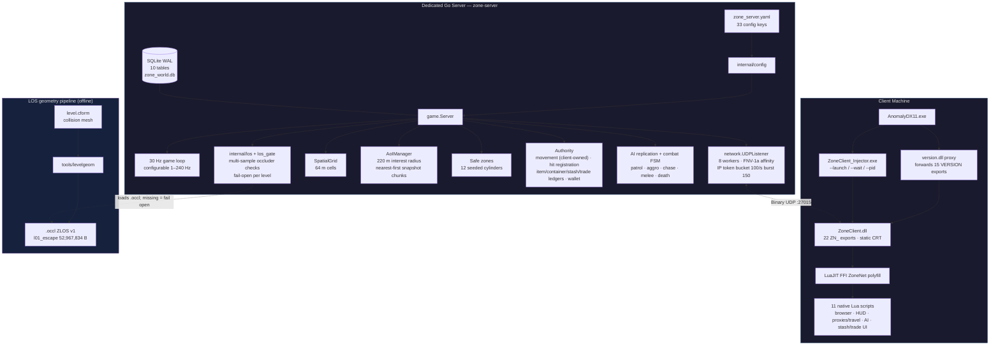

# Zone — S.T.A.L.K.E.R. Anomaly Multiplayer

[](https://golang.org)
[](https://isocpp.org)
[](https://github.com/themrdemonized/STALKER-Anomaly-modded-exes)
[](LICENSE)

**Zone** is a dedicated survival multiplayer architecture for **S.T.A.L.K.E.R. Anomaly 1.5.3**. It pairs a high-performance, authoritative Golang server with an autonomous C++ client DLL and native X-Ray UI — no DirectX hooks, no external overlays. The client installs either as a drop-in `version.dll` proxy (recommended) or through the `ZoneClient_Injector.exe` injector.

This tree carries the **v0.6.0 package** (the movement-unpoliced build prepared for the first live player test) plus the level-travel, AI-combat, line-of-sight gating and stash/trade/wallet waves developed on `feature/travel-ai-stash-trade`. The in-tree `dist/zone-online-v0.6.0` folder is the v0.6.0 snapshot; the v0.7.0 package that adds these newer waves is not assembled yet. Status of each wave is recorded below and in the linked documents.

---

## System Architecture


```mermaid
graph TB
    subgraph Server["Dedicated Go Server — zone-server"]
        direction TB
        YAML["zone_server.yaml<br/>33 config keys"] --> CFG["internal/config"]
        CFG --> SRV["game.Server"]
        SRV --> TICK["30 Hz game loop<br/>configurable 1–240 Hz"]
        SRV --> UDP["network.UDPListener<br/>8 workers · FNV-1a affinity<br/>IP token bucket 100/s burst 150"]
        SRV --> GRID["SpatialGrid<br/>64 m cells"]
        SRV --> AOI["AoIManager<br/>220 m interest radius<br/>nearest-first snapshot chunks"]
        SRV --> SZ["Safe zones<br/>12 seeded cylinders"]
        SRV --> AUTH["Authority<br/>movement (client-owned) · hit registration<br/>item/container/stash/trade ledgers · wallet"]
        SRV --> AIR["AI replication + combat FSM<br/>patrol · aggro · chase · melee · death"]
        SRV --> LOSM["internal/los + los_gate<br/>multi-sample occluder checks<br/>fail-open per level"]
        DB[("SQLite WAL<br/>10 tables<br/>zone_world.db")] --- SRV
    end

    subgraph Client["Client Machine"]
        EXE["AnomalyDX11.exe"] --> PROXY["version.dll proxy<br/>forwards 15 VERSION exports"]
        EXE --> INJ["ZoneClient_Injector.exe<br/>--launch / --wait / --pid"]
        PROXY --> DLL["ZoneClient.dll<br/>22 ZN_ exports · static CRT"]
        INJ --> DLL
        DLL --> LUA["LuaJIT FFI ZoneNet polyfill"]
        LUA --> SCRIPTS["11 native Lua scripts<br/>browser · HUD · proxies/travel · AI · stash/trade UI"]
    end

    subgraph Geometry["LOS geometry pipeline (offline)"]
        CFORM["level.cform<br/>collision mesh"] --> LG["tools/levelgeom"]
        LG --> OCCL[".occl ZLOS v1<br/>l01_escape 52,967,834 B"]
    end

    UDP <-.->|"Binary UDP :27015"| DLL
    LOSM -.->|"loads <level>.occl; missing = fail open"| OCCL

    style Server fill:#1a1a2e,stroke:#0f3460,color:#e0e0e0
    style Client fill:#1a1a2e,stroke:#0f3460,color:#e0e0e0
    style Geometry fill:#16213e,stroke:#533483,color:#e0e0e0
```

---

## Key Highlights

- **Headless Authoritative Daemon (`zone-server`)** — Written in Go for native concurrency and low memory footprint. Ticks at **30 Hz** by default (configurable 1–240 Hz via `tick_rate_hz`), managing a 64 m spatial grid, a 220 m Area of Interest radius, and two-tier AI simulation. Runs on Windows and Linux.

- **Embedded SQLite Persistence** — Zero external DB dependencies. WAL mode with `synchronous=NORMAL`, a 64 MB page cache, foreign keys enforced, and a single serialized writer. **10 tables**: `accounts`, `characters`, `character_inventory`, `world_items`, `schema_version`, `world_stashes`, `safe_zones`, `audit_log`, `faction_relations`, `ai_squads`. An async write-behind queue (capacity 1000) drains on shutdown.

- **Client-Authoritative Movement + Validated Hit Registration** (see [docs/AUTHORITY_MODEL.md](docs/AUTHORITY_MODEL.md)) — By owner decision the server does not police movement: finite, in-bounds transforms are accepted, and there is no speed/teleport validation, no position correction, no movement kicks and no lag-switch strikes. Receiver-side Hermite interpolation with a 100 ms jitter buffer is the only smoothing. Combat is validated instead: a client hit on a player proxy sends `OpDamageNotify` (0x0050) and cancels the local proxy damage; the server checks attacker session match, safe-zone immunity on either side, same faction/group, 3D range (≤ 300 m from the last known positions), damage sanity, a 150 single-hit clamp and a rolling 1 s `damage_budget_per_s` (400) budget, then relays the accepted hit to the victim only and audits it. The victim's client applies the validated damage to `db.actor` via `change_health` with a HUD notice. The authoritative item ledger (`OpItemAction` 0x007D / `OpItemUpdate` 0x007E) keeps client-monotonic ActionIDs, idempotent replay, rate limiting and transactional drop/pickup.

- **Inventory V2** (see [zone-server/docs/INVENTORY_V2.md](zone-server/docs/INVENTORY_V2.md)) — `OpContainerAction` (0x007F) / `OpContainerUpdate` (0x0080) deposit and withdraw against `world_stashes` rowids, with owner enforcement, per-packet access validation (no open-stash session state), atomic SQLite transactions through the shared stash manager, condition-bucket stacking, ammo-aware credits, forced inventory resync on rejection, and world-item persistence (AoI join sync, TTL sweep, per-level cap). The server side is complete; the native stash/trader windows use the position-keyed `0x0081`–`0x0085` path below, and no client UI drives the numeric `0x007F`/`0x0080` container ids yet.

- **Native Stash, Trader and Wallet** (see [docs/AUTHORITY_MODEL.md](docs/AUTHORITY_MODEL.md)) — `OpStashAction` (0x0081) / `OpStashResult` (0x0082) store into and take from position-keyed world stashes: the server rounds the client's XYZ onto a 0.5 m grid per level, creates the stash on first store and enforces a 5 m reach. `OpTradeAction` (0x0083) / `OpTradeResult` (0x0084) buy from and sell to traders against the authoritative ruble ledger; the client-asserted price is capped by `trade_max_money_delta` (200000) and a capped action is echoed as corrected. `OpWalletUpdate` (0x0085) pushes the character's absolute balance after every money change and on join, so the client's `db.actor` money reconciles. Stash and trade actions share the item-ledger ActionID floor, idempotent replay cache and `item_rate_per_s` budget, and are driven from the native inventory/trade windows.

- **AI Replication + Combat** (see [zone-server/docs/AI_REPLICATION.md](zone-server/docs/AI_REPLICATION.md)) — Four seeded `l01_escape` patrol squads (three stalker/bandit groups around the Cordon), simulated online while a same-level player is inside the leave radius (220 m default) and macro-stepped at 1 Hz offline. Replication uses 180 m enter / 220 m leave hysteresis, `ENTITY_ENTER_AOI` with `EntityType 0`, and `OpAIState` (0x007C) chunks capped at ~30 Hz. A server-side combat FSM adds aggro (40 m default), chase at run speed, melee attack (2.0 m reach, 1500 ms cooldown, 10 damage by default), an ALERT cool-down before patrol resumes, and corpse despawn after 5 s. Hostility comes from the persisted faction relation matrix (same faction never engages, monsters/neutrals engage everyone), and safe zones suppress engagement on both sides. A player hit on a puppet uses the same `OpDamageNotify` (0x0050) path with `TargetID >= 1_000_000`. No loot and no server-side pathfinding against level geometry yet; attack/death animation values stream from the FSM.

- **Server-Side Line-of-Sight Gating (enabled)** (see [zone-server/docs/LOS_GATING.md](zone-server/docs/LOS_GATING.md)) — `tools/levelgeom` parses `level.cform` collision data directly and emits the compact `ZLOS` v1 occluder; `internal/los` provides a zero-allocation, lock-free `SegmentBlocked` raycast with a hardened loader and fuzz coverage. The gate is wired into the shared damage handler and on by default (`los_enabled: true`, `los_data_dir: zone_los`): attacker eye to victim head/chest/pelvis samples, rejected only when all three segments are blocked, fail-open when `<level>.occl` is missing or corrupt with one warning per level. The `l01_escape` artifact is 52,967,834 B (2,949,773 of 2,949,775 triangles, SHA-256 in the geometry doc) and ships with the release package under `server/zone_los/` (not in git). Other levels fail open until their occluders are generated.

- **Autonomous Zero-Touch Client (`ZoneClient.dll`)** — Injected through the proxy or the injector. The DLL exposes **22 `ZN_*` exports** consumed through LuaJIT FFI and embeds an `AssetProvisioner` that writes missing configs and atomically refreshes scripts, UI XML and localization (19 Zone gamedata files in total). The third binary, `version.dll`, forwards all **15 `VERSION.dll` exports** to System32 and asynchronously loads `ZoneClient.dll` from its own directory, so drag-and-drop install needs no injector. All binaries use the static CRT; no Visual C++ redistributable is required.

- **Seamless Join and In-Game Travel** — A new player handshakes, receives `SHOW_START` (0x0071), and is taken straight into the native faction/loadout dialog; the server validates the choice, creates the character plus starter inventory in SQLite, then sends `LOAD_LEVEL` (0x0073) and `INVENTORY_SYNC` (0x0076). Returning players skip the dialog and spawn at their saved position. The initial menu start is still hard-wired to `l01_escape` (engine limitation), but once in game `OpLevelChange` (0x0074) switches between all installed levels: the server resets that session's grid/AoI/AI caches, exchanges per-level `ENTITY_ENTER_AOI`/`ENTITY_LEAVE_AOI` with peers, recomputes safe-zone state from the accepted position and re-sends world items in range. See [zone-server/docs/LEVEL_TRAVEL.md](zone-server/docs/LEVEL_TRAVEL.md).

- **Native X-Ray UI** — Zero overlay layers or DirectX Present hooks. A native `CUI3tButton` opens a native `CUIScriptWnd` Server Browser (Internet/LAN/Favorites/Direct Connect) with a fully asynchronous query (`ZN_QueryStart`/`ZN_QueryPoll`/`ZN_QueryCancel`), incremental rows, stale/offline retry backoff, sortable headers, filters, favorites/history and double-click-to-connect. The faction/loadout dialog, chat bar and social HUD are native XML/Lua windows.

- **Factions, Groups, Safe Zones** — The vanilla relation matrix seeds SQLite and ships as a DLTX config; same-faction and same-group damage is rejected. `/invite`, `/accept`, `/decline`, `/leave` and `/group` drive mixed-faction groups (default 4 players, 60 s invites, reliable 0x0078/0x0079/0x007A). Twelve cylindrical safe zones enforce weapon holstering, fire blocks, damage immunity in both directions and client-side AI hostility suppression.

- **48-Player Scaling** — Snapshot broadcasting chunks nearest-first so every peer is delivered exactly once across packets, pooled buffers and zero-allocation encode paths. The 48-session dense benchmark runs a full tick in **0.974 ms** (~3% of the 33.3 ms budget) with 980 B and 1 allocation per tick on a Ryzen 9 6900HX (numbers re-measured against this tree).

- **Player Isolation** — Accounts are keyed by client UUID; each account owns one character row and its own `character_inventory`. Position, faction, health, economy tier, rank, reputation, rubles and play time live on the character row, so progression and inventory are independent per account/character. A second session with the same account evicts the first rather than sharing state.

- **xrRazom Coexistence** — Both menu buttons are preserved and a single dormancy gate (`zone_main.xrr_is_active()`, which also checks `XrrNet`) disables every Zone subsystem while a co-op session is active. Input hooks never consume keys while co-op is live.

---

## Repository Structure

```
zone-online/
├── zone-server/                 # Golang dedicated survival server
│   ├── cmd/server/main.go       # Entrypoint: config + CLI overrides, DB, game loop, UDP
│   ├── internal/
│   │   ├── ai/                  # A* pathfinding, squad manager, puppet patrol + combat FSM
│   │   ├── config/              # YAML configuration loader (33 keys)
│   │   ├── database/            # SQLite schema (10 tables), item/world-item/stash transactions
│   │   ├── game/                # 30 Hz tick, hit registration, ledgers, level travel, AI combat, AoI, safe zones, groups
│   │   ├── los/                 # ZLOS occluder loader + segment raycast (hardened)
│   │   ├── network/             # UDP listener (8 workers), sessions, ACK queue, transform history
│   │   └── protocol/            # Binary wire protocol (35 opcodes, 12-byte header)
│   ├── tools/levelgeom/         # level.cform -> .occl converter
│   ├── docs/                    # AI_REPLICATION.md, INVENTORY_V2.md, LEVEL_TRAVEL.md, LOS_GATING.md
│   └── zone_server.yaml         # Server configuration
│
├── zone-client/                 # C++ client DLL + injector + proxy
│   ├── injector/                # Win32 injector (--launch, --wait, --pid, --dll, --ephemeral)
│   ├── src/
│   │   ├── main.cpp             # DllMain: identity, provisioning, UDP client startup
│   │   ├── identity/            # UUID + HWID persistence (appdata\zone_identity.ltx)
│   │   ├── lua/                 # 22 ZN_* exports consumed via LuaJIT FFI
│   │   ├── net/                 # UDP client: background thread, ring buffer, ACK engine
│   │   ├── protocol/            # Packed binary structs (#pragma pack(push, 1))
│   │   ├── provision/           # Embedded gamedata provisioning
│   │   └── proxy/               # version.dll drop-in proxy (15 forwarded exports)
│   └── CMakeLists.txt           # Static-CRT Release build
│
├── gamedata/                    # 19 Zone files for Anomaly 1.5.3
│   ├── configs/                 # DLTX patches, relation matrix, UI layouts, en/ru text
│   └── scripts/                 # 11 native X-Ray Lua scripts
│
├── docs/
│   ├── AUTHORITY_MODEL.md       # Movement, damage and item authority
│   ├── LOS_GEOMETRY.md          # cform/ZLOS pipeline, benchmarks, blockers
│   ├── PROJECT_BRIEF.md         # One-page project refresher
│   └── PRODUCTION_READINESS.md  # Production hardening backlog
│
├── Makefile                     # Root build orchestrator (server, client, test, dist)
├── INSTALL.md                   # Installation and configuration guide
└── README.md                    # This file
```

---

## Lua Scripting Layer

The client-side game logic is implemented entirely in native X-Ray Lua scripts. They communicate with the server through the `ZoneNet` global table — a Lua-side polyfill defined in `zone_net.script` that wraps FFI calls to the injected `ZoneClient.dll` exports.

| Script | Lines | Purpose |
|:---|:---:|:---|
| `zone_main` | 380 | Bootstrap entry point. Loads or generates `appdata\zone_identity.ltx`, registers the save/load veto and tick callbacks, owns the single xrRazom dormancy gate and the `SHOW_START` dialog flow. |
| `zone_net` | 2576 | Core network layer. Defines `ZoneNet` over 22 DLL exports via LuaJIT FFI, sends transforms at 30 Hz, validates the 12-byte header, and dispatches every opcode: join/spawn, level change, inventory sync, item/stash/trade/wallet ledgers with retransmits, damage notify, AI state, chat and the menu-safe packet pump. |
| `zone_dummy` | 928 | Remote player proxies and hit registration. Spawns alife proxies, buffers 8 position samples, applies cubic Hermite interpolation with a 100 ms jitter buffer, reports proxy hits to the server with 0x0050 (cancelling the local proxy damage), and applies server-validated damage to the local actor with a HUD notice. |
| `zone_safezone` | 621 | Safe-zone enforcement. Holsters the weapon, blocks only proven weapon binds while no UI or chat owns input, cancels damage involving a protected actor, suppresses AI hostility, and stays dormant under xrRazom. |
| `zone_hud` | 1121 | Top-right `[ZO]` status (Online / Safe Zone / Offline + ping), PDA news, nearby-players panel with relation colors, group roster, invite notices and chat bar with fading history. |
| `modxml_zone_main_menu` | 142 | XML patch injecting `btn_zone_online` into `ui_mm_main.xml` / `ui_mm_main_16.xml` while preserving other menu mods. |
| `zone_menu_patch` | 100 | Zone button behavior plus the menu-safe packet pump. |
| `zone_ui_server_list` | 2529 | Full `CUIScriptWnd` server browser: async scan, generation abort, LAN probe, stale/offline backoff, sortable headers, filters, details pane, favorites/history, double-click-to-connect. |
| `zone_ui_peer_faction` | 616 | Faction grid and point-budgeted loadout selection; sends `CHARACTER_SELECT`. |
| `zone_ai_proxy` | 572 | Server-authoritative AI puppets: spawn from `ENTITY_ENTER_AOI` (type 0), steer/rotate and play idle/walk/run/attack/death anims from `OpAIState` 0x007C, handle entity leave and pending-spawn retry. |
| `zone_worldevent` | 191 | Emission warnings/active/clear and raid start/end with weather and siren effects. |
| **Total** | **9776** | **11 scripts** |

---

## Binary UDP Protocol

All communication uses UDP port `27015` with packed little-endian structures. The header is 12 bytes:

```
 0                   1                   2                   3
 0 1 2 3 4 5 6 7 8 9 0 1 2 3 4 5 6 7 8 9 0 1 2 3 4 5 6 7 8 9 0 1
+-+-+-+-+-+-+-+-+-+-+-+-+-+-+-+-+-+-+-+-+-+-+-+-+-+-+-+-+-+-+-+-+
|       Magic (0x5A4F "ZO")     |  Protocol(1)  |  Flags/Chan   |
+ +-+-+-+-+-+-+-+-+-+-+-+-+-+-+-+-+-+-+-+-+-+-+-+-+-+-+-+-+-+-+-+
|                    Sequence Number (uint32)                   |
+ +-+-+-+-+-+-+-+-+-+-+-+-+-+-+-+-+-+-+-+-+-+-+-+-+-+-+-+-+-+-+-+
|        Opcode (uint16)        |     Payload Length (uint16)   |
+-+-+-+-+-+-+-+-+-+-+-+-+-+-+-+-+-+-+-+-+-+-+-+-+-+-+-+-+-+-+-+-+
```

Flags: `0x01` reliable, `0x02` unreliable, `0x04` compressed. `WritePacket` enforces the 1200-byte safe MTU and the uint16 payload ceiling.

### Opcode Reference (35 opcodes)

| Opcode | Name | Dir | Payload |
|:---:|:---|:---:|:---|
| `0x0001` | `HANDSHAKE_REQ` | C→S | 102 B: UUID[37], HWID SHA-256[32], Nickname[32], ProtocolVer (u8) |
| `0x0002` | `HANDSHAKE_RES` | S→C | 43 B: SessionID (u32), Status (u8), SpawnXYZ (f32×3), WorldTime (u64), EcoTier, HasCharacter, Faction[16] |
| `0x0003` | `DISCONNECT` | both | 1 B reason |
| `0x0004` | `HEARTBEAT` | both | 8 B timestamp |
| `0x0005` | `ACK` | both | 4 B sequence (declared in `packets.go`, not `opcodes.go`) |
| `0x0006` | `SERVER_QUERY` | C→S | 0 B; answered without creating a session |
| `0x0007` | `SERVER_QUERY_RES` | S→C | 70 B frozen: Name[32], Map[32], Players, MaxPlayers, Mode, Locked, ProtoVer, TickRateHz |
| `0x0010` | `CLIENT_TRANSFORM` | C→S | 29 B: SessionID, PosXYZ, Yaw/Pitch (i16), VelXYZ (i16), AnimFlags, Gvid (u16) |
| `0x0011` | `SERVER_SNAPSHOT` | S→C | 1 + 22×N B, N ≤ 32; nearest-first chunking |
| `0x0012` | `ENTITY_ENTER_AOI` | S→C | 132 B v3: EntityID, Type (0=AI, 1=player), Section[64], PosXYZ, Faction[16], Health, Gvid, Name[32] |
| `0x0013` | `ENTITY_LEAVE_AOI` | S→C | 4 B entity id |
| `0x0020` | `SAFEZONE_STATE` | S→C | 33 B: Locked (u8), ZoneID[32] |
| `0x0030` | `WORLD_EVENT` | S→C | 6 B: EventType, State, Timer (u32) |
| `0x0050` | `DAMAGE_NOTIFY` | both | 13 B: TargetID, AttackerID, Damage (f32), BoneID |
| `0x0060` | `CHAT_TEXT` | both | 260 B fixed struct (Len + text ≤ 255 B) |
| `0x0071` | `SHOW_START` | S→C | 15 B: Level, PosXYZ, Flags, EcoTier |
| `0x0072` | `CHARACTER_SELECT` | C→S | 276 B: Faction[16], Money, Items[256] |
| `0x0073` | `LOAD_LEVEL` | S→C | 30 B: Level, PosXYZ, Faction[16], EcoTier |
| `0x0074` | `LEVEL_CHANGE` | C→S | 32 B level name |
| `0x0075` | `PLAYER_VISUAL` | C→S | 64 B actor section |
| `0x0076` | `INVENTORY_SYNC` | S→C | 1 + 70×N B, N ≤ 16 per MTU-safe chunk |
| `0x0077` | `ERROR` | S→C | 97 B: Code (1=faction, 2=loadout, 3=character creation), Message[96] |
| `0x0078` | `GROUP_INVITE_NOTIFY` | S→C | 52 B: InviterSessionID, InviterName[32], InviterFaction[16] |
| `0x0079` | `GROUP_RESPONSE` | C→S | 1 B accept flag (chat commands carry the same intent) |
| `0x007A` | `GROUP_STATE` | S→C | 1 + 53×N B, N ≤ 8 |
| `0x007C` | `AI_STATE` | S→C | 1 + 19×N B, N ≤ 32: EntityID, XYZ, Yaw (u16), Anim (0 idle/1 walk/2 run/3 attack/4 death) |
| `0x007D` | `ITEM_ACTION` | C→S | 88 B: ActionID, Action (1=drop/2=pickup/3=consume), ItemID, Section[64], Count, XYZ, Condition |
| `0x007E` | `ITEM_UPDATE` | S→C | 89 B: ActionID, Result (0=ok/1=rejected/2=corrected), Action, ItemID, Count (i16 delta), Section[64], XYZ, Condition |
| `0x007F` | `CONTAINER_ACTION` | C→S | 88 B: ActionID, ContainerID, Action (1=deposit/2=withdraw), Section[64], Count, XYZ, Condition |
| `0x0080` | `CONTAINER_UPDATE` | S→C | 77 B: ActionID, Result, Action, ContainerID, Count (i16 delta), Section[64], Condition |
| `0x0081` | `STASH_ACTION` | C→S | 84 B: ActionID, Action (1=store/2=take), XYZ (raw position, server rounds to the 0.5 m stash grid), Section[64], Count, Condition |
| `0x0082` | `STASH_RESULT` | S→C | 73 B: ActionID, Result, Action, Count (i16 delta), Section[64], Condition |
| `0x0083` | `TRADE_ACTION` | C→S | 76 B: ActionID, Action (1=buy/2=sell), MoneyDelta (u32, server-capped), Section[64], Count, Condition |
| `0x0084` | `TRADE_RESULT` | S→C | 75 B: ActionID, Result, Action, MoneyDelta (i32 signed credit/debit), Section[64], Condition |
| `0x0085` | `WALLET_UPDATE` | S→C | 4 B: Money (u32, absolute authoritative balance) |

Reliable inbound packets are ACKed immediately and replayed reliable sequences are dropped. The client sends `OpAck` for every reliable server packet. Server snapshots and AI state are unreliable and sent on the tick; group notifications, inventory sync, item/container/stash/trade results, wallet updates and level transitions are reliable.

---

## Authority Model

The server owns persistent state; the client is the presenter and the source of truth for its own character's position. By owner decision the server does **not** restrict or police movement: there is no speed or teleport validation, no position correction, no movement kicks and no lag-switch strikes. Finite, in-bounds transforms are accepted as-is; receivers smooth remote proxies with Hermite interpolation and a 100 ms jitter buffer. The trust model is explicit — a modified client can move arbitrarily and the server will not dispute it.

Combat is validated. Hitting a player proxy sends `OpDamageNotify` (0x0050, 13 B) from the client and cancels the local proxy damage. The server validates attacker session match, safe-zone immunity on either side, same faction/group, cross-level, 3D range ≤ 300 m from the last known positions, damage sanity, a 150 single-hit clamp and a rolling 1 s `damage_budget_per_s` (400) budget, then relays the accepted hit to the victim only and writes audit entries. When an occluder exists for the level, the hit must also pass the multi-sample line-of-sight gate (head/chest/pelvis; rejected only if all three segments are blocked; missing artifacts fail open). Hit detection itself stays on the client: the server cannot raycast the shot, and damage is applied 1:1 with no server-side armor or hit-location scaling. The victim's client applies the validated damage to `db.actor` through `change_health` (with its own safe-zone guard) and shows a HUD notice.

Server-authoritative economy state is equally strict: the item ledger rejects duplicate pickups transactionally, echoes cached results for replayed ActionIDs, rate-limits item actions (`item_rate_per_s`) and forces an inventory resync when a rejection may have followed a client-side mutation (insufficient-stock corrections change no server state and skip the resync). Stashes are addressed by level position (0.5 m grid, 5 m reach) and resolved/created server-side; trader buy/sell executes against the SQLite inventory and ruble columns with the client-asserted price capped by `trade_max_money_delta` (200000); every money change pushes `OpWalletUpdate` with the absolute balance. AI puppet health, aggro, movement and melee damage are simulated server-side, and a player's hit on a puppet (`TargetID >= 1_000_000`) runs the same validation pipeline.

Full details, defaults and the still-client-side list: [docs/AUTHORITY_MODEL.md](docs/AUTHORITY_MODEL.md).

---

## AI Replication

AI squads are seeded into `ai_squads` (four Cordon patrols) and loaded at startup when `ai_enabled` is true. Each squad is one replicated leader puppet. A squad is simulated ONLINE while any same-level player is inside the leave radius (220 m by default, clamped at 250 ms dt) and macro-stepped at 1 Hz with a 2 s dt cap when OFFLINE. Replication uses AoI hysteresis: a puppet enters a client's stream at `ai_enter_radius_m` (180 m) and only leaves past `ai_leave_radius_m` (220 m). `OpAIState` (0x007C) streams unreliable, nearest-first, in chunks of at most 32 entries, decimated to ~30 Hz regardless of tick rate; enter/leave transitions are never decimated and are delivered exactly once per session.

With `ai_combat_enabled` (default true) the puppet runs a server-side FSM: IDLE/PATROL acquires a hostile player inside `ai_aggro_radius_m` (40 m), CHASE steers at run speed, ATTACK faces and swings inside `ai_attack_range_m` (2.0 m) every `ai_attack_cooldown_ms` (1500 ms) for `ai_melee_damage` (10), ALERT holds for `ai_patrol_resume_s` (10 s) after losing the target, and DEAD streams the death animation for `ai_corpse_seconds` (5 s) before `ENTITY_LEAVE_AOI`. Hostility is the persisted faction relation (strictly negative = enemy; same faction never engages; monster/neutral squads engage everyone) and safe zones suppress the FSM on both sides. AI melee goes through the same damage validator as player hits, and actor fire on a puppet arrives as `OpDamageNotify` with `TargetID >= 1_000_000`. There is no loot and no server-side pathfinding against level geometry yet.

Full details: [zone-server/docs/AI_REPLICATION.md](zone-server/docs/AI_REPLICATION.md).

---

## Inventory V2 (Containers)

`OpContainerAction` (0x007F, 88 B) deposits or withdraws a section between the character inventory and a `world_stashes` row (the wire `ContainerID` is the SQLite rowid). Validation order: known action, section format, non-zero count, stash exists, same level, within 5 m, owner match, passcode fail-closed. Every packet is self-contained: there is no open-stash session state. Deposit and withdraw are each one SQLite transaction serialized through the stash manager; a replayed ActionID echoes the cached `OpContainerUpdate` and never re-applies. Deposits consume condition-bucket stacks and store the bucket of the row actually removed; insufficient stock returns `result=2` with the authoritative remaining count plus a forced `OpInventorySync`, and non-rate-limit rejections also resync. The numeric container path (0x007F/0x0080) is logged by the client but still has no sender/consumer window; the native stash and trader windows use the position-keyed 0x0081–0x0085 path instead.

Full details: [zone-server/docs/INVENTORY_V2.md](zone-server/docs/INVENTORY_V2.md).

---

## Server-Side LOS (Enabled)

`tools/levelgeom` parses `level.cform` directly (no external level tooling) and writes a grid-indexed `ZLOS` v1 occluder; `internal/los` loads it into an immutable in-RAM form and answers `SegmentBlocked`/`Visible` queries with Möller–Trumbore, zero allocations and a DDA cell traversal. The exact `l01_escape` artifact converts 2,949,773 of 2,949,775 triangles into 52,967,834 bytes (534×534 grid, SHA-256 `705d987281888bfb322994fa625bbae8b0813a07aed9fd493855e77353957263`). The loader is hardened against corrupt and oversized files with table-driven and fuzz tests.

The gate is wired into the shared `DamageHandler` and **enabled by default** (`los_enabled: true`, `los_data_dir: zone_los`). On a hit, the server checks attacker eye (+1.6 m) against the victim's head (+1.6 m), chest (+1.0 m) and pelvis (+0.5 m); the hit is rejected only when all three segments are blocked, so a shot over low cover still lands. Occluders are loaded on demand and cached per level; a missing, corrupt or unsafe `<level>.occl` fails **open** (damage allowed) with one warning per level. The `l01_escape` artifact is not in git: it ships with the release package under `server/zone_los/` (the in-tree v0.6.0 snapshot predates it). Generate occluders for other levels with `tools/levelgeom` and place them in the configured directory; until then those levels fail open.

Full format, benchmarks and pipeline details: [docs/LOS_GEOMETRY.md](docs/LOS_GEOMETRY.md). Gating rules and configuration: [zone-server/docs/LOS_GATING.md](zone-server/docs/LOS_GATING.md).

---

## Installation

Server (prebuilt in the release package):

```bat
cd server
zone-server.exe
```

Client (drag-and-drop, recommended): copy `version.dll` and `ZoneClient.dll` into `<Anomaly>\bin\`, merge the package `gamedata\` into `<Anomaly>\`, launch the game normally. Alternatively, run `ZoneClient_Injector.exe --launch "<Anomaly>\bin\AnomalyDX11.exe"`. Full instructions, all **33 configuration keys** with defaults, CLI flags, the first-run restart note, xrRazom coexistence and connection verification are in [INSTALL.md](INSTALL.md).

---

## Validation

Recorded against this tree:

- **Go test suite — green.** `go test ./...` passes across all eight test packages (`ai`, `config`, `database`, `game`, `los`, `network`, `protocol`, `tools/levelgeom`): **308 Test functions, 1 fuzz target, 17 benchmarks across 57 `_test.go` files** (re-counted after the level-travel, AI-combat, LOS-gating and stash/trade waves). CI runs `go test -v -race ./...` on Linux plus a Lua-syntax job. `gofmt -l` is clean.
- **48-session benchmark — measured on this tree.** Full 30 Hz tick with 48 sessions packed in one AoI: **0.974 ms/tick, 980 B, 1 alloc** (spread sessions: 0.389 ms/tick) on an AMD Ryzen 9 6900HX. Snapshot chunking tests assert all 47 peers are delivered exactly once, nearest-first, with no silent drops.
- **12-client UDP load test — PASSED on this branch.** [`tools/loadtest/zone_loadtest.py`](tools/loadtest/zone_loadtest.py) (see [tools/loadtest/README.md](tools/loadtest/README.md)) spawns twelve concurrent simulated clients that complete handshakes, exchange **5,052 snapshots and 228 entity enters**, exercise the group invite/accept/state round-trip, item drop/pickup/duplicate-pickup rejection and AI AoI transitions, and survive 300 deliberately malformed packets with no panics. It is standard-library-only Python and re-runnable against a live server.
- **Duplicate-pickup and replay rejection — covered by committed tests.** Concurrent pickup single-winner, ActionID replay echo, stale ActionID rejection, condition-bucket merging, per-level cap and TTL sweep suites are green.
- **Player isolation — covered by committed tests.** `TestInventoryIsolationBetweenAccounts`, `TestProgressionIsolationBetweenAccounts` and the session-level isolation suite (inventory sync, item ledger, chat rate window, session cleanup, group members, ACK ownership) verify that inventory and progression never leak between accounts or sessions.
- **Lua scripts — 11/11 parse under LuaJIT 2.1.** The committed validator [`tools/check_lua_syntax.py`](tools/check_lua_syntax.py) compiles every script with the LuaJIT 2.1 runtime bundled by `lupa`; CI runs it as the `lua-syntax` job.
- **XML configs — parse clean** (server browser, faction dialog, chat bar, en/ru localization).
- **MSVC Release builds — clean.** `ZoneClient.dll`, `ZoneClient_Injector.exe` and `version.dll` build with the static CRT; artifacts are present and freshly built in `zone-client/build/Release/`.

---

## Known Limitations

- **Initial spawn is fixed to `l01_escape`.** The engine turns the first menu start into a vanilla Cordon launch, so a fresh session always begins there. In-game travel via `OpLevelChange` switches between all installed levels; the first level is the remaining engine limitation, not a server one.
- **Movement is not validated by the server (owner decision).** Positions are client-authoritative: no speed or teleport validation, no position correction (0x007B removed), no movement kicks and no lag-switch strikes. The trust model accepts that a modified client can move freely.
- **Hit registration is implemented but not yet validated in live play.** Client proxy hits are reported (0x0050), validated (including the LOS gate when an occluder exists) and relayed by the server, and applied by the victim's client; no two-real-client session has exercised the path yet. The server cannot raycast the shot itself, and damage is applied 1:1 from the client-reported hit power with no server-side armor or hit-location scaling.
- **Occluders exist only for `l01_escape`.** The `zone_los` directory shipped with the release package contains the Cordon artifact; every other level fails open until `tools/levelgeom` is run and its `<level>.occl` is placed in `los_data_dir`. Geometry is static `cform` collision; movable objects are not occluders.
- **AI combat is basic.** Puppets acquire, chase and melee hostile players and die, but there is no loot, no server-side pathfinding against level geometry, no AI-vs-AI fighting and no per-member squads. Faction hostility uses the persisted relation matrix; safe zones suppress engagement.
- **The numeric container path has no client UI.** `OpContainerAction`/`OpContainerUpdate` (0x007F/0x0080, SQLite rowid addressing) are server-complete and logged as stubs by the client; the native stash and trader windows drive the position-keyed 0x0081–0x0085 path instead.
- **No master server.** Server discovery is direct connect plus LAN broadcast; there is no HTTP announce/list service.
- **Live two-player verification pending.** The 12-client simulation and all suites pass, but a two-real-client runtime session on an install is the remaining stability gate. The in-tree **v0.6.0** package is the movement-unpoliced build intended for that first live test; **v0.7.0** is the package that adds level travel, AI combat, LOS gating and stash/trade.
- **Player models/animations are proxy-level.** Remote players are alife proxies driven by snapshots and Hermite interpolation; quests remain singleplayer-local, while trading and stashes now go through the native windows and the server ledger.

---

## Roadmap

The production hardening backlog is tracked in [docs/PRODUCTION_READINESS.md](docs/PRODUCTION_READINESS.md); the high-level Done / Next / Backlog view is in [ROADMAP.md](ROADMAP.md).

---

## License

This project is licensed under the MIT License. S.T.A.L.K.E.R. and X-Ray Engine are trademarks of GSC Game World.
